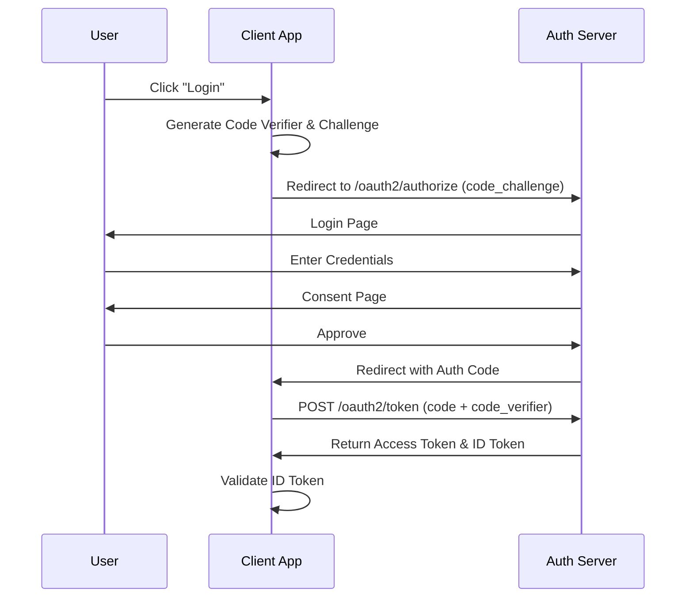

# OAuth2 Authorization Server

A production-ready Spring Boot OAuth2 Authorization Server with OpenID Connect (OIDC), PKCE, JWT support, and comprehensive observability features.


## Features

- **OAuth2 Authorization Server** - Full OAuth2 2.1 compliance
- **OpenID Connect (OIDC)** - OIDC 1.0 support with discovery endpoint
- **PKCE Support** - Proof Key for Code Exchange for public clients
- **JWT Tokens** - RSA-signed JWT access tokens
- **Multiple Grant Types**:
  - Authorization Code (with PKCE)
  - Client Credentials
  - Refresh Token
- **OpenAPI Documentation** - Interactive Swagger UI and OpenAPI 3.0 specification
- **OpenTelemetry Integration** - Distributed tracing and metrics
- **Prometheus Metrics** - Ready for Grafana dashboards
- **OWASP Security** - Security best practices implemented
- **Docker Support** - Container-ready with multi-stage builds

## Architecture

### Authorization Code Flow with PKCE



## Quick Start

### Prerequisites

- Java 21 (LTS) or higher
- Gradle 9.0+ (wrapper included)
- Docker (optional, required for testcontainers tests)

### Running Locally

```bash
# Clone the repository
git clone https://github.com/ianlintner/bootsandcats.git
cd bootsandcats

# Build and run
./gradlew :server-ui:bootRun

# Or build and run JAR
./gradlew :server-ui:build
java -jar server-ui/build/libs/server-ui-1.0.0-SNAPSHOT.jar
```

The server will start on `http://localhost:9000`.

### Profile UI

For an end-to-end smoke test, deploy the Profile UI OIDC web client that signs in via this Authorization Server and displays user profile and claims. See `docs/operations/profile-ui.md`.

### Running with Docker

```bash
# Build and run with Docker Compose
docker-compose up -d

# Or build standalone image
docker build -t oauth2-server .
docker run -p 9000:9000 oauth2-server
```

## Configuration

### Default Clients

> **⚠️ WARNING**: The credentials shown below are for demonstration purposes only. In production, these should be replaced with secure values loaded from environment variables or a secrets management system.

| Client ID | Client Secret | Type | Description |
|-----------|---------------|------|-------------|
| `demo-client` | `demo-secret` | Confidential | Full OAuth2 client with authorization code and refresh token grants |
| `public-client` | N/A | Public | PKCE-enabled client for SPAs and mobile apps |
| `m2m-client` | `m2m-secret` | Confidential | Machine-to-machine client for service-to-service auth |

### Default Users

> **⚠️ WARNING**: These are demo credentials only. In production, implement proper user management.

| Username | Password | Roles |
|----------|----------|-------|
| `user` | `password` | USER |
| `admin` | `admin` | USER, ADMIN |

## Connect

To quickly test the server, you can use the Client Credentials flow to get a token:

```bash
curl -X POST http://localhost:9000/oauth2/token \
  -H "Content-Type: application/x-www-form-urlencoded" \
  -d "grant_type=client_credentials" \
  -d "client_id=m2m-client" \
  -d "client_secret=m2m-secret" \
  -d "scope=message.read"
```

For more detailed examples in different languages (Java, Python, JavaScript), see the [Client Onboarding Guide](docs/api/client-onboarding.md).

## Endpoints

### OAuth2 Endpoints

| Endpoint | Description |
|----------|-------------|
| `/oauth2/authorize` | Authorization endpoint |
| `/oauth2/token` | Token endpoint |
| `/oauth2/jwks` | JSON Web Key Set |
| `/oauth2/introspect` | Token introspection |
| `/oauth2/revoke` | Token revocation |
| `/userinfo` | OIDC UserInfo endpoint |

### Discovery Endpoints

| Endpoint | Description |
|----------|-------------|
| `/.well-known/openid-configuration` | OIDC Discovery |

### API Documentation Endpoints

| Endpoint | Description |
|----------|-------------|
| `/swagger-ui.html` | Interactive API documentation (Swagger UI) |
| `/v3/api-docs` | OpenAPI specification (JSON) |
| `/v3/api-docs.yaml` | OpenAPI specification (YAML) |

### Admin Console

| Endpoint | Description |
|----------|-------------|
| `/admin` | Spring Boot Admin UI - Application monitoring and management |

### Actuator Endpoints

| Endpoint | Description |
|----------|-------------|
| `/actuator/health` | Health check |
| `/actuator/health/liveness` | Kubernetes liveness probe |
| `/actuator/health/readiness` | Kubernetes readiness probe |
| `/actuator/prometheus` | Prometheus metrics |
| `/actuator/info` | Application info |

## Usage Examples

> **Note**: The credentials shown in these examples are demo values. Replace them with your own secure credentials in production.

### Client Credentials Flow

```bash
# Get access token
curl -X POST http://localhost:9000/oauth2/token \
  -u m2m-client:m2m-secret \
  -d "grant_type=client_credentials" \
  -d "scope=api:read"

# Response:
# {
#   "access_token": "eyJhbGciOiJSUzI1NiIsInR5cCI6IkpXVCJ9...",
#   "token_type": "Bearer",
#   "expires_in": 3600,
#   "scope": "api:read"
# }
```

### Authorization Code Flow with PKCE

```bash
# Generate code verifier and challenge
CODE_VERIFIER=$(openssl rand -base64 32 | tr -d /=+ | cut -c -43)
CODE_CHALLENGE=$(echo -n $CODE_VERIFIER | openssl dgst -sha256 -binary | base64 | tr -d /=+ | cut -c -43)

# Step 1: Redirect user to authorization endpoint
# GET http://localhost:9000/oauth2/authorize?
#   response_type=code
#   &client_id=public-client
#   &redirect_uri=http://localhost:3000/callback
#   &scope=openid%20profile
#   &code_challenge=$CODE_CHALLENGE
#   &code_challenge_method=S256

# Step 2: Exchange code for tokens
curl -X POST http://localhost:9000/oauth2/token \
  -d "grant_type=authorization_code" \
  -d "client_id=public-client" \
  -d "redirect_uri=http://localhost:3000/callback" \
  -d "code=$AUTHORIZATION_CODE" \
  -d "code_verifier=$CODE_VERIFIER"
```

### Token Introspection

```bash
curl -X POST http://localhost:9000/oauth2/introspect \
  -u m2m-client:m2m-secret \
  -d "token=$ACCESS_TOKEN"
```

## Testing

The project uses Gradle 9.0 with JUnit 5 and comprehensive test categories.

### Unit Tests (Default)
```bash
# Run unit tests (uses H2 in-memory database)
./gradlew :server-ui:test

# Run all tests with coverage report
./gradlew :server-ui:test jacocoTestReport
```

### Integration Tests with Testcontainers
Testcontainers tests run against real PostgreSQL and Redis containers for production-like testing.

```bash
# Run all testcontainers tests (requires Docker)
./gradlew :server-ui:testcontainersTests

# Run PostgreSQL-specific tests
./gradlew :server-ui:postgresTests

# Run Redis-specific tests
./gradlew :server-ui:redisTests

# Run federated identity tests (WireMock for OAuth providers)
./gradlew :server-ui:federatedIdentityTests
```

### Specialized Test Tasks
```bash
# Behavioral tests (happy path + sad path scenarios)
./gradlew :server-ui:behavioralTests

# Security and contract tests
./gradlew :server-ui:securityTests
./gradlew :server-ui:contractTests

# OAuth2-specific tests
./gradlew :server-ui:oauth2Tests

# Fast tests (excludes integration and slow)
./gradlew :server-ui:fastTests
```

### Load Tests
```bash
# Run load tests (requires running server)
./gradlew :e2e-tests:gatlingRun
```

## Security

### OWASP Compliance

- Security headers (CSP, HSTS, X-Frame-Options)
- BCrypt password encoding with cost factor 12
- CSRF protection
- Rate limiting ready (via Spring Security)
- OWASP Dependency Check in CI pipeline

## Federation and Deployment Docs

- Federated login architecture and setup: `docs/architecture/federation.md`
- Profile UI operations and troubleshooting: `docs/operations/profile-ui.md`
- Azure AKS deployment (Key Vault, CSI, Ingress): `docs/deployment/azure.md`

### Security Scanning

```bash
# Run OWASP dependency check
./mvnw org.owasp:dependency-check-maven:check

# Run SpotBugs with FindSecBugs
./mvnw spotbugs:check
```

## Observability

### OpenTelemetry

Configure the OTLP exporter endpoint in `application.properties`:

```properties
otel.exporter.otlp.endpoint=http://your-collector:4317
```

### Prometheus Metrics

Metrics are exposed at `/actuator/prometheus`. Key metrics include:

- `oauth2.tokens.issued` - Number of tokens issued
- `oauth2.tokens.revoked` - Number of tokens revoked
- `oauth2.authorization.requests` - Authorization requests count
- `http_server_requests_*` - HTTP request metrics

### Grafana Dashboard

Use the provided `prometheus.yml` and `docker-compose.yml` to set up a complete observability stack.

## Workflows

Status badges:

- CI: 
- Security Scan: 
- Manual Load Test: 

See `docs/ci.md` for a full pipeline overview.

## Deployment

### Azure & GitHub Setup

Automated setup (recommended):

```bash
./scripts/setup-now.sh
```

This configures:
- Azure service principal with OIDC federated identity
- GitHub repository secrets
- Kubernetes resources (secrets, ConfigMap)
- Deploys to AKS cluster "bigboy"

See `SETUP.md` for detailed instructions and manual setup steps.

### Deployment Architecture

- **Container Registry**: Azure Container Registry (gabby.azurecr.io)
- **Kubernetes**: AKS cluster "bigboy"
- **CI/CD**: GitHub Actions with automatic deployment on main branch
- **Authentication**: OIDC federated identity (no long-lived secrets)

## Project Structure

```
bootsandcats/
├── src/
│   ├── main/
│   │   ├── java/com/bootsandcats/oauth2/
│   │   │   ├── OAuth2AuthorizationServerApplication.java
│   │   │   ├── config/
│   │   │   │   ├── AuthorizationServerConfig.java
│   │   │   │   ├── OpenTelemetryConfig.java
│   │   │   │   └── SecurityHeadersConfig.java
│   │   │   ├── controller/
│   │   │   │   ├── UserInfoController.java
│   │   │   │   └── CustomErrorController.java
│   │   │   └── service/
│   │   │       └── OAuth2MetricsService.java
│   │   └── resources/
│   │       ├── application.properties
│   │       └── application-prod.properties
│   └── test/
│       ├── java/com/bootsandcats/oauth2/
│       │   ├── config/
│       │   ├── controller/
│       │   ├── integration/
│       │   ├── load/
│       │   ├── security/
│       │   └── service/
│       └── resources/
│           └── application-test.properties
├── .github/workflows/
│   ├── ci.yml
│   ├── security.yml
│   └── load-test.yml
├── Dockerfile
├── docker-compose.yml
├── pom.xml
└── README.md
```

## License

MIT License

## Contributing

1. Fork the repository
2. Create a feature branch
3. Make your changes
4. Run tests: `./mvnw verify`
5. Format code: `./mvnw spotless:apply`
6. Submit a pull request

## Pre-commit Quality Gate

To prevent commits that break the main quality bars, the repository ships with a Git pre-commit hook that runs the following Maven goals in order:

- `./mvnw spotless:check` – verifies formatting
- `./mvnw spotbugs:check` – runs static analysis / linting
- `./mvnw verify` – builds the project and executes tests

### Installation

1. Point Git to the bundled hooks directory (one-time setup):
  ```bash
  git config core.hooksPath githooks
  ```
2. Commit as usual; the hook will run automatically and block the commit if any command fails.

You can also run the same checks on-demand outside of Git by executing:

```bash
./scripts/pre-commit-checks.sh
```
