# OAuth2 Data Flow

This document provides detailed diagrams of all OAuth2 and OIDC flows supported by the Authorization Server.

## Authorization Code Flow with PKCE

The recommended flow for web applications, single-page applications (SPAs), and mobile apps.

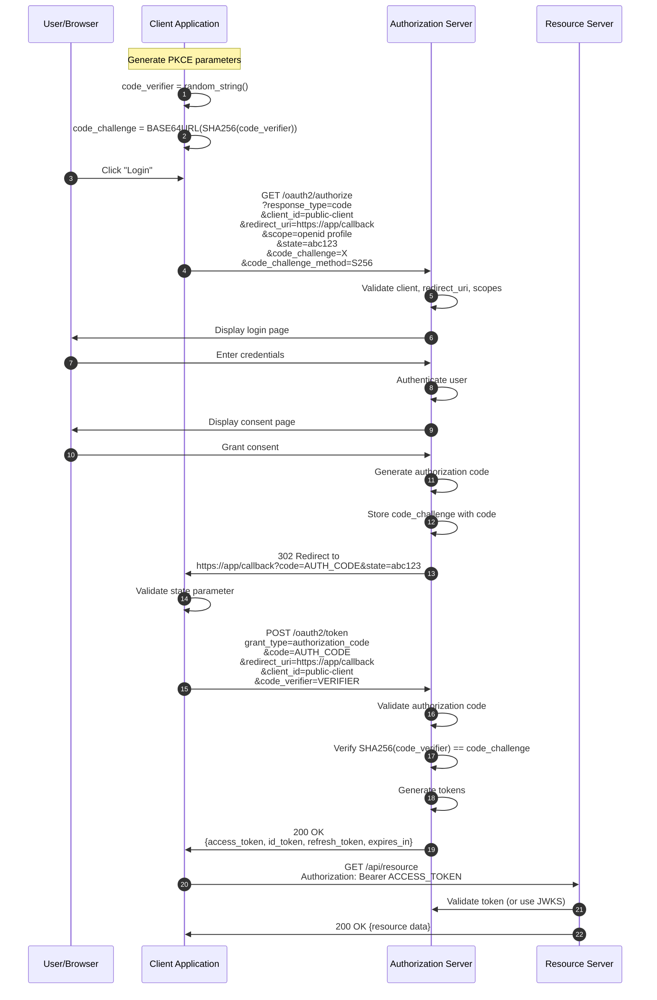

### PKCE Parameter Generation

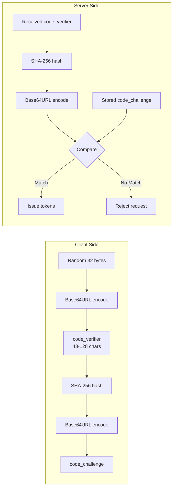

## Client Credentials Flow

For machine-to-machine (M2M) authentication between trusted backend services.

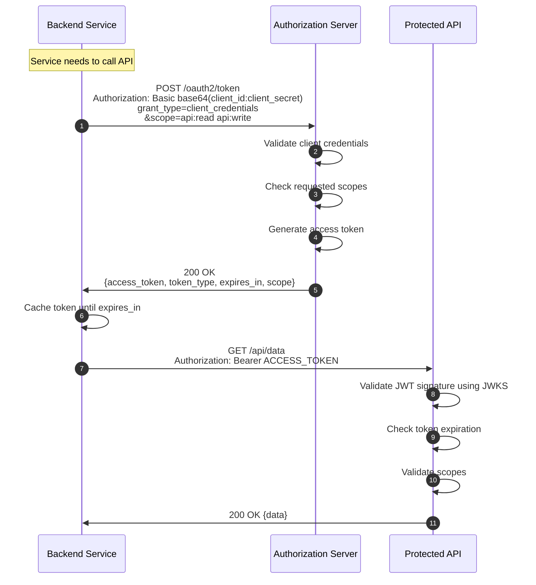

### Client Credentials Request Flow

```mermaid
graph TB
    subgraph "Token Request"
        ClientCreds[Client Credentials] --> BasicAuth[Authorization Header<br/>Basic base64 encode]
        GrantType[grant_type=client_credentials] --> Request[HTTP POST]
        Scopes[scope=api:read] --> Request
        BasicAuth --> Request
    end
    
    subgraph "Server Processing"
        Request --> ValidateClient[Validate Client]
        ValidateClient --> CheckScopes[Validate Scopes]
        CheckScopes --> GenerateToken[Generate JWT]
        GenerateToken --> SignToken[Sign with RSA Private Key]
    end
    
    subgraph "Response"
        SignToken --> Response[Token Response]
        Response --> AccessToken[access_token]
        Response --> TokenType[token_type: Bearer]
        Response --> ExpiresIn[expires_in: 3600]
    end
```

## Refresh Token Flow

Used to obtain new access tokens without re-authentication.

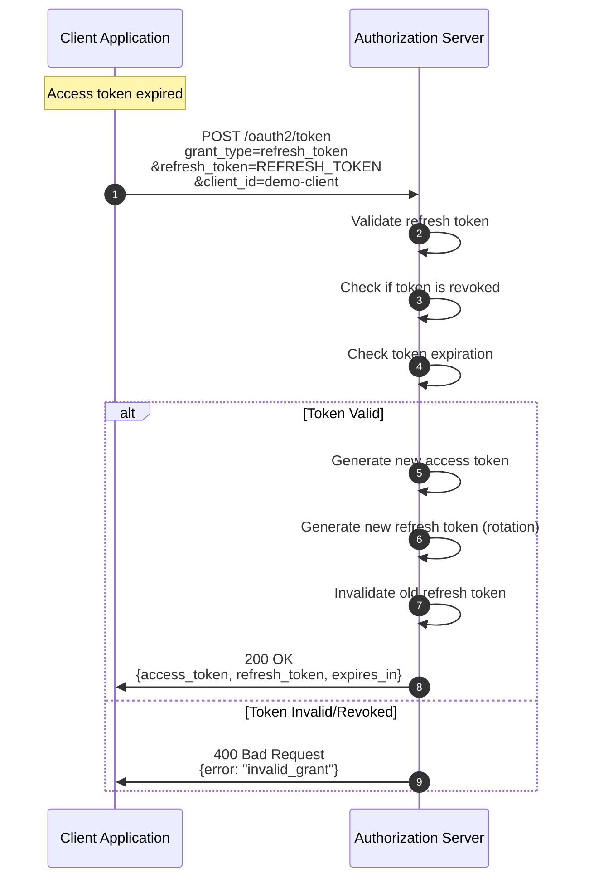

### Refresh Token Rotation

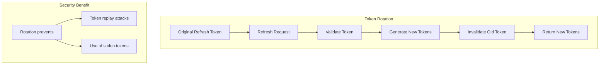

## Token Introspection Flow

Allows resource servers to validate tokens and get token metadata.

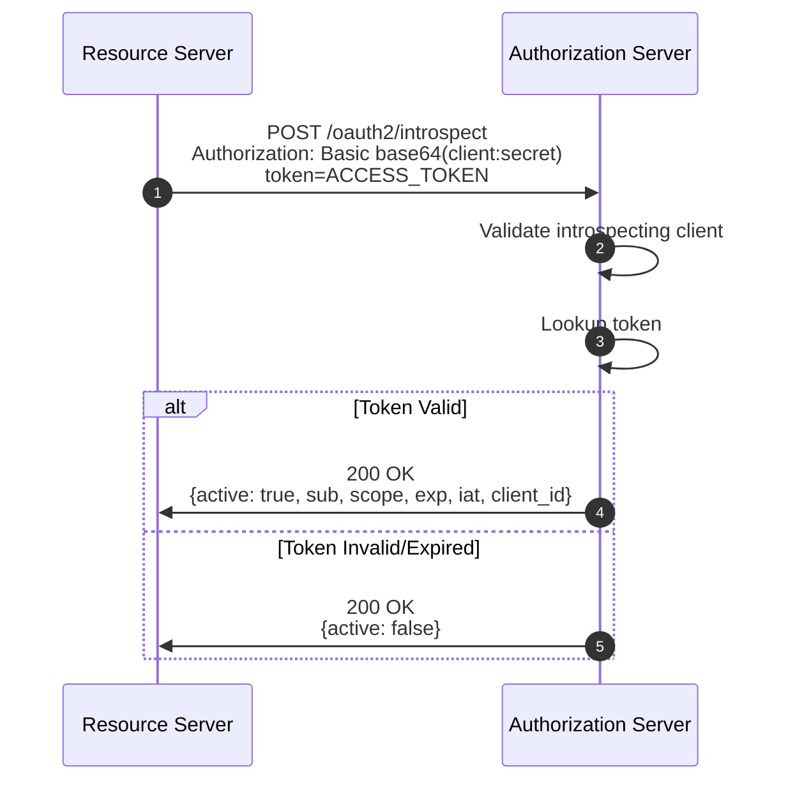

## Token Revocation Flow

Used to invalidate tokens before their natural expiration.

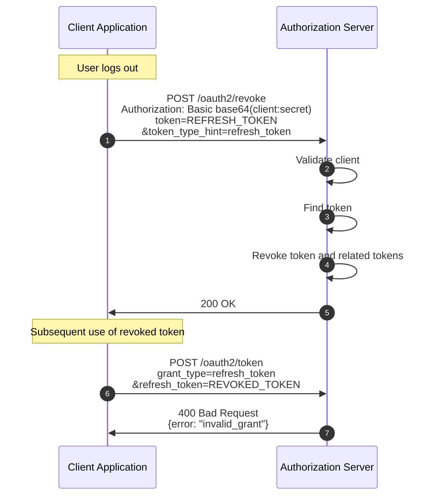

## OpenID Connect Discovery Flow

How clients discover the authorization server configuration.

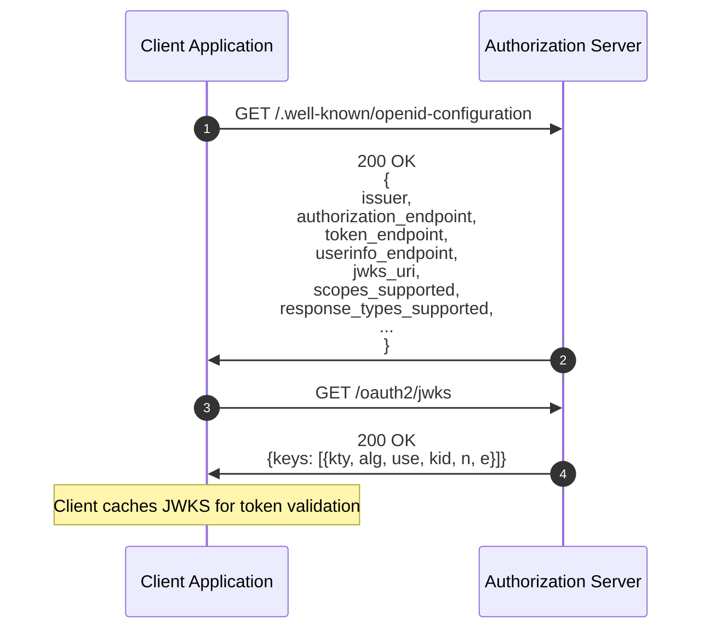

## UserInfo Endpoint Flow

Retrieving user claims using an access token.

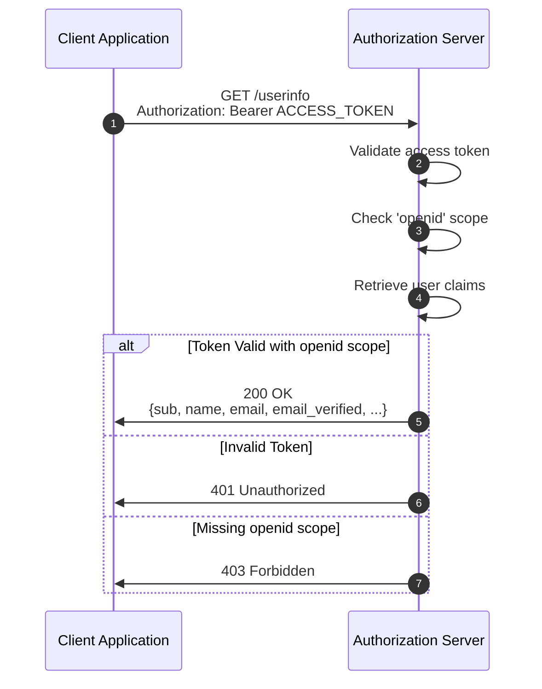

## Complete Authentication Flow

End-to-end flow from user login to API access.

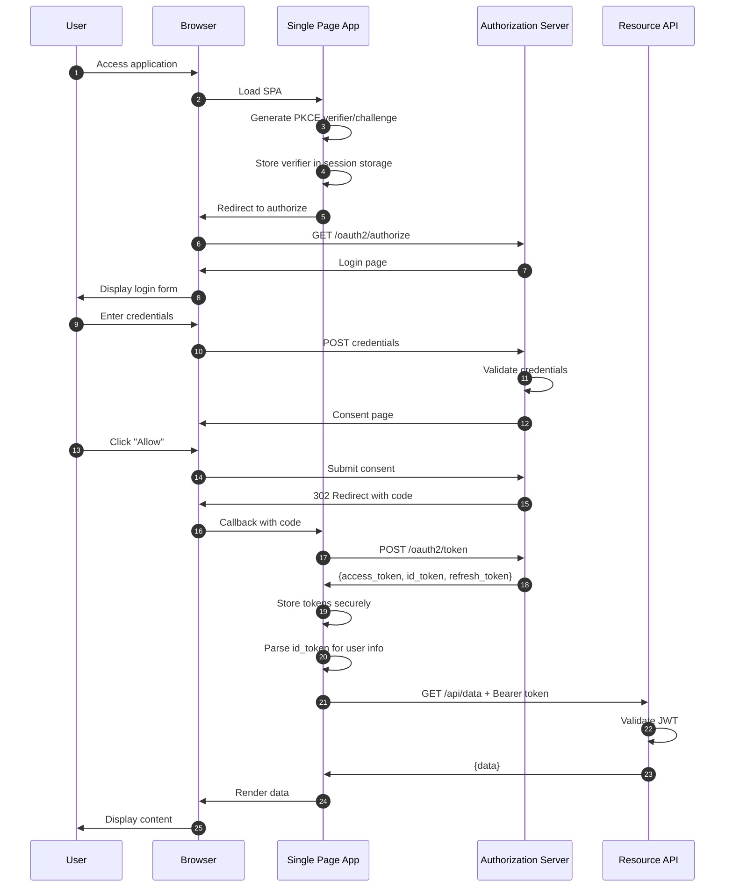

## Error Flows

### Invalid Client Error

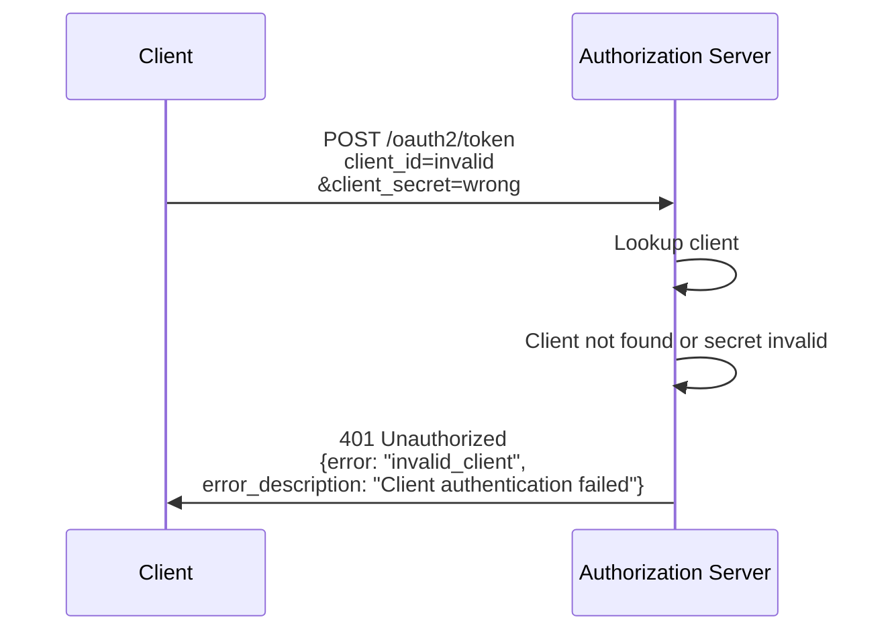

### Invalid Grant Error

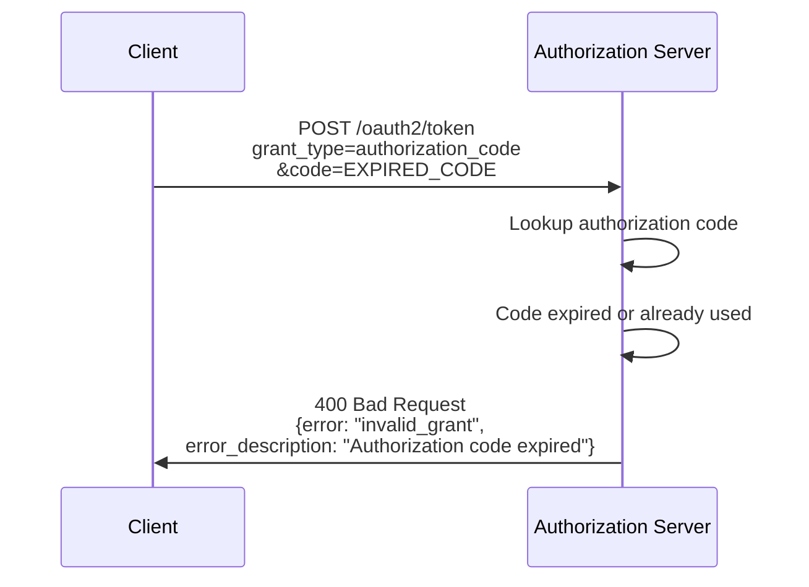

### Invalid Scope Error

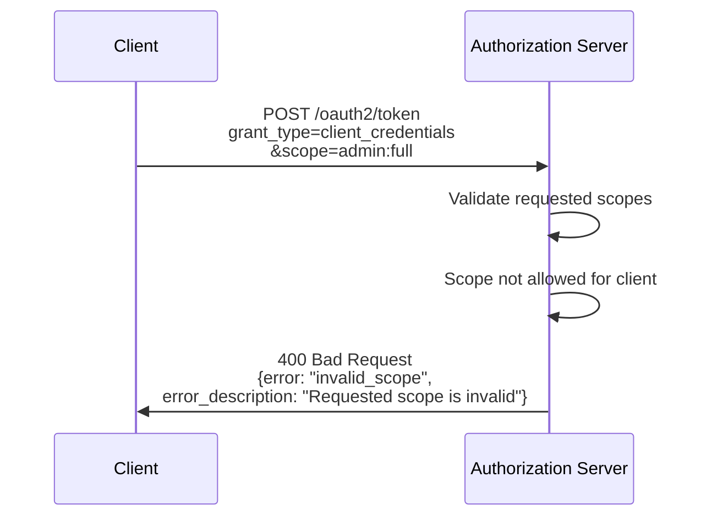

## Flow Selection Guide

| Use Case | Recommended Flow | Reason |
|----------|------------------|--------|
| Web Application (SPA) | Authorization Code + PKCE | No client secret exposure |
| Mobile Application | Authorization Code + PKCE | Cannot store secrets securely |
| Server-side Web App | Authorization Code | Can store client secret |
| Microservice to Microservice | Client Credentials | No user context needed |
| Refresh expired tokens | Refresh Token | Avoid re-authentication |
| Logout | Token Revocation | Invalidate tokens |

## Next Steps

- [OAuth2 API Reference](../api/oauth2-endpoints.md) - Detailed endpoint documentation
- [Security Architecture](security.md) - Token security details
- [Configuration](../configuration.md) - OAuth2 settings
