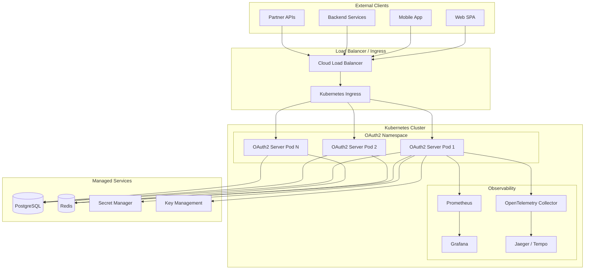
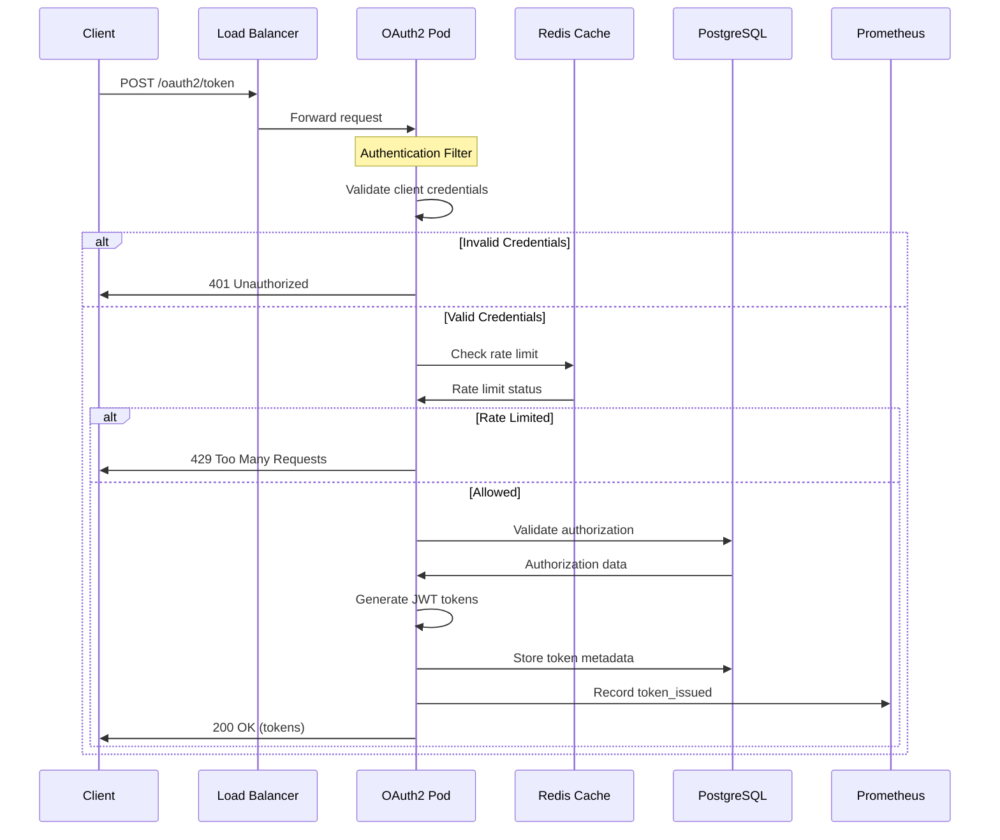
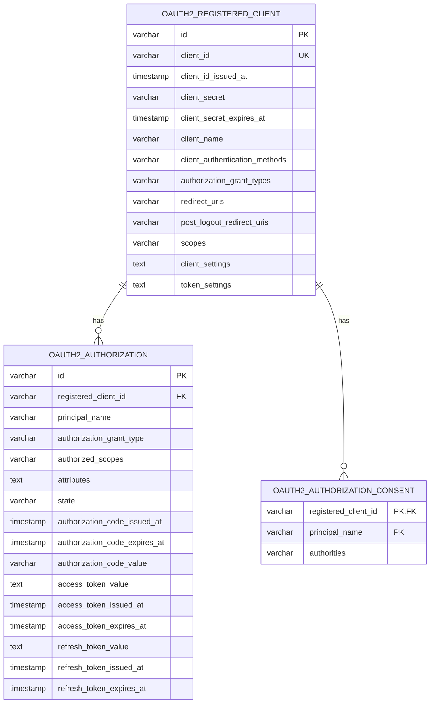
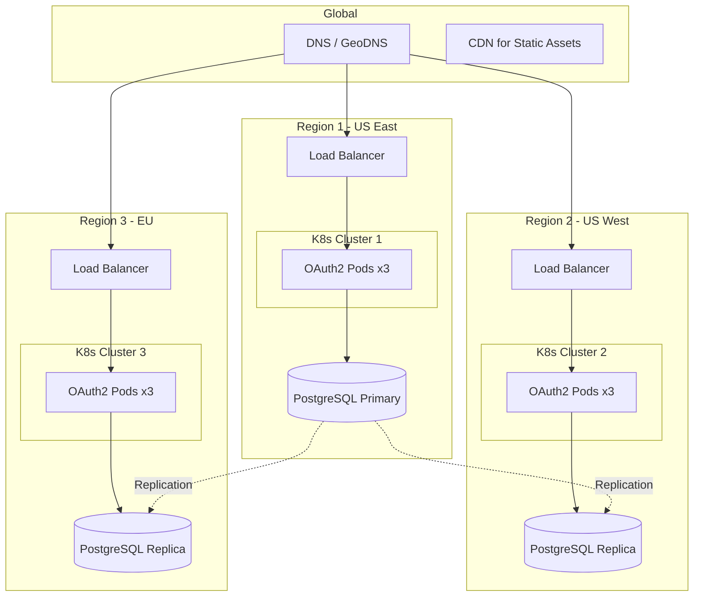

# Architecture Overview

This document provides a comprehensive overview of the OAuth2 Authorization Server architecture, designed for production deployment in Kubernetes environments.

## High-Level Architecture



## Component Architecture

The current implementation is built directly on top of Spring Authorization Server and Spring
Security components. Rather than custom `*Service` classes, the application wires and
configures framework-provided building blocks.

```mermaid
graph LR
    subgraph "OAuth2 Authorization Server"
        subgraph "Web Layer"
            Filters[Spring Security Filter Chain]
            Controllers[Authorization Server Endpoints]
        end

        subgraph "Security Layer"
            ASConfig[AuthorizationServerConfig]
            JwtCustomizer[OAuth2TokenCustomizer]
            JwtDecoder[JwtDecoder]
        end

        subgraph "Identity Layer"
            UserDetailsSvc[InMemoryUserDetailsManager]
        end

        subgraph "Client Registration"
            RegRepo[JdbcRegisteredClientRepository]
        end

        subgraph "Crypto / Keys"
            JwkProvider[JwkSetProvider]
            JwkSource[JWKSource]
        end
    end

    Filters --> Controllers
    Controllers --> ASConfig

    ASConfig --> UserDetailsSvc
    ASConfig --> RegRepo
    ASConfig --> JwtCustomizer
    ASConfig --> JwtDecoder
    ASConfig --> JwkSource

    JwkSource --> JwkProvider

    RegRepo --> DB[(PostgreSQL)]

    note right of UserDetailsSvc: Demo users in-memory (non-persistent)
    note right of RegRepo: OAuth2 clients stored in PostgreSQL
```

> NOTE: User accounts and authorization data are currently held in-memory. This is suitable for
> local development, tests, and demos, but **not** for production. For production deployments,
> plan to replace the in-memory user store and token storage with persistent implementations
> backed by your identity store and database.

## Request Flow Architecture

### Token Request Flow



## Data Architecture

### Database Schema



## Security Architecture

For detailed security architecture, see [Security Architecture](security.md).

## Deployment Architecture

### Multi-Region Deployment



## Scalability Considerations

### Horizontal Pod Autoscaling

```yaml
# HPA Configuration
apiVersion: autoscaling/v2
kind: HorizontalPodAutoscaler
metadata:
  name: oauth2-server-hpa
spec:
  scaleTargetRef:
    apiVersion: apps/v1
    kind: Deployment
    name: oauth2-server
  minReplicas: 3
  maxReplicas: 10
  metrics:
    - type: Resource
      resource:
        name: cpu
        target:
          type: Utilization
          averageUtilization: 70
    - type: Resource
      resource:
        name: memory
        target:
          type: Utilization
          averageUtilization: 80
```

### Resource Recommendations

| Environment | CPU Request | CPU Limit | Memory Request | Memory Limit | Replicas |
|-------------|-------------|-----------|----------------|--------------|----------|
| Development | 250m | 500m | 512Mi | 1Gi | 1 |
| Staging | 500m | 1000m | 1Gi | 2Gi | 2 |
| Production | 1000m | 2000m | 2Gi | 4Gi | 3-10 |

## Technology Decisions

### Why Spring Authorization Server?

| Aspect | Decision | Rationale |
|--------|----------|-----------|
| **Framework** | Spring Authorization Server | Official Spring OAuth2 implementation, active development, strong community |
| **Token Format** | JWT | Stateless, self-contained, supports cryptographic signatures |
| **Signing Algorithm** | RS256 | Asymmetric encryption allows public key distribution |
| **Database** | PostgreSQL | ACID compliance, strong consistency, excellent Kubernetes support |
| **Caching** | Redis | Distributed caching, session management, rate limiting |
| **Observability** | OpenTelemetry | Vendor-neutral, wide ecosystem support |

### Key Design Principles

1. **Stateless Design**: JWT tokens enable horizontal scaling without session affinity
2. **Defense in Depth**: Multiple security layers (network, application, data)
3. **Observability First**: Built-in metrics, tracing, and logging
4. **Cloud Native**: Container-ready, Kubernetes-native health probes
5. **Separation of Concerns**: Clear boundaries between components

## Next Steps

- [Security Architecture](security.md) - Deep dive into security design
- [Data Flow](data-flow.md) - Detailed OAuth2 flow diagrams
- [Deployment Overview](../deployment/overview.md) - Kubernetes deployment guide
