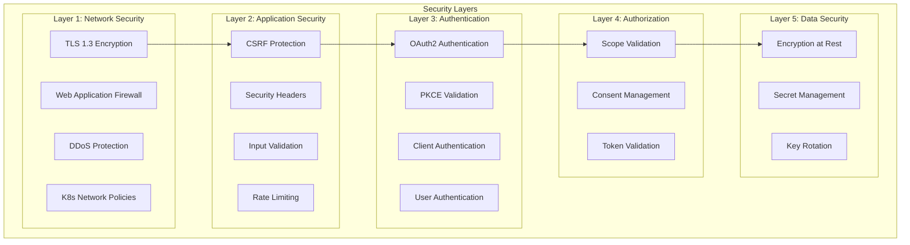
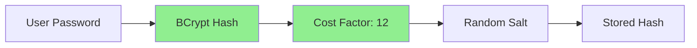
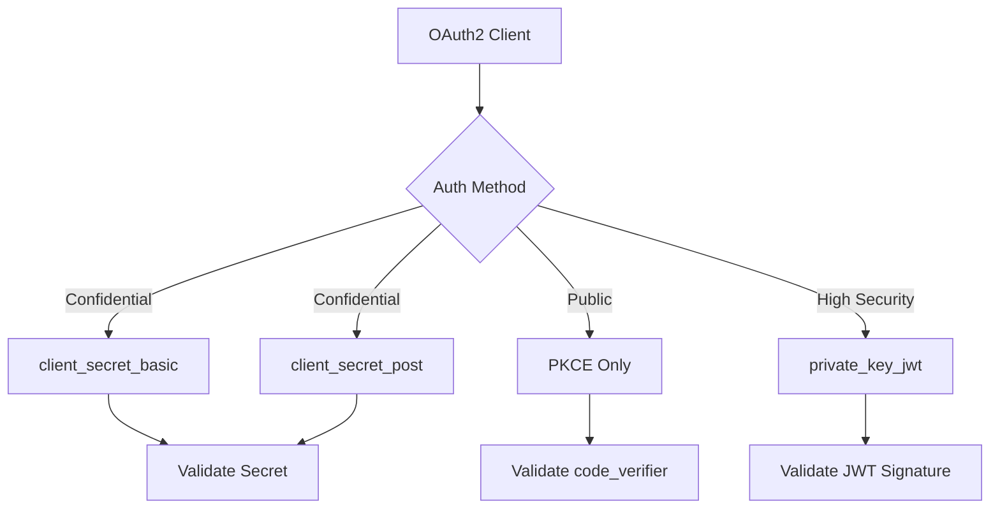
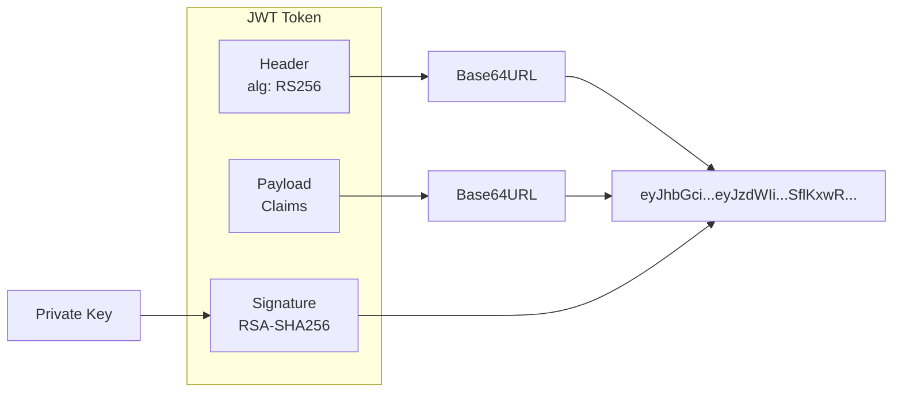
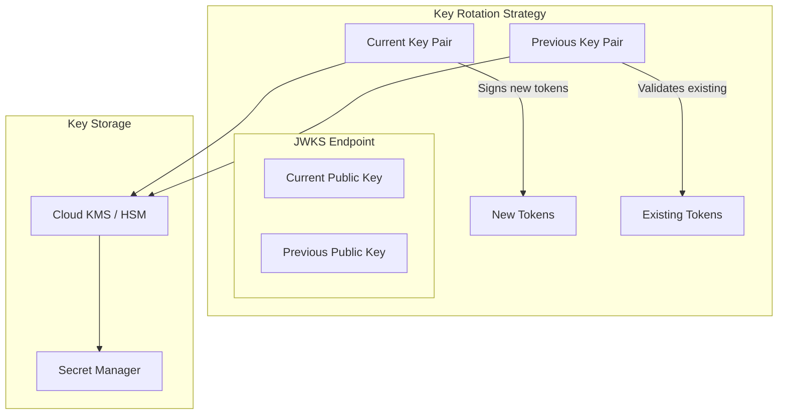
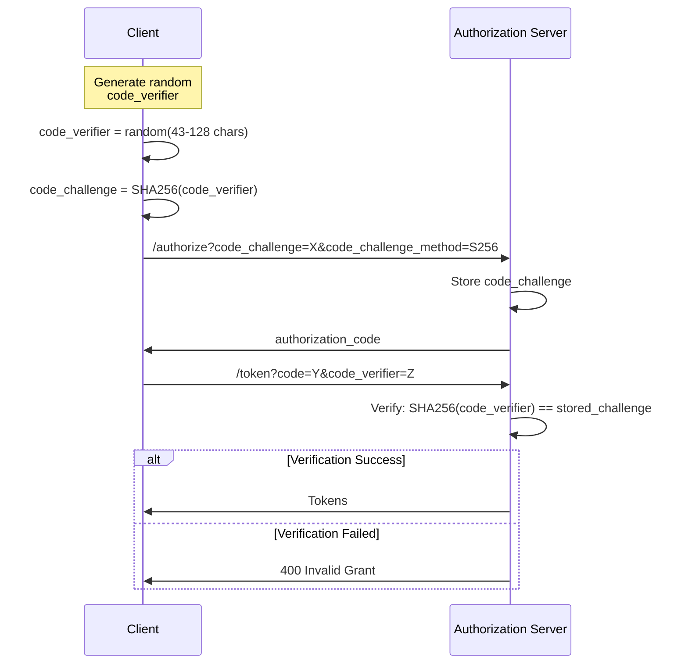
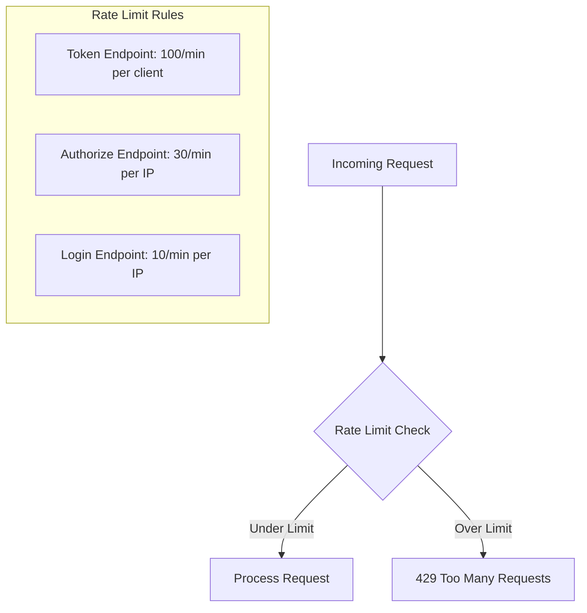
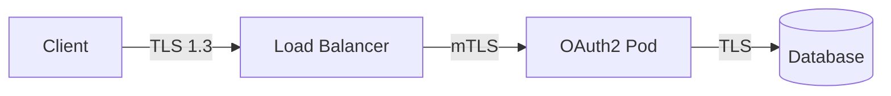
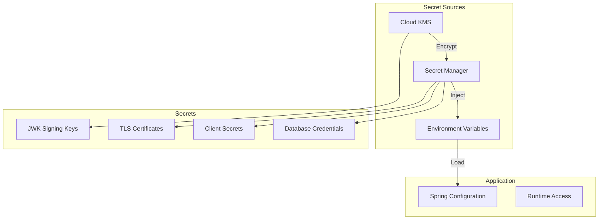

# Security Architecture

This document details the security architecture of the OAuth2 Authorization Server, covering authentication, authorization, token security, and infrastructure security.

## Security Model Overview



## Authentication Security

### Password Security



| Security Measure | Implementation |
|------------------|----------------|
| Password Hashing | BCrypt with cost factor 12 |
| Salt | Automatically generated per password |
| Min Length | Configurable (recommended: 12+) |
| Complexity | Configurable policies |

### Client Authentication Methods



| Client Type | Authentication Method | Use Case |
|-------------|----------------------|----------|
| Confidential Server | `client_secret_basic` | Server-side applications |
| Confidential Server | `client_secret_post` | Legacy systems |
| Public Client | `none` + PKCE | SPAs, mobile apps |
| High Security | `private_key_jwt` | High-security integrations |

## Token Security

### JWT Token Structure



### Token Claims

| Claim | Type | Description |
|-------|------|-------------|
| `iss` | Standard | Issuer identifier |
| `sub` | Standard | Subject (user/client ID) |
| `aud` | Standard | Audience (intended recipient) |
| `exp` | Standard | Expiration timestamp |
| `iat` | Standard | Issued at timestamp |
| `nbf` | Standard | Not before timestamp |
| `jti` | Standard | JWT ID (unique identifier) |
| `scope` | OAuth2 | Granted scopes |
| `client_id` | OAuth2 | Client identifier |

### Token Lifetimes

| Token Type | Default Lifetime | Recommended Production |
|------------|------------------|----------------------|
| Access Token | 15 minutes | 5-15 minutes |
| Refresh Token | 7 days | 1-24 hours |
| Authorization Code | 5 minutes | 5 minutes |
| ID Token | 15 minutes | 15 minutes |

### Key Management



!!! warning "Key Rotation"
    In the default configuration, RSA keys are generated on startup. For production, 
    implement persistent key storage with regular rotation (recommended: 90 days).

## Security Headers

The server implements comprehensive security headers:

```yaml
# Security Headers Configuration
Security-Headers:
  Content-Security-Policy: |
    default-src 'self';
    script-src 'self';
    style-src 'self' 'unsafe-inline';
    img-src 'self' data:;
    font-src 'self';
    frame-ancestors 'none';
    base-uri 'self';
    form-action 'self'
  
  Strict-Transport-Security: max-age=31536000; includeSubDomains; preload
  X-Content-Type-Options: nosniff
  X-Frame-Options: DENY
  X-XSS-Protection: 1; mode=block
  Referrer-Policy: strict-origin-when-cross-origin
  Permissions-Policy: camera=(), microphone=(), geolocation=()
```

## PKCE Security

PKCE (Proof Key for Code Exchange) prevents authorization code interception attacks:



| Parameter | Requirements |
|-----------|-------------|
| `code_verifier` | 43-128 characters, [A-Z], [a-z], [0-9], `-`, `.`, `_`, `~` |
| `code_challenge` | Base64URL-encoded SHA256 hash of code_verifier |
| `code_challenge_method` | `S256` (plain not recommended) |

## CSRF Protection

```mermaid
graph LR
    subgraph "CSRF Protection"
        Form[Login Form] -->|CSRF Token| Server[Server]
        Server -->|Validate Token| Session[Session]
    end
    
    subgraph "Excluded Endpoints"
        Token[/oauth2/token]
        Introspect[/oauth2/introspect]
        Revoke[/oauth2/revoke]
    end
    
    Note[Token endpoints use<br/>client authentication instead]
```

| Endpoint | CSRF Protection | Reason |
|----------|----------------|--------|
| `/oauth2/authorize` | ✅ Enabled | Browser-based flow |
| `/login` | ✅ Enabled | Form-based login |
| `/oauth2/token` | ❌ Disabled | Uses client authentication |
| `/oauth2/introspect` | ❌ Disabled | Uses client authentication |
| `/oauth2/revoke` | ❌ Disabled | Uses client authentication |

## Rate Limiting

Implement rate limiting to prevent abuse:



| Endpoint | Rate Limit | Window | Key |
|----------|------------|--------|-----|
| `/oauth2/token` | 100 requests | 1 minute | Client ID |
| `/oauth2/authorize` | 30 requests | 1 minute | IP Address |
| `/login` | 10 requests | 1 minute | IP Address |
| `/oauth2/introspect` | 500 requests | 1 minute | Client ID |

## Network Security

### Kubernetes Network Policies

```yaml
apiVersion: networking.k8s.io/v1
kind: NetworkPolicy
metadata:
  name: oauth2-server-policy
spec:
  podSelector:
    matchLabels:
      app: oauth2-server
  policyTypes:
    - Ingress
    - Egress
  ingress:
    - from:
        - namespaceSelector:
            matchLabels:
              name: ingress-nginx
        - podSelector:
            matchLabels:
              app: prometheus
      ports:
        - port: 9000
  egress:
    - to:
        - namespaceSelector:
            matchLabels:
              name: database
      ports:
        - port: 5432
    - to:
        - namespaceSelector:
            matchLabels:
              name: redis
      ports:
        - port: 6379
```

### TLS Configuration



| Connection | TLS Version | Certificate |
|------------|-------------|-------------|
| Client → Load Balancer | TLS 1.3 | Public CA |
| Load Balancer → Pod | TLS 1.2+ / mTLS | Internal CA |
| Pod → Database | TLS 1.2+ | Cloud Provider CA |
| Pod → Redis | TLS 1.2+ | Cloud Provider CA |

## Secret Management

### Production Secret Hierarchy



### Required Secrets

| Secret | Type | Rotation Period | Storage |
|--------|------|-----------------|---------|
| `DATABASE_PASSWORD` | Credential | 90 days | Secret Manager |
| `OAUTH2_DEMO_CLIENT_SECRET` | Credential | 90 days | Secret Manager |
| `OAUTH2_M2M_CLIENT_SECRET` | Credential | 90 days | Secret Manager |
| `JWK_PRIVATE_KEY` | Cryptographic | 90 days | Cloud KMS |
| `TLS_PRIVATE_KEY` | Certificate | 1 year | Certificate Manager |

## Security Scanning

### OWASP Dependency Check

```bash
# Run OWASP dependency check
./mvnw org.owasp:dependency-check-maven:check
```

### SpotBugs with FindSecBugs

```bash
# Run security-focused static analysis
./mvnw spotbugs:check
```

### Container Scanning

```bash
# Trivy container scanning
trivy image oauth2-server:latest
```

## Compliance Considerations

| Standard | Relevant Controls |
|----------|-------------------|
| **OAuth2 2.1** | PKCE mandatory for public clients, refresh token rotation |
| **OWASP Top 10** | A01-A10 security controls implemented |
| **SOC 2** | Access control, encryption, monitoring |
| **GDPR** | Consent management, data minimization |
| **PCI DSS** | Strong cryptography, access logging |

## Security Checklist

- [ ] TLS 1.3 enabled for all external connections
- [ ] PKCE required for all public clients
- [ ] BCrypt password hashing with cost factor ≥ 12
- [ ] JWT signing keys stored in KMS/HSM
- [ ] All secrets loaded from Secret Manager
- [ ] Rate limiting configured
- [ ] Security headers enabled
- [ ] Network policies applied
- [ ] Container runs as non-root user
- [ ] Read-only root filesystem
- [ ] Security scanning in CI/CD pipeline
- [ ] Audit logging enabled
- [ ] Key rotation scheduled

## Next Steps

- [Data Flow](data-flow.md) - OAuth2 flow diagrams
- [Configuration](../configuration.md) - Security configuration options
- [Incident Response](../operations/incident-response.md) - Security incident procedures
