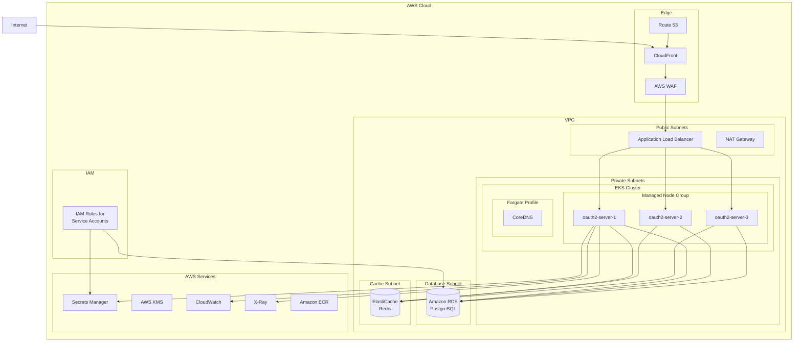

# AWS EKS Deployment

This guide covers deploying the OAuth2 Authorization Server to Amazon Elastic Kubernetes Service (EKS) with Amazon RDS for PostgreSQL and Amazon ElastiCache for Redis.

## Architecture



## Prerequisites

- AWS CLI v2 installed and configured
- eksctl installed
- kubectl installed
- Helm 3.x installed
- AWS account with required permissions

## Infrastructure Setup

### 1. Set Environment Variables

```bash
export AWS_REGION="us-east-1"
export CLUSTER_NAME="oauth2-eks-cluster"
export AWS_ACCOUNT_ID=$(aws sts get-caller-identity --query Account --output text)
export VPC_NAME="oauth2-vpc"

# Verify AWS credentials
aws sts get-caller-identity
```

### 2. Create VPC with eksctl

```bash
# Create EKS cluster with managed node groups
eksctl create cluster \
  --name $CLUSTER_NAME \
  --region $AWS_REGION \
  --version 1.28 \
  --nodegroup-name oauth2-ng \
  --node-type t3.xlarge \
  --nodes 3 \
  --nodes-min 3 \
  --nodes-max 10 \
  --managed \
  --asg-access \
  --with-oidc \
  --alb-ingress-access \
  --full-ecr-access \
  --zones ${AWS_REGION}a,${AWS_REGION}b,${AWS_REGION}c

# Update kubeconfig
aws eks update-kubeconfig --name $CLUSTER_NAME --region $AWS_REGION
```

### 3. Create Amazon RDS for PostgreSQL

```bash
# Get VPC and subnet IDs from EKS
export VPC_ID=$(aws eks describe-cluster --name $CLUSTER_NAME --query "cluster.resourcesVpcConfig.vpcId" --output text)
export PRIVATE_SUBNETS=$(aws eks describe-cluster --name $CLUSTER_NAME --query "cluster.resourcesVpcConfig.subnetIds" --output text | tr '\t' ',')

# Create DB subnet group
aws rds create-db-subnet-group \
  --db-subnet-group-name oauth2-db-subnet-group \
  --db-subnet-group-description "OAuth2 DB subnet group" \
  --subnet-ids $(echo $PRIVATE_SUBNETS | tr ',' ' ')

# Create security group for RDS
export RDS_SG=$(aws ec2 create-security-group \
  --group-name oauth2-rds-sg \
  --description "Security group for OAuth2 RDS" \
  --vpc-id $VPC_ID \
  --output text --query 'GroupId')

# Get EKS node security group
export EKS_NODE_SG=$(aws eks describe-cluster --name $CLUSTER_NAME --query "cluster.resourcesVpcConfig.clusterSecurityGroupId" --output text)

# Allow PostgreSQL from EKS nodes
aws ec2 authorize-security-group-ingress \
  --group-id $RDS_SG \
  --protocol tcp \
  --port 5432 \
  --source-group $EKS_NODE_SG

# Generate password
export DB_PASSWORD=$(openssl rand -base64 24 | tr -dc 'a-zA-Z0-9')

# Create RDS instance
aws rds create-db-instance \
  --db-instance-identifier oauth2-postgres \
  --db-instance-class db.r6g.large \
  --engine postgres \
  --engine-version 15.4 \
  --master-username oauth2_admin \
  --master-user-password "$DB_PASSWORD" \
  --allocated-storage 100 \
  --storage-type gp3 \
  --storage-encrypted \
  --kms-key-id alias/aws/rds \
  --multi-az \
  --db-subnet-group-name oauth2-db-subnet-group \
  --vpc-security-group-ids $RDS_SG \
  --backup-retention-period 7 \
  --preferred-backup-window "02:00-03:00" \
  --preferred-maintenance-window "sun:03:00-sun:04:00" \
  --auto-minor-version-upgrade \
  --deletion-protection \
  --publicly-accessible false \
  --tags Key=Environment,Value=production

# Wait for RDS to be available
aws rds wait db-instance-available --db-instance-identifier oauth2-postgres

# Get RDS endpoint
export RDS_ENDPOINT=$(aws rds describe-db-instances \
  --db-instance-identifier oauth2-postgres \
  --query "DBInstances[0].Endpoint.Address" --output text)

echo "RDS Endpoint: $RDS_ENDPOINT"

# Create database
PGPASSWORD=$DB_PASSWORD psql -h $RDS_ENDPOINT -U oauth2_admin -d postgres -c "CREATE DATABASE oauth2db;"
```

### 4. Create Amazon ElastiCache for Redis

```bash
# Create ElastiCache subnet group
aws elasticache create-cache-subnet-group \
  --cache-subnet-group-name oauth2-redis-subnet-group \
  --cache-subnet-group-description "OAuth2 Redis subnet group" \
  --subnet-ids $(echo $PRIVATE_SUBNETS | tr ',' ' ')

# Create security group for ElastiCache
export REDIS_SG=$(aws ec2 create-security-group \
  --group-name oauth2-redis-sg \
  --description "Security group for OAuth2 Redis" \
  --vpc-id $VPC_ID \
  --output text --query 'GroupId')

# Allow Redis from EKS nodes
aws ec2 authorize-security-group-ingress \
  --group-id $REDIS_SG \
  --protocol tcp \
  --port 6379 \
  --source-group $EKS_NODE_SG

# Create ElastiCache replication group
aws elasticache create-replication-group \
  --replication-group-id oauth2-redis \
  --replication-group-description "OAuth2 Redis cluster" \
  --engine redis \
  --engine-version 7.0 \
  --cache-node-type cache.r6g.large \
  --num-cache-clusters 3 \
  --automatic-failover-enabled \
  --multi-az-enabled \
  --cache-subnet-group-name oauth2-redis-subnet-group \
  --security-group-ids $REDIS_SG \
  --at-rest-encryption-enabled \
  --transit-encryption-enabled \
  --auth-token "$(openssl rand -base64 32)" \
  --tags Key=Environment,Value=production

# Wait for Redis to be available
aws elasticache wait replication-group-available --replication-group-id oauth2-redis

# Get Redis endpoint
export REDIS_ENDPOINT=$(aws elasticache describe-replication-groups \
  --replication-group-id oauth2-redis \
  --query "ReplicationGroups[0].NodeGroups[0].PrimaryEndpoint.Address" --output text)

echo "Redis Endpoint: $REDIS_ENDPOINT"
```

### 5. Set Up AWS Secrets Manager

```bash
# Store database credentials
aws secretsmanager create-secret \
  --name oauth2/database-credentials \
  --secret-string "{\"username\":\"oauth2_admin\",\"password\":\"$DB_PASSWORD\",\"host\":\"$RDS_ENDPOINT\",\"port\":\"5432\",\"database\":\"oauth2db\"}"

# Store OAuth2 client secrets
aws secretsmanager create-secret \
  --name oauth2/demo-client-secret \
  --secret-string "$(openssl rand -base64 32)"

aws secretsmanager create-secret \
  --name oauth2/m2m-client-secret \
  --secret-string "$(openssl rand -base64 32)"

# Store Redis auth token
aws secretsmanager create-secret \
  --name oauth2/redis-auth-token \
  --secret-string "$(openssl rand -base64 32)"
```

### 6. Configure IAM Roles for Service Accounts (IRSA)

```bash
# Create IAM policy for Secrets Manager access
cat <<EOF > /tmp/secrets-policy.json
{
    "Version": "2012-10-17",
    "Statement": [
        {
            "Effect": "Allow",
            "Action": [
                "secretsmanager:GetSecretValue",
                "secretsmanager:DescribeSecret"
            ],
            "Resource": [
                "arn:aws:secretsmanager:$AWS_REGION:$AWS_ACCOUNT_ID:secret:oauth2/*"
            ]
        },
        {
            "Effect": "Allow",
            "Action": [
                "kms:Decrypt"
            ],
            "Resource": "*",
            "Condition": {
                "StringEquals": {
                    "kms:ViaService": "secretsmanager.$AWS_REGION.amazonaws.com"
                }
            }
        }
    ]
}
EOF

aws iam create-policy \
  --policy-name OAuth2SecretsPolicy \
  --policy-document file:///tmp/secrets-policy.json

# Create IAM policy for X-Ray
cat <<EOF > /tmp/xray-policy.json
{
    "Version": "2012-10-17",
    "Statement": [
        {
            "Effect": "Allow",
            "Action": [
                "xray:PutTraceSegments",
                "xray:PutTelemetryRecords",
                "xray:GetSamplingRules",
                "xray:GetSamplingTargets",
                "xray:GetSamplingStatisticSummaries"
            ],
            "Resource": "*"
        }
    ]
}
EOF

aws iam create-policy \
  --policy-name OAuth2XRayPolicy \
  --policy-document file:///tmp/xray-policy.json

# Create service account with IRSA
eksctl create iamserviceaccount \
  --cluster $CLUSTER_NAME \
  --namespace oauth2-system \
  --name oauth2-server \
  --attach-policy-arn arn:aws:iam::$AWS_ACCOUNT_ID:policy/OAuth2SecretsPolicy \
  --attach-policy-arn arn:aws:iam::$AWS_ACCOUNT_ID:policy/OAuth2XRayPolicy \
  --override-existing-serviceaccounts \
  --approve
```

### 7. Install AWS Load Balancer Controller

```bash
# Install AWS Load Balancer Controller
helm repo add eks https://aws.github.io/eks-charts
helm repo update

helm install aws-load-balancer-controller eks/aws-load-balancer-controller \
  --namespace kube-system \
  --set clusterName=$CLUSTER_NAME \
  --set serviceAccount.create=false \
  --set serviceAccount.name=aws-load-balancer-controller
```

## Kubernetes Configuration

### External Secrets Operator with AWS

```yaml
# external-secrets.yaml
apiVersion: external-secrets.io/v1beta1
kind: ClusterSecretStore
metadata:
  name: aws-secrets-manager
spec:
  provider:
    aws:
      service: SecretsManager
      region: us-east-1
      auth:
        jwt:
          serviceAccountRef:
            name: external-secrets
            namespace: external-secrets
---
apiVersion: external-secrets.io/v1beta1
kind: ExternalSecret
metadata:
  name: oauth2-server-secrets
  namespace: oauth2-system
spec:
  refreshInterval: 1h
  secretStoreRef:
    name: aws-secrets-manager
    kind: ClusterSecretStore
  target:
    name: oauth2-server-secrets
    creationPolicy: Owner
  data:
    - secretKey: DATABASE_URL
      remoteRef:
        key: oauth2/database-credentials
        property: host
        decodingStrategy: None
      # Transform to JDBC URL in init container
    - secretKey: DATABASE_USERNAME
      remoteRef:
        key: oauth2/database-credentials
        property: username
    - secretKey: DATABASE_PASSWORD
      remoteRef:
        key: oauth2/database-credentials
        property: password
    - secretKey: OAUTH2_DEMO_CLIENT_SECRET
      remoteRef:
        key: oauth2/demo-client-secret
    - secretKey: OAUTH2_M2M_CLIENT_SECRET
      remoteRef:
        key: oauth2/m2m-client-secret
```

### EKS Deployment

```yaml
# deployment-aws.yaml
apiVersion: apps/v1
kind: Deployment
metadata:
  name: oauth2-server
  namespace: oauth2-system
  labels:
    app: oauth2-server
spec:
  replicas: 3
  selector:
    matchLabels:
      app: oauth2-server
  template:
    metadata:
      labels:
        app: oauth2-server
      annotations:
        prometheus.io/scrape: "true"
        prometheus.io/path: "/actuator/prometheus"
        prometheus.io/port: "9000"
    spec:
      serviceAccountName: oauth2-server
      securityContext:
        runAsNonRoot: true
        runAsUser: 1001
        fsGroup: 1001
      containers:
        - name: oauth2-server
          image: ${AWS_ACCOUNT_ID}.dkr.ecr.${AWS_REGION}.amazonaws.com/oauth2-server:latest
          ports:
            - name: http
              containerPort: 9000
          env:
            - name: SPRING_PROFILES_ACTIVE
              value: "prod"
            - name: DATABASE_URL
              value: "jdbc:postgresql://${RDS_ENDPOINT}:5432/oauth2db?sslmode=require"
            - name: OAUTH2_ISSUER_URL
              value: "https://auth.example.com"
            - name: REDIS_HOST
              value: "${REDIS_ENDPOINT}"
            - name: REDIS_PORT
              value: "6379"
            - name: REDIS_SSL
              value: "true"
            # AWS X-Ray Configuration
            - name: AWS_XRAY_DAEMON_ADDRESS
              value: "xray-daemon.kube-system:2000"
          envFrom:
            - secretRef:
                name: oauth2-server-secrets
          resources:
            requests:
              cpu: "500m"
              memory: "1Gi"
            limits:
              cpu: "2000m"
              memory: "4Gi"
          livenessProbe:
            httpGet:
              path: /actuator/health/liveness
              port: 9000
            initialDelaySeconds: 60
            periodSeconds: 10
          readinessProbe:
            httpGet:
              path: /actuator/health/readiness
              port: 9000
            initialDelaySeconds: 30
            periodSeconds: 5
          securityContext:
            allowPrivilegeEscalation: false
            readOnlyRootFilesystem: true
            capabilities:
              drop:
                - ALL
          volumeMounts:
            - name: tmp
              mountPath: /tmp
      volumes:
        - name: tmp
          emptyDir: {}
      affinity:
        podAntiAffinity:
          requiredDuringSchedulingIgnoredDuringExecution:
            - labelSelector:
                matchExpressions:
                  - key: app
                    operator: In
                    values:
                      - oauth2-server
              topologyKey: topology.kubernetes.io/zone
      topologySpreadConstraints:
        - maxSkew: 1
          topologyKey: topology.kubernetes.io/zone
          whenUnsatisfiable: DoNotSchedule
          labelSelector:
            matchLabels:
              app: oauth2-server
```

### AWS ALB Ingress

```yaml
# ingress-aws.yaml
apiVersion: networking.k8s.io/v1
kind: Ingress
metadata:
  name: oauth2-server
  namespace: oauth2-system
  annotations:
    kubernetes.io/ingress.class: alb
    alb.ingress.kubernetes.io/scheme: internet-facing
    alb.ingress.kubernetes.io/target-type: ip
    alb.ingress.kubernetes.io/certificate-arn: arn:aws:acm:${AWS_REGION}:${AWS_ACCOUNT_ID}:certificate/xxx
    alb.ingress.kubernetes.io/ssl-policy: ELBSecurityPolicy-TLS13-1-2-2021-06
    alb.ingress.kubernetes.io/listen-ports: '[{"HTTPS":443}]'
    alb.ingress.kubernetes.io/ssl-redirect: '443'
    alb.ingress.kubernetes.io/healthcheck-path: /actuator/health
    alb.ingress.kubernetes.io/healthcheck-interval-seconds: '15'
    alb.ingress.kubernetes.io/healthcheck-timeout-seconds: '5'
    alb.ingress.kubernetes.io/healthy-threshold-count: '2'
    alb.ingress.kubernetes.io/unhealthy-threshold-count: '3'
    alb.ingress.kubernetes.io/wafv2-acl-arn: arn:aws:wafv2:${AWS_REGION}:${AWS_ACCOUNT_ID}:regional/webacl/oauth2-waf/xxx
    alb.ingress.kubernetes.io/group.name: oauth2-alb
spec:
  rules:
    - host: auth.example.com
      http:
        paths:
          - path: /
            pathType: Prefix
            backend:
              service:
                name: oauth2-server
                port:
                  number: 80
```

### AWS WAFv2 Configuration

```bash
# Create WAF WebACL
aws wafv2 create-web-acl \
  --name oauth2-waf \
  --scope REGIONAL \
  --default-action Allow={} \
  --rules '[
    {
      "Name": "RateLimitRule",
      "Priority": 1,
      "Statement": {
        "RateBasedStatement": {
          "Limit": 1000,
          "AggregateKeyType": "IP"
        }
      },
      "Action": {"Block": {}},
      "VisibilityConfig": {
        "SampledRequestsEnabled": true,
        "CloudWatchMetricsEnabled": true,
        "MetricName": "RateLimitRule"
      }
    },
    {
      "Name": "AWSManagedRulesCommonRuleSet",
      "Priority": 2,
      "Statement": {
        "ManagedRuleGroupStatement": {
          "VendorName": "AWS",
          "Name": "AWSManagedRulesCommonRuleSet"
        }
      },
      "OverrideAction": {"None": {}},
      "VisibilityConfig": {
        "SampledRequestsEnabled": true,
        "CloudWatchMetricsEnabled": true,
        "MetricName": "AWSManagedRulesCommonRuleSet"
      }
    },
    {
      "Name": "AWSManagedRulesKnownBadInputsRuleSet",
      "Priority": 3,
      "Statement": {
        "ManagedRuleGroupStatement": {
          "VendorName": "AWS",
          "Name": "AWSManagedRulesKnownBadInputsRuleSet"
        }
      },
      "OverrideAction": {"None": {}},
      "VisibilityConfig": {
        "SampledRequestsEnabled": true,
        "CloudWatchMetricsEnabled": true,
        "MetricName": "AWSManagedRulesKnownBadInputsRuleSet"
      }
    },
    {
      "Name": "AWSManagedRulesSQLiRuleSet",
      "Priority": 4,
      "Statement": {
        "ManagedRuleGroupStatement": {
          "VendorName": "AWS",
          "Name": "AWSManagedRulesSQLiRuleSet"
        }
      },
      "OverrideAction": {"None": {}},
      "VisibilityConfig": {
        "SampledRequestsEnabled": true,
        "CloudWatchMetricsEnabled": true,
        "MetricName": "AWSManagedRulesSQLiRuleSet"
      }
    }
  ]' \
  --visibility-config SampledRequestsEnabled=true,CloudWatchMetricsEnabled=true,MetricName=oauth2-waf
```

## Observability with Amazon CloudWatch

### CloudWatch Container Insights

```bash
# Enable Container Insights
aws eks update-cluster-config \
  --name $CLUSTER_NAME \
  --logging '{"clusterLogging":[{"types":["api","audit","authenticator","controllerManager","scheduler"],"enabled":true}]}'

# Install CloudWatch agent
curl -O https://raw.githubusercontent.com/aws-samples/amazon-cloudwatch-container-insights/latest/k8s-deployment-manifest-templates/deployment-mode/daemonset/container-insights-monitoring/quickstart/cwagent-fluent-bit-quickstart.yaml

sed -i "s/{{cluster_name}}/$CLUSTER_NAME/g" cwagent-fluent-bit-quickstart.yaml
sed -i "s/{{region_name}}/$AWS_REGION/g" cwagent-fluent-bit-quickstart.yaml

kubectl apply -f cwagent-fluent-bit-quickstart.yaml
```

### CloudWatch Alarms

```bash
# Create CloudWatch alarms
aws cloudwatch put-metric-alarm \
  --alarm-name oauth2-high-error-rate \
  --alarm-description "OAuth2 server error rate > 5%" \
  --metric-name 5XXError \
  --namespace AWS/ApplicationELB \
  --statistic Sum \
  --period 300 \
  --threshold 10 \
  --comparison-operator GreaterThanThreshold \
  --dimensions Name=LoadBalancer,Value=app/oauth2-alb/xxx \
  --evaluation-periods 2 \
  --alarm-actions arn:aws:sns:$AWS_REGION:$AWS_ACCOUNT_ID:oauth2-alerts

aws cloudwatch put-metric-alarm \
  --alarm-name oauth2-high-latency \
  --alarm-description "OAuth2 server P95 latency > 2s" \
  --metric-name TargetResponseTime \
  --namespace AWS/ApplicationELB \
  --extended-statistic p95 \
  --period 300 \
  --threshold 2 \
  --comparison-operator GreaterThanThreshold \
  --dimensions Name=LoadBalancer,Value=app/oauth2-alb/xxx \
  --evaluation-periods 2 \
  --alarm-actions arn:aws:sns:$AWS_REGION:$AWS_ACCOUNT_ID:oauth2-alerts

aws cloudwatch put-metric-alarm \
  --alarm-name oauth2-unhealthy-hosts \
  --alarm-description "OAuth2 unhealthy hosts > 0" \
  --metric-name UnHealthyHostCount \
  --namespace AWS/ApplicationELB \
  --statistic Minimum \
  --period 60 \
  --threshold 1 \
  --comparison-operator GreaterThanOrEqualToThreshold \
  --dimensions Name=TargetGroup,Value=targetgroup/oauth2-server/xxx \
  --evaluation-periods 2 \
  --alarm-actions arn:aws:sns:$AWS_REGION:$AWS_ACCOUNT_ID:oauth2-alerts
```

### CloudWatch Dashboard

```json
{
  "widgets": [
    {
      "type": "metric",
      "properties": {
        "title": "Request Count",
        "metrics": [
          ["AWS/ApplicationELB", "RequestCount", "LoadBalancer", "app/oauth2-alb/xxx"]
        ],
        "period": 60,
        "stat": "Sum",
        "region": "us-east-1"
      }
    },
    {
      "type": "metric",
      "properties": {
        "title": "Latency (P95)",
        "metrics": [
          ["AWS/ApplicationELB", "TargetResponseTime", "LoadBalancer", "app/oauth2-alb/xxx"]
        ],
        "period": 60,
        "stat": "p95",
        "region": "us-east-1"
      }
    },
    {
      "type": "metric",
      "properties": {
        "title": "Error Rate",
        "metrics": [
          ["AWS/ApplicationELB", "HTTPCode_Target_5XX_Count", "LoadBalancer", "app/oauth2-alb/xxx"]
        ],
        "period": 60,
        "stat": "Sum",
        "region": "us-east-1"
      }
    },
    {
      "type": "metric",
      "properties": {
        "title": "Healthy Hosts",
        "metrics": [
          ["AWS/ApplicationELB", "HealthyHostCount", "TargetGroup", "targetgroup/oauth2-server/xxx"]
        ],
        "period": 60,
        "stat": "Minimum",
        "region": "us-east-1"
      }
    },
    {
      "type": "metric",
      "properties": {
        "title": "RDS CPU Utilization",
        "metrics": [
          ["AWS/RDS", "CPUUtilization", "DBInstanceIdentifier", "oauth2-postgres"]
        ],
        "period": 60,
        "stat": "Average",
        "region": "us-east-1"
      }
    },
    {
      "type": "metric",
      "properties": {
        "title": "Redis Cache Hits",
        "metrics": [
          ["AWS/ElastiCache", "CacheHits", "ReplicationGroupId", "oauth2-redis"]
        ],
        "period": 60,
        "stat": "Sum",
        "region": "us-east-1"
      }
    }
  ]
}
```

## Deployment Script

```bash
#!/bin/bash
# deploy-aws.sh

set -e

NAMESPACE="oauth2-system"

echo "Creating namespace..."
kubectl create namespace $NAMESPACE --dry-run=client -o yaml | kubectl apply -f -

echo "Installing External Secrets Operator..."
helm repo add external-secrets https://charts.external-secrets.io
helm install external-secrets external-secrets/external-secrets \
  --namespace external-secrets \
  --create-namespace

echo "Applying External Secrets..."
envsubst < external-secrets.yaml | kubectl apply -f -

echo "Waiting for secrets to sync..."
sleep 30

echo "Applying ConfigMap..."
kubectl apply -f configmap.yaml

echo "Applying Deployment..."
envsubst < deployment-aws.yaml | kubectl apply -f -

echo "Applying Service..."
kubectl apply -f service.yaml

echo "Applying Ingress..."
envsubst < ingress-aws.yaml | kubectl apply -f -

echo "Applying HPA..."
kubectl apply -f hpa.yaml

echo "Applying PDB..."
kubectl apply -f infrastructure/k8s/apps/configs/pdb.yaml

echo "Waiting for deployment..."
kubectl rollout status deployment/oauth2-server -n $NAMESPACE

echo "Deployment complete!"
kubectl get pods -n $NAMESPACE

echo ""
echo "ALB URL: $(kubectl get ingress oauth2-server -n $NAMESPACE -o jsonpath='{.status.loadBalancer.ingress[0].hostname}')"
```

## Cost Optimization

| Resource | Configuration | Monthly Cost (Est.) |
|----------|---------------|---------------------|
| EKS Cluster | Control Plane | ~$72 |
| EC2 Nodes (3x t3.xlarge) | On-Demand | ~$350 |
| RDS PostgreSQL (db.r6g.large, Multi-AZ) | Standard | ~$280 |
| ElastiCache Redis (cache.r6g.large, 3 nodes) | Standard | ~$290 |
| Application Load Balancer | Standard | ~$25 |
| NAT Gateway | Standard | ~$45 |
| AWS WAF | Standard | ~$10 |
| Secrets Manager | Standard | ~$3 |
| CloudWatch | Standard | ~$30 |
| **Total** | | **~$1,100/month** |

### Cost Reduction Options

| Option | Savings | Trade-off |
|--------|---------|-----------|
| Reserved Instances (1yr) | ~30% | Commitment |
| Savings Plans | ~20-30% | Commitment |
| Spot Instances for non-critical workloads | ~60-90% | Instance interruption |
| Graviton instances (t4g, r6g) | ~20% | ARM architecture |
| Single-AZ RDS for dev/test | ~50% | No HA |

## Next Steps

- [Azure Deployment](azure.md) - Alternative deployment on Azure
- [GCP Deployment](gcp.md) - Alternative deployment on GCP
- [Observability](../observability/overview.md) - Configure monitoring
- [Operations](../operations/slos.md) - SLOs and runbooks
