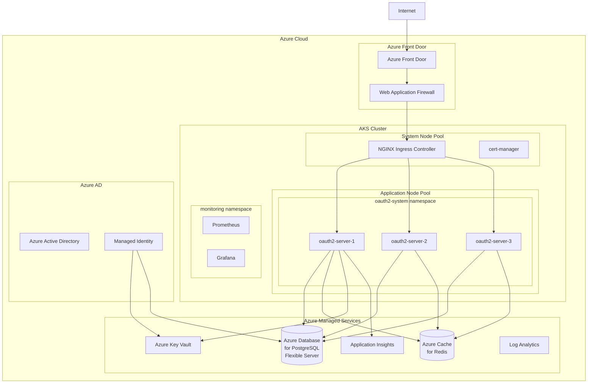

# Azure AKS Deployment

This guide covers deploying the OAuth2 Authorization Server to Azure Kubernetes Service (AKS) with Azure Database for PostgreSQL and Azure Cache for Redis.

## Architecture



## Prerequisites

- Azure CLI installed (`az`)
- kubectl installed
- Helm 3.x installed
- Azure subscription with required permissions

## Infrastructure Setup

### 1. Create Resource Group

```bash
# Set variables
export RESOURCE_GROUP="oauth2-prod-rg"
export LOCATION="eastus"
export CLUSTER_NAME="oauth2-aks-cluster"

# Create resource group
az group create --name $RESOURCE_GROUP --location $LOCATION
```

### 2. Create AKS Cluster

```bash
# Create AKS cluster with managed identity
az aks create \
  --resource-group $RESOURCE_GROUP \
  --name $CLUSTER_NAME \
  --node-count 3 \
  --node-vm-size Standard_D4s_v3 \
  --enable-managed-identity \
  --enable-addons monitoring \
  --network-plugin azure \
  --network-policy azure \
  --zones 1 2 3 \
  --generate-ssh-keys \
  --enable-cluster-autoscaler \
  --min-count 3 \
  --max-count 10

# Get credentials
az aks get-credentials --resource-group $RESOURCE_GROUP --name $CLUSTER_NAME
```

### 3. Create Azure Database for PostgreSQL

```bash
export PG_SERVER_NAME="oauth2-postgres-$(openssl rand -hex 4)"
export PG_ADMIN_USER="pgadmin"
export PG_ADMIN_PASSWORD="$(openssl rand -base64 24)"

# Create PostgreSQL Flexible Server
az postgres flexible-server create \
  --resource-group $RESOURCE_GROUP \
  --name $PG_SERVER_NAME \
  --location $LOCATION \
  --admin-user $PG_ADMIN_USER \
  --admin-password "$PG_ADMIN_PASSWORD" \
  --sku-name Standard_D2s_v3 \
  --tier GeneralPurpose \
  --storage-size 128 \
  --version 15 \
  --high-availability ZoneRedundant \
  --zone 1 \
  --standby-zone 2

# Create database
az postgres flexible-server db create \
  --resource-group $RESOURCE_GROUP \
  --server-name $PG_SERVER_NAME \
  --database-name oauth2db

# Enable Azure AD authentication (optional)
az postgres flexible-server ad-admin create \
  --resource-group $RESOURCE_GROUP \
  --server-name $PG_SERVER_NAME \
  --display-name "OAuth2 Admin" \
  --object-id "<your-aad-group-object-id>"

# Allow AKS to connect
AKS_SUBNET_ID=$(az aks show --resource-group $RESOURCE_GROUP --name $CLUSTER_NAME --query "agentPoolProfiles[0].vnetSubnetId" -o tsv)
az postgres flexible-server firewall-rule create \
  --resource-group $RESOURCE_GROUP \
  --name $PG_SERVER_NAME \
  --rule-name AllowAKS \
  --start-ip-address 0.0.0.0 \
  --end-ip-address 255.255.255.255

# For production, use Private Endpoint instead
az network private-endpoint create \
  --resource-group $RESOURCE_GROUP \
  --name oauth2-postgres-pe \
  --vnet-name $(az aks show -g $RESOURCE_GROUP -n $CLUSTER_NAME --query nodeResourceGroup -o tsv) \
  --subnet default \
  --private-connection-resource-id $(az postgres flexible-server show -g $RESOURCE_GROUP -n $PG_SERVER_NAME --query id -o tsv) \
  --group-id postgresqlServer \
  --connection-name oauth2-postgres-connection
```

### 4. Create Azure Cache for Redis

```bash
export REDIS_NAME="oauth2-redis-$(openssl rand -hex 4)"

# Create Redis Cache
az redis create \
  --resource-group $RESOURCE_GROUP \
  --name $REDIS_NAME \
  --location $LOCATION \
  --sku Premium \
  --vm-size P1 \
  --zones 1 2 3 \
  --enable-non-ssl-port false \
  --minimum-tls-version 1.2

# Get Redis connection string
REDIS_KEY=$(az redis list-keys --resource-group $RESOURCE_GROUP --name $REDIS_NAME --query primaryKey -o tsv)
REDIS_HOST="$REDIS_NAME.redis.cache.windows.net"
```

### 5. Create Azure Key Vault

```bash
export KEY_VAULT_NAME="oauth2-kv-$(openssl rand -hex 4)"

# Create Key Vault
az keyvault create \
  --resource-group $RESOURCE_GROUP \
  --name $KEY_VAULT_NAME \
  --location $LOCATION \
  --enable-rbac-authorization true

# Get AKS Managed Identity
AKS_IDENTITY=$(az aks show -g $RESOURCE_GROUP -n $CLUSTER_NAME --query identityProfile.kubeletidentity.clientId -o tsv)

# Grant access to Key Vault
az role assignment create \
  --role "Key Vault Secrets User" \
  --assignee $AKS_IDENTITY \
  --scope $(az keyvault show -n $KEY_VAULT_NAME --query id -o tsv)

# Store secrets
az keyvault secret set --vault-name $KEY_VAULT_NAME --name database-url --value "jdbc:postgresql://$PG_SERVER_NAME.postgres.database.azure.com:5432/oauth2db?sslmode=require"
az keyvault secret set --vault-name $KEY_VAULT_NAME --name database-username --value $PG_ADMIN_USER
az keyvault secret set --vault-name $KEY_VAULT_NAME --name database-password --value "$PG_ADMIN_PASSWORD"
az keyvault secret set --vault-name $KEY_VAULT_NAME --name oauth2-demo-client-secret --value "$(openssl rand -base64 32)"
az keyvault secret set --vault-name $KEY_VAULT_NAME --name oauth2-m2m-client-secret --value "$(openssl rand -base64 32)"
az keyvault secret set --vault-name $KEY_VAULT_NAME --name redis-password --value "$REDIS_KEY"
```

### 6. Install Prerequisites in AKS

```bash
# Install NGINX Ingress Controller
helm repo add ingress-nginx https://kubernetes.github.io/ingress-nginx
helm repo update

helm install ingress-nginx ingress-nginx/ingress-nginx \
  --namespace ingress-nginx \
  --create-namespace \
  --set controller.replicaCount=2 \
  --set controller.service.annotations."service\.beta\.kubernetes\.io/azure-load-balancer-health-probe-request-path"=/healthz

# Install cert-manager
helm repo add jetstack https://charts.jetstack.io
helm repo update

helm install cert-manager jetstack/cert-manager \
  --namespace cert-manager \
  --create-namespace \
  --set installCRDs=true

# Install Azure Key Vault Provider for Secrets Store CSI Driver
helm repo add csi-secrets-store-provider-azure https://azure.github.io/secrets-store-csi-driver-provider-azure/charts
helm repo update

helm install csi-secrets-store csi-secrets-store-provider-azure/csi-secrets-store-provider-azure \
  --namespace kube-system
```

## Kubernetes Configuration

### SecretProviderClass for Azure Key Vault

```yaml
# secret-provider-class.yaml
apiVersion: secrets-store.csi.x-k8s.io/v1
kind: SecretProviderClass
metadata:
  name: oauth2-server-secrets
  namespace: oauth2-system
spec:
  provider: azure
  parameters:
    usePodIdentity: "false"
    useVMManagedIdentity: "true"
    userAssignedIdentityID: "${AKS_IDENTITY}"
    keyvaultName: "${KEY_VAULT_NAME}"
    cloudName: "AzurePublicCloud"
    objects: |
      array:
        - |
          objectName: database-url
          objectType: secret
        - |
          objectName: database-username
          objectType: secret
        - |
          objectName: database-password
          objectType: secret
        - |
          objectName: oauth2-demo-client-secret
          objectType: secret
        - |
          objectName: oauth2-m2m-client-secret
          objectType: secret
        - |
          objectName: redis-password
          objectType: secret
    tenantId: "${AZURE_TENANT_ID}"
  secretObjects:
    - secretName: oauth2-server-secrets
      type: Opaque
      data:
        - objectName: database-url
          key: DATABASE_URL
        - objectName: database-username
          key: DATABASE_USERNAME
        - objectName: database-password
          key: DATABASE_PASSWORD
        - objectName: oauth2-demo-client-secret
          key: OAUTH2_DEMO_CLIENT_SECRET
        - objectName: oauth2-m2m-client-secret
          key: OAUTH2_M2M_CLIENT_SECRET
        - objectName: redis-password
          key: REDIS_PASSWORD
```

### Azure-Specific Deployment

```yaml
# deployment-azure.yaml
apiVersion: apps/v1
kind: Deployment
metadata:
  name: oauth2-server
  namespace: oauth2-system
  labels:
    app: oauth2-server
    azure.workload.identity/use: "true"
spec:
  replicas: 3
  selector:
    matchLabels:
      app: oauth2-server
  template:
    metadata:
      labels:
        app: oauth2-server
      annotations:
        prometheus.io/scrape: "true"
        prometheus.io/path: "/actuator/prometheus"
        prometheus.io/port: "9000"
    spec:
      serviceAccountName: oauth2-server
      securityContext:
        runAsNonRoot: true
        runAsUser: 1001
        fsGroup: 1001
      containers:
        - name: oauth2-server
          image: ghcr.io/ianlintner/bootsandcats/oauth2-server:latest
          ports:
            - name: http
              containerPort: 9000
          env:
            - name: SPRING_PROFILES_ACTIVE
              value: "prod"
            - name: OAUTH2_ISSUER_URL
              value: "https://auth.example.com"
            - name: APPLICATIONINSIGHTS_CONNECTION_STRING
              valueFrom:
                secretKeyRef:
                  name: azure-app-insights
                  key: connection-string
          envFrom:
            - secretRef:
                name: oauth2-server-secrets
          resources:
            requests:
              cpu: "500m"
              memory: "1Gi"
            limits:
              cpu: "2000m"
              memory: "4Gi"
          livenessProbe:
            httpGet:
              path: /actuator/health/liveness
              port: 9000
            initialDelaySeconds: 60
            periodSeconds: 10
          readinessProbe:
            httpGet:
              path: /actuator/health/readiness
              port: 9000
            initialDelaySeconds: 30
            periodSeconds: 5
          volumeMounts:
            - name: secrets-store
              mountPath: /mnt/secrets-store
              readOnly: true
            - name: tmp
              mountPath: /tmp
      volumes:
        - name: secrets-store
          csi:
            driver: secrets-store.csi.k8s.io
            readOnly: true
            volumeAttributes:
              secretProviderClass: oauth2-server-secrets
        - name: tmp
          emptyDir: {}
      topologySpreadConstraints:
        - maxSkew: 1
          topologyKey: topology.kubernetes.io/zone
          whenUnsatisfiable: DoNotSchedule
          labelSelector:
            matchLabels:
              app: oauth2-server
```

### Azure Ingress with Azure Front Door

```yaml
# ingress-azure.yaml
apiVersion: networking.k8s.io/v1
kind: Ingress
metadata:
  name: oauth2-server
  namespace: oauth2-system
  annotations:
    kubernetes.io/ingress.class: nginx
    cert-manager.io/cluster-issuer: letsencrypt-prod
    nginx.ingress.kubernetes.io/ssl-redirect: "true"
    nginx.ingress.kubernetes.io/proxy-body-size: "10m"
    # Azure Front Door health probe path
    nginx.ingress.kubernetes.io/health-check-path: "/actuator/health"
spec:
  tls:
    - hosts:
        - auth.example.com
      secretName: oauth2-server-tls
  rules:
    - host: auth.example.com
      http:
        paths:
          - path: /
            pathType: Prefix
            backend:
              service:
                name: oauth2-server
                port:
                  number: 80
```

## Observability with Azure Monitor

### Application Insights Integration

```yaml
# application-insights-config.yaml
apiVersion: v1
kind: ConfigMap
metadata:
  name: oauth2-server-config
  namespace: oauth2-system
data:
  APPLICATIONINSIGHTS_CONFIGURATION_FILE: "/etc/applicationinsights/applicationinsights.json"
---
apiVersion: v1
kind: ConfigMap
metadata:
  name: applicationinsights-config
  namespace: oauth2-system
data:
  applicationinsights.json: |
    {
      "role": {
        "name": "oauth2-authorization-server"
      },
      "sampling": {
        "percentage": 50
      },
      "preview": {
        "sampling": {
          "overrides": [
            {
              "telemetryType": "request",
              "attributes": [
                {
                  "key": "http.url",
                  "value": "/actuator/.*",
                  "matchType": "regexp"
                }
              ],
              "percentage": 0
            }
          ]
        }
      }
    }
```

### Azure Monitor Alerts

```bash
# Create action group
az monitor action-group create \
  --resource-group $RESOURCE_GROUP \
  --name oauth2-alerts \
  --short-name oauth2 \
  --email-receiver name="On-Call" email="oncall@example.com"

# Create alert rules
# High Error Rate
az monitor metrics alert create \
  --resource-group $RESOURCE_GROUP \
  --name "oauth2-high-error-rate" \
  --scopes $(az aks show -g $RESOURCE_GROUP -n $CLUSTER_NAME --query id -o tsv) \
  --condition "avg http_server_requests_seconds_count{status=~'5..'} > 10" \
  --window-size 5m \
  --evaluation-frequency 1m \
  --action oauth2-alerts \
  --severity 2

# High Latency
az monitor metrics alert create \
  --resource-group $RESOURCE_GROUP \
  --name "oauth2-high-latency" \
  --scopes $(az aks show -g $RESOURCE_GROUP -n $CLUSTER_NAME --query id -o tsv) \
  --condition "avg http_server_requests_seconds{quantile='0.95'} > 2" \
  --window-size 5m \
  --evaluation-frequency 1m \
  --action oauth2-alerts \
  --severity 3
```

## Deployment Script

```bash
#!/bin/bash
# deploy-azure.sh

set -e

NAMESPACE="oauth2-system"

echo "Creating namespace..."
kubectl create namespace $NAMESPACE --dry-run=client -o yaml | kubectl apply -f -

echo "Applying SecretProviderClass..."
envsubst < secret-provider-class.yaml | kubectl apply -f -

echo "Applying ConfigMaps..."
kubectl apply -f configmap.yaml

echo "Applying Deployment..."
kubectl apply -f deployment-azure.yaml

echo "Applying Service..."
kubectl apply -f service.yaml

echo "Applying Ingress..."
kubectl apply -f ingress-azure.yaml

echo "Applying HPA..."
kubectl apply -f hpa.yaml

echo "Applying PDB..."
kubectl apply -f pdb.yaml

echo "Waiting for deployment..."
kubectl rollout status deployment/oauth2-server -n $NAMESPACE

echo "Deployment complete!"
kubectl get pods -n $NAMESPACE
```

## Verification

```bash
# Check pods
kubectl get pods -n oauth2-system

# Check service
kubectl get svc -n oauth2-system

# Check ingress
kubectl get ingress -n oauth2-system

# Test health endpoint
kubectl port-forward svc/oauth2-server 9000:80 -n oauth2-system &
curl http://localhost:9000/actuator/health

# Test OIDC discovery
curl https://auth.example.com/.well-known/openid-configuration
```

## Cost Optimization

| Resource | SKU | Monthly Cost (Est.) |
|----------|-----|---------------------|
| AKS Cluster (3 nodes D4s v3) | Standard | ~$450 |
| PostgreSQL Flexible Server (D2s v3, HA) | General Purpose | ~$200 |
| Azure Cache for Redis (P1) | Premium | ~$200 |
| Azure Front Door | Standard | ~$35 |
| Azure Key Vault | Standard | ~$3 |
| Log Analytics | Pay-as-you-go | ~$50 |
| **Total** | | **~$940/month** |

## Next Steps

- [GCP Deployment](gcp.md) - Alternative deployment on Google Cloud
- [AWS Deployment](aws.md) - Alternative deployment on AWS
- [Observability](../observability/overview.md) - Configure monitoring
- [Operations](../operations/slos.md) - SLOs and runbooks
