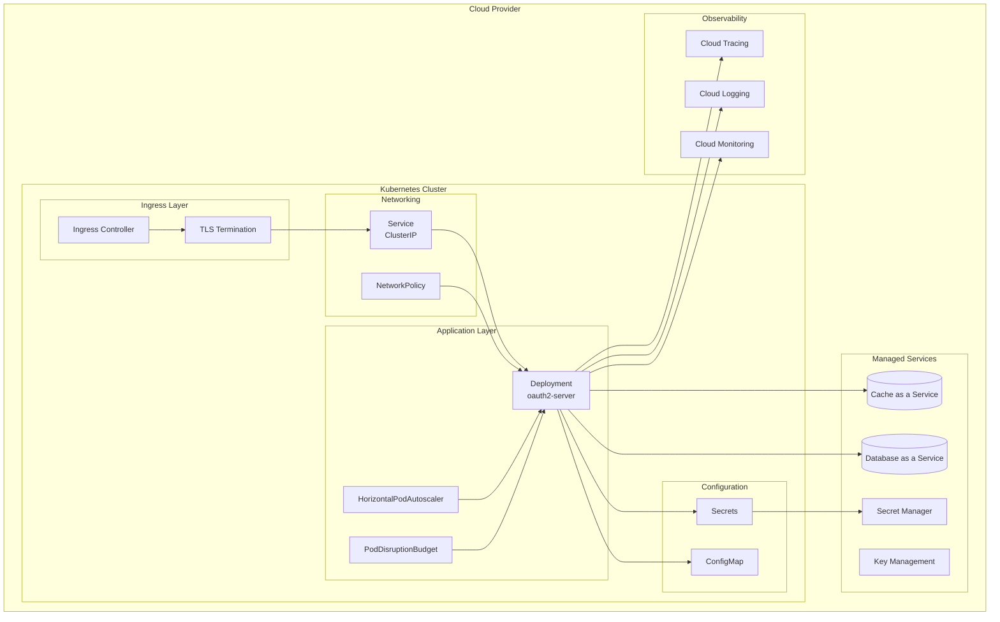

# Deployment Overview

This guide covers deploying the OAuth2 Authorization Server to Kubernetes clusters across major cloud providers.

## Deployment Architecture



## Kubernetes Resources

### Core Resources

| Resource | Purpose |
|----------|---------|
| Deployment | Manages OAuth2 server pods |
| Service | Internal cluster networking |
| Ingress | External access and TLS termination |
| ConfigMap | Non-sensitive configuration |
| Secret | Sensitive configuration (credentials) |
| HorizontalPodAutoscaler | Auto-scaling based on metrics |
| PodDisruptionBudget | Ensures availability during updates |
| NetworkPolicy | Network segmentation |

### Base Kubernetes Manifests

#### Namespace

```yaml
# namespace.yaml
apiVersion: v1
kind: Namespace
metadata:
  name: oauth2-system
  labels:
    name: oauth2-system
    istio-injection: enabled  # Optional: for service mesh
```

#### ConfigMap

```yaml
# configmap.yaml
apiVersion: v1
kind: ConfigMap
metadata:
  name: oauth2-server-config
  namespace: oauth2-system
data:
  SPRING_PROFILES_ACTIVE: "prod"
  SERVER_PORT: "9000"
  MANAGEMENT_ENDPOINTS_WEB_EXPOSURE_INCLUDE: "health,info,prometheus"
  MANAGEMENT_ENDPOINT_HEALTH_PROBES_ENABLED: "true"
  OTEL_SERVICE_NAME: "oauth2-authorization-server"
  OTEL_TRACES_EXPORTER: "otlp"
  OTEL_METRICS_EXPORTER: "prometheus"
  LOGGING_LEVEL_ROOT: "INFO"
  LOGGING_LEVEL_COM_BOOTSANDCATS: "INFO"
```

#### Deployment

```yaml
# deployment.yaml
apiVersion: apps/v1
kind: Deployment
metadata:
  name: oauth2-server
  namespace: oauth2-system
  labels:
    app: oauth2-server
    version: v1
spec:
  replicas: 3
  selector:
    matchLabels:
      app: oauth2-server
  template:
    metadata:
      labels:
        app: oauth2-server
        version: v1
      annotations:
        prometheus.io/scrape: "true"
        prometheus.io/path: "/actuator/prometheus"
        prometheus.io/port: "9000"
    spec:
      serviceAccountName: oauth2-server
      securityContext:
        runAsNonRoot: true
        runAsUser: 1001
        fsGroup: 1001
      containers:
        - name: oauth2-server
          image: ghcr.io/ianlintner/bootsandcats/oauth2-server:latest
          imagePullPolicy: Always
          ports:
            - name: http
              containerPort: 9000
              protocol: TCP
          envFrom:
            - configMapRef:
                name: oauth2-server-config
            - secretRef:
                name: oauth2-server-secrets
          resources:
            requests:
              cpu: "500m"
              memory: "1Gi"
            limits:
              cpu: "2000m"
              memory: "4Gi"
          livenessProbe:
            httpGet:
              path: /actuator/health/liveness
              port: 9000
            initialDelaySeconds: 60
            periodSeconds: 10
            timeoutSeconds: 5
            failureThreshold: 3
          readinessProbe:
            httpGet:
              path: /actuator/health/readiness
              port: 9000
            initialDelaySeconds: 30
            periodSeconds: 5
            timeoutSeconds: 3
            failureThreshold: 3
          securityContext:
            allowPrivilegeEscalation: false
            readOnlyRootFilesystem: true
            capabilities:
              drop:
                - ALL
          volumeMounts:
            - name: tmp
              mountPath: /tmp
      volumes:
        - name: tmp
          emptyDir: {}
      affinity:
        podAntiAffinity:
          preferredDuringSchedulingIgnoredDuringExecution:
            - weight: 100
              podAffinityTerm:
                labelSelector:
                  matchExpressions:
                    - key: app
                      operator: In
                      values:
                        - oauth2-server
                topologyKey: kubernetes.io/hostname
      topologySpreadConstraints:
        - maxSkew: 1
          topologyKey: topology.kubernetes.io/zone
          whenUnsatisfiable: ScheduleAnyway
          labelSelector:
            matchLabels:
              app: oauth2-server
```

#### Service

```yaml
# service.yaml
apiVersion: v1
kind: Service
metadata:
  name: oauth2-server
  namespace: oauth2-system
  labels:
    app: oauth2-server
spec:
  type: ClusterIP
  ports:
    - name: http
      port: 80
      targetPort: 9000
      protocol: TCP
  selector:
    app: oauth2-server
```

#### Ingress

```yaml
# ingress.yaml
apiVersion: networking.k8s.io/v1
kind: Ingress
metadata:
  name: oauth2-server
  namespace: oauth2-system
  annotations:
    kubernetes.io/ingress.class: nginx
    cert-manager.io/cluster-issuer: letsencrypt-prod
    nginx.ingress.kubernetes.io/ssl-redirect: "true"
    nginx.ingress.kubernetes.io/proxy-body-size: "10m"
    nginx.ingress.kubernetes.io/rate-limit: "100"
    nginx.ingress.kubernetes.io/rate-limit-window: "1m"
spec:
  tls:
    - hosts:
        - auth.example.com
      secretName: oauth2-server-tls
  rules:
    - host: auth.example.com
      http:
        paths:
          - path: /
            pathType: Prefix
            backend:
              service:
                name: oauth2-server
                port:
                  number: 80
```

#### HorizontalPodAutoscaler

```yaml
# hpa.yaml
apiVersion: autoscaling/v2
kind: HorizontalPodAutoscaler
metadata:
  name: oauth2-server
  namespace: oauth2-system
spec:
  scaleTargetRef:
    apiVersion: apps/v1
    kind: Deployment
    name: oauth2-server
  minReplicas: 3
  maxReplicas: 10
  metrics:
    - type: Resource
      resource:
        name: cpu
        target:
          type: Utilization
          averageUtilization: 70
    - type: Resource
      resource:
        name: memory
        target:
          type: Utilization
          averageUtilization: 80
  behavior:
    scaleDown:
      stabilizationWindowSeconds: 300
      policies:
        - type: Percent
          value: 10
          periodSeconds: 60
    scaleUp:
      stabilizationWindowSeconds: 0
      policies:
        - type: Percent
          value: 100
          periodSeconds: 15
        - type: Pods
          value: 4
          periodSeconds: 15
      selectPolicy: Max
```

#### PodDisruptionBudget

```yaml
# pdb.yaml
apiVersion: policy/v1
kind: PodDisruptionBudget
metadata:
  name: oauth2-server
  namespace: oauth2-system
spec:
  minAvailable: 2
  selector:
    matchLabels:
      app: oauth2-server
```

#### NetworkPolicy

```yaml
# networkpolicy.yaml
apiVersion: networking.k8s.io/v1
kind: NetworkPolicy
metadata:
  name: oauth2-server
  namespace: oauth2-system
spec:
  podSelector:
    matchLabels:
      app: oauth2-server
  policyTypes:
    - Ingress
    - Egress
  ingress:
    - from:
        - namespaceSelector:
            matchLabels:
              name: ingress-nginx
      ports:
        - protocol: TCP
          port: 9000
    - from:
        - namespaceSelector:
            matchLabels:
              name: monitoring
      ports:
        - protocol: TCP
          port: 9000
  egress:
    - to:
        - namespaceSelector:
            matchLabels:
              name: database
      ports:
        - protocol: TCP
          port: 5432
    - to:
        - ipBlock:
            cidr: 0.0.0.0/0
      ports:
        - protocol: TCP
          port: 443
        - protocol: TCP
          port: 4317  # OpenTelemetry
```

## Pre-Deployment Checklist

### Infrastructure

- [ ] Kubernetes cluster provisioned
- [ ] Ingress controller installed (nginx, istio, etc.)
- [ ] cert-manager installed for TLS certificates
- [ ] DNS configured for auth domain
- [ ] Network policies supported by CNI

### Database

- [ ] PostgreSQL instance provisioned
- [ ] Database created: `oauth2db`
- [ ] Database user with appropriate permissions
- [ ] Connection string tested
- [ ] TLS/SSL configured

### Secrets Management

- [ ] Secret Manager configured (AWS Secrets Manager, GCP Secret Manager, Azure Key Vault)
- [ ] Secrets created for:
    - [ ] `DATABASE_PASSWORD`
    - [ ] `OAUTH2_DEMO_CLIENT_SECRET`
    - [ ] `OAUTH2_M2M_CLIENT_SECRET`
- [ ] External Secrets Operator installed (optional)

### Observability

- [ ] Prometheus/Grafana stack deployed
- [ ] OpenTelemetry collector configured
- [ ] Log aggregation configured
- [ ] Alerting rules defined

## Deployment Commands

```bash
# Create namespace
kubectl apply -f namespace.yaml

# Create secrets (or use External Secrets Operator)
kubectl create secret generic oauth2-server-secrets \
  --namespace oauth2-system \
  --from-literal=DATABASE_URL="jdbc:postgresql://host:5432/oauth2db" \
  --from-literal=DATABASE_USERNAME="oauth2_user" \
  --from-literal=DATABASE_PASSWORD="secure-password" \
  --from-literal=OAUTH2_DEMO_CLIENT_SECRET="secure-secret-1" \
  --from-literal=OAUTH2_M2M_CLIENT_SECRET="secure-secret-2"

# Apply resources
kubectl apply -f configmap.yaml
kubectl apply -f deployment.yaml
kubectl apply -f service.yaml
kubectl apply -f ingress.yaml
kubectl apply -f hpa.yaml
kubectl apply -f pdb.yaml
kubectl apply -f networkpolicy.yaml

# Verify deployment
kubectl -n oauth2-system get pods
kubectl -n oauth2-system get svc
kubectl -n oauth2-system get ingress

# Check logs
kubectl -n oauth2-system logs -l app=oauth2-server -f

# Test health endpoint
kubectl -n oauth2-system port-forward svc/oauth2-server 9000:80
curl http://localhost:9000/actuator/health
```

## Cloud-Specific Guides

For detailed cloud-specific deployment instructions, see:

- [Azure AKS Deployment](azure.md) - Azure Kubernetes Service with Azure Database for PostgreSQL and Azure Cache for Redis
- [Google Cloud GKE Deployment](gcp.md) - Google Kubernetes Engine with Cloud SQL and Memorystore
- [AWS EKS Deployment](aws.md) - Elastic Kubernetes Service with RDS and ElastiCache

## Production Recommendations

### High Availability

| Setting | Recommendation | Reason |
|---------|----------------|--------|
| Replicas | Minimum 3 | Survive node failures |
| Pod Anti-Affinity | Enabled | Spread across nodes |
| Zone Distribution | Multi-zone | Survive zone failures |
| PDB | minAvailable: 2 | Safe rolling updates |

### Resource Sizing

| Environment | CPU Request | Memory Request | Replicas |
|-------------|-------------|----------------|----------|
| Development | 250m | 512Mi | 1 |
| Staging | 500m | 1Gi | 2 |
| Production | 1000m | 2Gi | 3-10 |

### Security

| Control | Implementation |
|---------|----------------|
| TLS | Required for all external traffic |
| Network Policies | Restrict pod communication |
| Non-root user | Container runs as UID 1001 |
| Read-only filesystem | Enabled with /tmp writable |
| Secret rotation | 90-day rotation policy |

## Next Steps

- [Azure Deployment](azure.md) - Deploy to Azure AKS
- [GCP Deployment](gcp.md) - Deploy to Google Cloud GKE
- [AWS Deployment](aws.md) - Deploy to Amazon EKS
- [Observability Setup](../observability/overview.md) - Configure monitoring
- [Operations Guide](../operations/slos.md) - SLOs and runbooks
