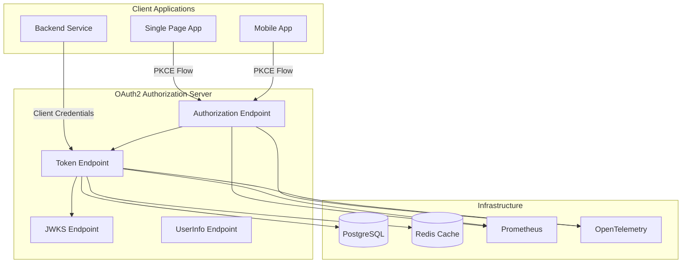
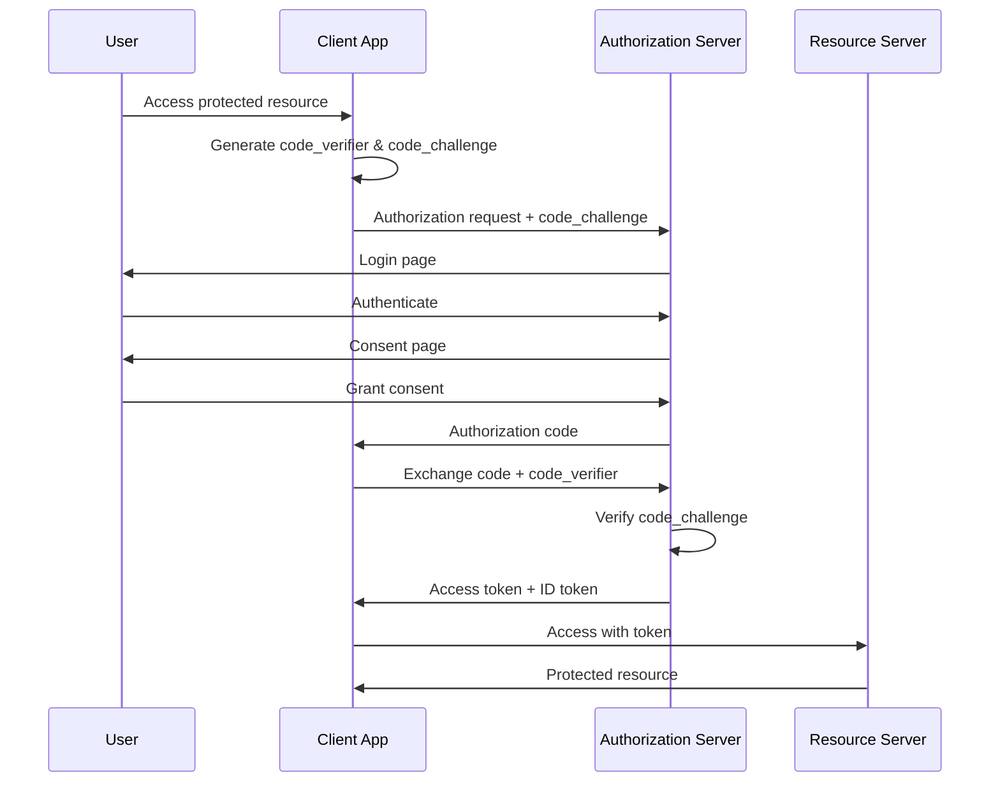
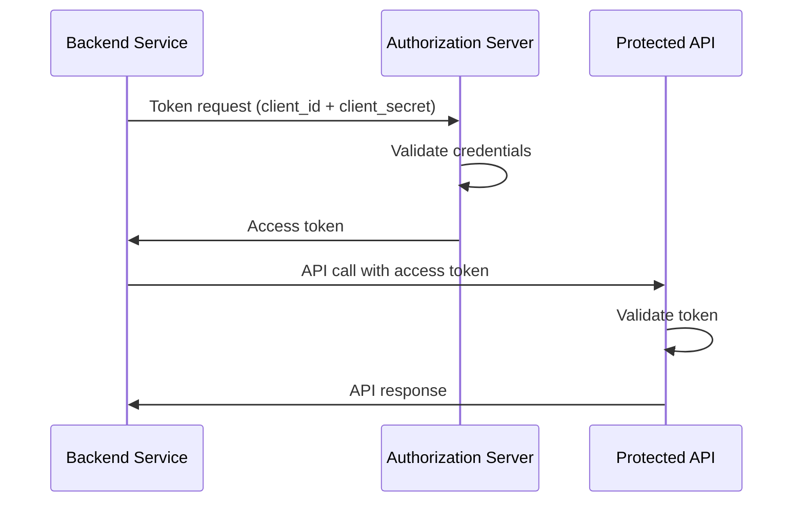

# OAuth2 Authorization Server

Welcome to the OAuth2 Authorization Server documentation. This is a production-ready Spring Boot OAuth2 Authorization Server with OpenID Connect (OIDC), PKCE support, JWT tokens, and comprehensive observability features.

## Overview

## Key Features

| Feature | Description |
|---------|-------------|
| **OAuth2 2.1 Compliant** | Full compliance with OAuth2 2.1 specification |
| **OpenID Connect (OIDC)** | OIDC 1.0 support with discovery endpoint |
| **PKCE Support** | Proof Key for Code Exchange for public clients |
| **JWT Tokens** | ES256/RS256-signed JWT access tokens |
| **Multiple Grant Types** | Authorization Code, Client Credentials, Refresh Token |
| **Envoy Native Filters** | Istio/Envoy OAuth2 + JWT filters for downstream services |
| **OpenTelemetry** | Distributed tracing and metrics |
| **Prometheus Metrics** | Ready for Grafana dashboards |
| **AKS + Istio Ready** | Health probes, graceful shutdown, Azure-first Kubernetes setup |

## Quick Links

-   :material-rocket-launch:{ .lg .middle } **Getting Started**

    ---

    Get up and running quickly with our step-by-step guide

    [:octicons-arrow-right-24: Getting Started](getting-started.md)

-   :material-server:{ .lg .middle } **Architecture**

    ---

    Understand the system architecture and security design

    [:octicons-arrow-right-24: Architecture Overview](architecture/overview.md)

-   :material-kubernetes:{ .lg .middle } **Deployment**

    ---

    Deploy to Azure Kubernetes Service (AKS) with Istio + Envoy filters

    [:octicons-arrow-right-24: Deployment Guide](deployment/overview.md)

-   :material-api:{ .lg .middle } **API Reference**

    ---

    Complete API documentation for all endpoints

    [:octicons-arrow-right-24: API Reference](api/oauth2-endpoints.md)

-   :material-chart-line:{ .lg .middle } **Observability**

    ---

    Monitoring, metrics, and distributed tracing

    [:octicons-arrow-right-24: Observability](observability/overview.md)

-   :material-book-open-variant:{ .lg .middle } **Operations**

    ---

    Runbooks, SLOs, and incident response procedures

    [:octicons-arrow-right-24: Operations](operations/slos.md)

## Supported OAuth2 Flows

### Authorization Code with PKCE

Recommended for single-page applications (SPAs) and mobile applications:

### Client Credentials

For machine-to-machine (M2M) authentication:

## Technology Stack

| Component | Technology |
|-----------|------------|
| Framework | Spring Boot 3.2 |
| OAuth2 Server | Spring Authorization Server 1.2 |
| Database | PostgreSQL 15 |
| Cache | Redis (optional) |
| Metrics | Micrometer + Prometheus |
| Tracing | OpenTelemetry |
| Container | Docker with multi-stage builds |
| Orchestration | Kubernetes |

## Security Highlights

!!! warning "Production Credentials"
    Default credentials provided in this documentation are for development purposes only. 
    Always use secure, randomly generated credentials in production environments.

- **BCrypt Password Encoding** with cost factor 12
- **CSRF Protection** on all state-changing operations
- **Security Headers** (CSP, HSTS, X-Frame-Options)
- **JWT Token Signing** with RSA-256
- **PKCE Enforcement** for public clients
- **Token Introspection** and **Revocation** support

## Getting Help

- 📚 [GitHub Repository](https://github.com/ianlintner/bootsandcats)
- 🐛 [Issue Tracker](https://github.com/ianlintner/bootsandcats/issues)
- 📖 [API Documentation](api/oauth2-endpoints.md)
- 🔧 [Troubleshooting Guide](operations/runbooks/common-issues.md)
