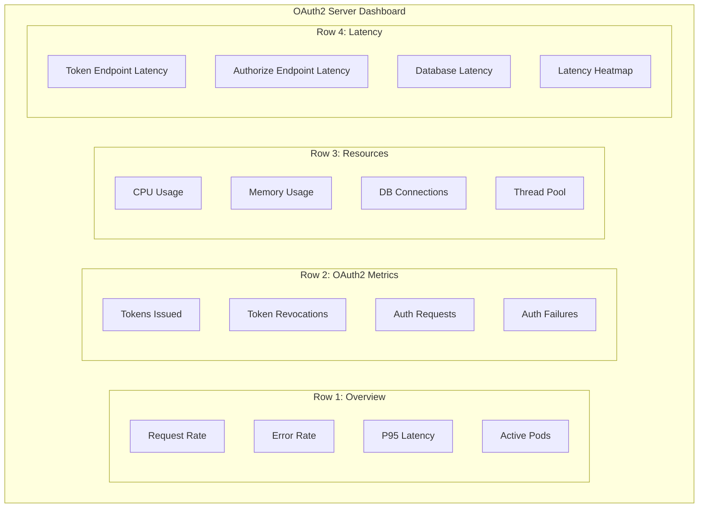

# Grafana Dashboards

This document provides configuration and setup for Grafana dashboards to monitor the OAuth2 Authorization Server.

## Dashboard Overview



---

## Dashboard JSON

### OAuth2 Server Dashboard

```json
{
  "dashboard": {
    "id": null,
    "uid": "oauth2-server",
    "title": "OAuth2 Authorization Server",
    "tags": ["oauth2", "authentication", "security"],
    "timezone": "browser",
    "schemaVersion": 30,
    "refresh": "30s",
    "templating": {
      "list": [
        {
          "name": "namespace",
          "type": "query",
          "query": "label_values(up{job=\"oauth2-server\"}, namespace)",
          "datasource": "Prometheus"
        }
      ]
    },
    "panels": [
      {
        "title": "Request Rate",
        "type": "stat",
        "gridPos": {"h": 4, "w": 6, "x": 0, "y": 0},
        "targets": [
          {
            "expr": "sum(rate(http_server_requests_seconds_count{job=\"oauth2-server\"}[5m]))",
            "legendFormat": "req/s"
          }
        ],
        "options": {
          "colorMode": "value",
          "graphMode": "area"
        }
      },
      {
        "title": "Error Rate",
        "type": "stat",
        "gridPos": {"h": 4, "w": 6, "x": 6, "y": 0},
        "targets": [
          {
            "expr": "sum(rate(http_server_requests_seconds_count{job=\"oauth2-server\",status=~\"5..\"}[5m])) / sum(rate(http_server_requests_seconds_count{job=\"oauth2-server\"}[5m])) * 100",
            "legendFormat": "%"
          }
        ],
        "thresholds": {
          "steps": [
            {"color": "green", "value": null},
            {"color": "yellow", "value": 1},
            {"color": "red", "value": 5}
          ]
        }
      },
      {
        "title": "P95 Latency",
        "type": "stat",
        "gridPos": {"h": 4, "w": 6, "x": 12, "y": 0},
        "targets": [
          {
            "expr": "histogram_quantile(0.95, sum(rate(http_server_requests_seconds_bucket{job=\"oauth2-server\"}[5m])) by (le))",
            "legendFormat": "seconds"
          }
        ],
        "fieldConfig": {
          "defaults": {
            "unit": "s"
          }
        },
        "thresholds": {
          "steps": [
            {"color": "green", "value": null},
            {"color": "yellow", "value": 1},
            {"color": "red", "value": 2}
          ]
        }
      },
      {
        "title": "Active Pods",
        "type": "stat",
        "gridPos": {"h": 4, "w": 6, "x": 18, "y": 0},
        "targets": [
          {
            "expr": "count(up{job=\"oauth2-server\"} == 1)",
            "legendFormat": "pods"
          }
        ]
      },
      {
        "title": "Request Rate by Endpoint",
        "type": "graph",
        "gridPos": {"h": 8, "w": 12, "x": 0, "y": 4},
        "targets": [
          {
            "expr": "sum(rate(http_server_requests_seconds_count{job=\"oauth2-server\"}[5m])) by (uri)",
            "legendFormat": "{{uri}}"
          }
        ],
        "yAxes": [{"format": "reqps", "min": 0}]
      },
      {
        "title": "Error Rate by Status Code",
        "type": "graph",
        "gridPos": {"h": 8, "w": 12, "x": 12, "y": 4},
        "targets": [
          {
            "expr": "sum(rate(http_server_requests_seconds_count{job=\"oauth2-server\",status=~\"[45]..\"}[5m])) by (status)",
            "legendFormat": "{{status}}"
          }
        ]
      },
      {
        "title": "Tokens Issued",
        "type": "graph",
        "gridPos": {"h": 6, "w": 6, "x": 0, "y": 12},
        "targets": [
          {
            "expr": "rate(oauth2_tokens_issued_total[5m]) * 60",
            "legendFormat": "tokens/min"
          }
        ]
      },
      {
        "title": "Authorization Requests",
        "type": "graph",
        "gridPos": {"h": 6, "w": 6, "x": 6, "y": 12},
        "targets": [
          {
            "expr": "rate(oauth2_authorization_requests_total[5m]) * 60",
            "legendFormat": "requests/min"
          }
        ]
      },
      {
        "title": "Authorization Failures",
        "type": "graph",
        "gridPos": {"h": 6, "w": 6, "x": 12, "y": 12},
        "targets": [
          {
            "expr": "rate(oauth2_authorization_failed_total[5m]) * 60",
            "legendFormat": "failures/min"
          }
        ]
      },
      {
        "title": "Token Revocations",
        "type": "graph",
        "gridPos": {"h": 6, "w": 6, "x": 18, "y": 12},
        "targets": [
          {
            "expr": "rate(oauth2_tokens_revoked_total[5m]) * 60",
            "legendFormat": "revocations/min"
          }
        ]
      },
      {
        "title": "CPU Usage",
        "type": "graph",
        "gridPos": {"h": 6, "w": 6, "x": 0, "y": 18},
        "targets": [
          {
            "expr": "process_cpu_usage{job=\"oauth2-server\"} * 100",
            "legendFormat": "{{instance}}"
          }
        ],
        "yAxes": [{"format": "percent", "max": 100, "min": 0}]
      },
      {
        "title": "Memory Usage",
        "type": "graph",
        "gridPos": {"h": 6, "w": 6, "x": 6, "y": 18},
        "targets": [
          {
            "expr": "jvm_memory_used_bytes{job=\"oauth2-server\",area=\"heap\"} / jvm_memory_max_bytes{job=\"oauth2-server\",area=\"heap\"} * 100",
            "legendFormat": "{{instance}}"
          }
        ],
        "yAxes": [{"format": "percent", "max": 100, "min": 0}]
      },
      {
        "title": "Database Connections",
        "type": "graph",
        "gridPos": {"h": 6, "w": 6, "x": 12, "y": 18},
        "targets": [
          {
            "expr": "hikaricp_connections_active{job=\"oauth2-server\"}",
            "legendFormat": "active"
          },
          {
            "expr": "hikaricp_connections_idle{job=\"oauth2-server\"}",
            "legendFormat": "idle"
          }
        ]
      },
      {
        "title": "Thread Pool",
        "type": "graph",
        "gridPos": {"h": 6, "w": 6, "x": 18, "y": 18},
        "targets": [
          {
            "expr": "jvm_threads_live_threads{job=\"oauth2-server\"}",
            "legendFormat": "live"
          },
          {
            "expr": "jvm_threads_daemon_threads{job=\"oauth2-server\"}",
            "legendFormat": "daemon"
          }
        ]
      },
      {
        "title": "Latency Heatmap",
        "type": "heatmap",
        "gridPos": {"h": 8, "w": 24, "x": 0, "y": 24},
        "targets": [
          {
            "expr": "sum(rate(http_server_requests_seconds_bucket{job=\"oauth2-server\"}[5m])) by (le)",
            "legendFormat": "{{le}}"
          }
        ],
        "options": {
          "calculate": true,
          "yAxis": {"unit": "s"}
        }
      }
    ]
  }
}
```

---

## Setting Up Dashboards

### Import Dashboard

```bash
# Using Grafana API
curl -X POST \
  -H "Content-Type: application/json" \
  -H "Authorization: Bearer ${GRAFANA_API_KEY}" \
  -d @oauth2-dashboard.json \
  http://grafana:3000/api/dashboards/db
```

### Kubernetes ConfigMap

```yaml
apiVersion: v1
kind: ConfigMap
metadata:
  name: grafana-dashboards
  namespace: monitoring
  labels:
    grafana_dashboard: "1"
data:
  oauth2-server.json: |
    {
      # Dashboard JSON here
    }
```

---

## Dashboard Variables

### Namespace Variable

```promql
label_values(up{job="oauth2-server"}, namespace)
```

### Instance Variable

```promql
label_values(up{job="oauth2-server", namespace="$namespace"}, instance)
```

### Time Range Variable

```yaml
- name: interval
  type: interval
  options:
    - 1m
    - 5m
    - 15m
    - 30m
    - 1h
```

---

## Key Panels

### Availability Panel

```promql
# Service availability percentage
avg_over_time(up{job="oauth2-server"}[5m]) * 100
```

### Error Budget Panel

```promql
# Error budget remaining (99.9% SLO)
(0.999 - (sum(rate(http_server_requests_seconds_count{status=~"5.."}[30d])) / sum(rate(http_server_requests_seconds_count[30d])))) * 100
```

### Apdex Score

```promql
# Application Performance Index (T=500ms)
(
  sum(rate(http_server_requests_seconds_bucket{le="0.5"}[5m])) +
  sum(rate(http_server_requests_seconds_bucket{le="2.0"}[5m])) / 2
) / sum(rate(http_server_requests_seconds_count[5m]))
```

---

## Alert Panels

### Critical Alerts

```yaml
- title: Critical Alerts
  type: alertlist
  options:
    dashboardAlerts: false
    alertName: ""
    dashboardTitle: ""
    stateFilter:
      alerting: true
      pending: true
```

### Alert History

```yaml
- title: Alert History
  type: state-timeline
  targets:
    - expr: ALERTS{alertstate="firing"}
```

---

## Dashboard Provisioning

### Grafana Provisioning

```yaml
# /etc/grafana/provisioning/dashboards/dashboards.yaml
apiVersion: 1

providers:
  - name: 'OAuth2 Dashboards'
    orgId: 1
    folder: 'OAuth2'
    folderUid: 'oauth2'
    type: file
    disableDeletion: false
    updateIntervalSeconds: 10
    options:
      path: /var/lib/grafana/dashboards/oauth2
```

### Helm Values

```yaml
# grafana-values.yaml
dashboardProviders:
  dashboardproviders.yaml:
    apiVersion: 1
    providers:
      - name: 'oauth2'
        orgId: 1
        folder: 'OAuth2'
        type: file
        disableDeletion: false
        editable: true
        options:
          path: /var/lib/grafana/dashboards/oauth2

dashboardsConfigMaps:
  oauth2: "grafana-dashboards"
```

---

## Datasource Configuration

### Prometheus Datasource

```yaml
apiVersion: 1

datasources:
  - name: Prometheus
    type: prometheus
    access: proxy
    url: http://prometheus:9090
    isDefault: true
    jsonData:
      timeInterval: "15s"
```

### Loki Datasource

```yaml
apiVersion: 1

datasources:
  - name: Loki
    type: loki
    access: proxy
    url: http://loki:3100
    jsonData:
      derivedFields:
        - datasourceUid: tempo
          matcherRegex: '"trace_id":"(\w+)"'
          name: TraceID
          url: '$${__value.raw}'
```

### Tempo Datasource

```yaml
apiVersion: 1

datasources:
  - name: Tempo
    type: tempo
    access: proxy
    url: http://tempo:3200
    jsonData:
      tracesToLogs:
        datasourceUid: loki
        filterByTraceID: true
```

---

## Dashboard Links

### Drill-Down Links

```json
{
  "links": [
    {
      "title": "View Traces",
      "url": "/explore?orgId=1&left=[\"now-1h\",\"now\",\"Tempo\",{\"query\":\"${__value.text}\"}]",
      "type": "link"
    },
    {
      "title": "View Logs",
      "url": "/explore?orgId=1&left=[\"now-1h\",\"now\",\"Loki\",{\"expr\":\"{app=\\\"oauth2-server\\\"}\"}]",
      "type": "link"
    }
  ]
}
```

---

## Annotations

### Deployment Annotations

```json
{
  "annotations": {
    "list": [
      {
        "name": "Deployments",
        "datasource": "Prometheus",
        "enable": true,
        "expr": "changes(kube_deployment_status_observed_generation{deployment=\"oauth2-server\"}[1m]) > 0",
        "titleFormat": "Deployment",
        "tagKeys": "deployment",
        "textFormat": "Version updated"
      }
    ]
  }
}
```

---

## Best Practices

### Dashboard Organization

1. **Overview Row**: High-level KPIs (rate, errors, latency)
2. **Business Metrics Row**: Application-specific metrics
3. **Resource Row**: Infrastructure metrics
4. **Detail Rows**: Granular metrics and drill-downs

### Performance

1. Use recording rules for complex queries
2. Limit time ranges on heavy queries
3. Use appropriate refresh intervals
4. Cache dashboard queries where possible

### Usability

1. Use consistent color schemes
2. Add meaningful thresholds
3. Include documentation links
4. Add contextual help tooltips

---

## Next Steps

- [Metrics](metrics.md) - Available metrics
- [SLOs](../operations/slos.md) - Service Level Objectives
- [Alerting](../operations/incident-response.md) - Alert configuration
