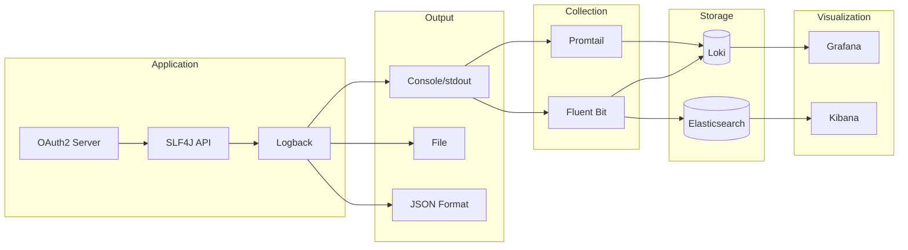

# Logging

This document provides comprehensive documentation on logging configuration and best practices for the OAuth2 Authorization Server.

## Logging Architecture



---

## Configuration

### Application Properties

```properties
# Logging Configuration
logging.level.root=INFO
logging.level.com.bootsandcats=INFO
logging.level.org.springframework.security=WARN
logging.level.org.springframework.security.oauth2=WARN

# Console output format (for development)
logging.pattern.console=%d{yyyy-MM-dd HH:mm:ss.SSS} [%thread] %-5level %logger{36} - %msg%n

# File output
logging.file.name=/var/log/oauth2-server/application.log
logging.file.max-size=100MB
logging.file.max-history=30
```

### Production Configuration (JSON Format)

```properties
# application-prod.properties
logging.level.root=INFO
logging.level.com.bootsandcats=INFO
logging.level.org.springframework.security=WARN

# Enable JSON logging for production
logging.config=classpath:logback-spring.xml
```

### Logback Configuration

```xml
<!-- logback-spring.xml -->
<?xml version="1.0" encoding="UTF-8"?>
<configuration>
    <springProfile name="!prod">
        <!-- Development: Console output with colors -->
        <appender name="CONSOLE" class="ch.qos.logback.core.ConsoleAppender">
            <encoder>
                <pattern>%d{HH:mm:ss.SSS} %highlight(%-5level) [%thread] %cyan(%logger{36}) - %msg%n</pattern>
            </encoder>
        </appender>
        
        <root level="INFO">
            <appender-ref ref="CONSOLE"/>
        </root>
    </springProfile>
    
    <springProfile name="prod">
        <!-- Production: JSON format for log aggregation -->
        <appender name="JSON" class="ch.qos.logback.core.ConsoleAppender">
            <encoder class="net.logstash.logback.encoder.LogstashEncoder">
                <includeMdcKeyName>trace_id</includeMdcKeyName>
                <includeMdcKeyName>span_id</includeMdcKeyName>
                <includeMdcKeyName>client_id</includeMdcKeyName>
                <customFields>{"service":"oauth2-authorization-server"}</customFields>
            </encoder>
        </appender>
        
        <root level="INFO">
            <appender-ref ref="JSON"/>
        </root>
    </springProfile>
</configuration>
```

---

## Log Levels

### Level Hierarchy

| Level | Description | Use Case |
|-------|-------------|----------|
| `ERROR` | Application errors requiring attention | Exceptions, failures |
| `WARN` | Potentially harmful situations | Deprecations, recoverable errors |
| `INFO` | Significant application events | Startup, business events |
| `DEBUG` | Detailed debugging information | Development troubleshooting |
| `TRACE` | Very detailed tracing | Deep debugging |

### Recommended Levels by Package

```properties
# Root level
logging.level.root=INFO

# Application code
logging.level.com.bootsandcats=INFO

# Spring Security (reduce noise)
logging.level.org.springframework.security=WARN
logging.level.org.springframework.security.oauth2=INFO

# Database
logging.level.org.hibernate.SQL=WARN
logging.level.org.hibernate.type.descriptor.sql=WARN

# OpenTelemetry
logging.level.io.opentelemetry=WARN

# HikariCP
logging.level.com.zaxxer.hikari=INFO
```

---

## Structured Logging

### JSON Log Format

```json
{
  "@timestamp": "2024-01-15T10:30:00.123Z",
  "@version": "1",
  "message": "Token issued for client demo-client",
  "logger_name": "c.b.o.s.OAuth2MetricsService",
  "thread_name": "http-nio-9000-exec-1",
  "level": "INFO",
  "level_value": 20000,
  "trace_id": "abc123def456789",
  "span_id": "987654321xyz",
  "client_id": "demo-client",
  "service": "oauth2-authorization-server",
  "environment": "production"
}
```

### Adding Context to Logs

```java
import org.slf4j.MDC;

// Add context for all logs in request
MDC.put("client_id", clientId);
MDC.put("request_id", requestId);

try {
    log.info("Processing token request");
    // ... processing
    log.info("Token issued successfully");
} finally {
    MDC.clear();
}
```

---

## Log Categories

### Authentication Logs

```json
{
  "level": "INFO",
  "message": "User authentication successful",
  "event_type": "authentication",
  "username": "john.doe",
  "authentication_method": "password",
  "client_id": "demo-client",
  "ip_address": "192.168.1.100"
}
```

### Authorization Logs

```json
{
  "level": "INFO",
  "message": "Authorization code issued",
  "event_type": "authorization",
  "client_id": "demo-client",
  "scope": "openid profile email",
  "redirect_uri": "https://app.example.com/callback"
}
```

### Token Logs

```json
{
  "level": "INFO",
  "message": "Access token issued",
  "event_type": "token_issued",
  "client_id": "demo-client",
  "grant_type": "authorization_code",
  "scope": "openid profile",
  "token_type": "access_token",
  "expires_in": 900
}
```

### Error Logs

```json
{
  "level": "ERROR",
  "message": "Token request failed",
  "event_type": "token_error",
  "error": "invalid_grant",
  "error_description": "Authorization code has expired",
  "client_id": "demo-client",
  "stack_trace": "..."
}
```

---

## Security Logging

### Audit Trail

Events that should always be logged:

| Event | Level | Details |
|-------|-------|---------|
| Login success | INFO | Username, client, IP |
| Login failure | WARN | Username, client, IP, reason |
| Token issued | INFO | Client, grant type, scopes |
| Token revoked | INFO | Client, token type |
| Consent granted | INFO | User, client, scopes |
| Consent denied | INFO | User, client |
| Client authentication failure | WARN | Client ID, IP, reason |

### Sensitive Data Handling

**Never log:**

- Passwords or secrets
- Full access tokens
- Full refresh tokens
- Full authorization codes
- Credit card numbers
- Personal identifiers (SSN, etc.)

**Safe to log (truncated):**

```java
// Token logging - only first/last 4 characters
String maskedToken = token.substring(0, 4) + "..." + 
                     token.substring(token.length() - 4);
log.info("Token validated: {}", maskedToken);
```

---

## Log Aggregation

### Fluent Bit Configuration

```yaml
# fluent-bit.conf
[SERVICE]
    Flush         5
    Log_Level     info
    Daemon        off
    Parsers_File  parsers.conf

[INPUT]
    Name              tail
    Path              /var/log/containers/*oauth2-server*.log
    Parser            docker
    Tag               oauth2.*
    Mem_Buf_Limit     50MB
    Skip_Long_Lines   On
    Refresh_Interval  10

[FILTER]
    Name         kubernetes
    Match        oauth2.*
    Kube_URL     https://kubernetes.default.svc:443
    Kube_CA_File /var/run/secrets/kubernetes.io/serviceaccount/ca.crt
    Kube_Token_File /var/run/secrets/kubernetes.io/serviceaccount/token
    Merge_Log    On
    K8S-Logging.Parser On
    K8S-Logging.Exclude On

[OUTPUT]
    Name        loki
    Match       oauth2.*
    Host        loki
    Port        3100
    Labels      job=oauth2-server, namespace=$kubernetes['namespace_name']
```

### Promtail Configuration

```yaml
# promtail-config.yaml
server:
  http_listen_port: 9080
  grpc_listen_port: 0

positions:
  filename: /tmp/positions.yaml

clients:
  - url: http://loki:3100/loki/api/v1/push

scrape_configs:
  - job_name: oauth2-server
    kubernetes_sd_configs:
      - role: pod
    relabel_configs:
      - source_labels: [__meta_kubernetes_pod_label_app]
        action: keep
        regex: oauth2-server
      - source_labels: [__meta_kubernetes_namespace]
        target_label: namespace
      - source_labels: [__meta_kubernetes_pod_name]
        target_label: pod
    pipeline_stages:
      - json:
          expressions:
            level: level
            trace_id: trace_id
            span_id: span_id
            client_id: client_id
      - labels:
          level:
          trace_id:
```

---

## Querying Logs

### Loki/LogQL Examples

```logql
# All logs from oauth2-server
{app="oauth2-server"}

# Error logs only
{app="oauth2-server"} | json | level="ERROR"

# Logs with specific trace ID
{app="oauth2-server"} | json | trace_id="abc123"

# Token-related logs
{app="oauth2-server"} |= "token"

# Failed authentications
{app="oauth2-server"} | json | event_type="authentication" | status="failed"

# Rate of errors per minute
sum(rate({app="oauth2-server"} | json | level="ERROR" [1m]))

# Top error messages
topk(10, sum by (message) (rate({app="oauth2-server"} | json | level="ERROR" [5m])))
```

### Elasticsearch/Kibana Queries

```json
// Error logs
{
  "query": {
    "bool": {
      "must": [
        {"match": {"service": "oauth2-authorization-server"}},
        {"match": {"level": "ERROR"}}
      ]
    }
  }
}

// Logs by trace ID
{
  "query": {
    "match": {"trace_id": "abc123def456"}
  }
}
```

---

## Log Retention

### Retention Policies

| Environment | Retention | Reason |
|-------------|-----------|--------|
| Development | 7 days | Short-term debugging |
| Staging | 14 days | Testing verification |
| Production | 30-90 days | Compliance, debugging |
| Audit logs | 1-7 years | Compliance requirements |

### Storage Estimation

| Log Volume | Daily Size | Monthly Size |
|------------|------------|--------------|
| Low (100 req/s) | ~5 GB | ~150 GB |
| Medium (1000 req/s) | ~50 GB | ~1.5 TB |
| High (10000 req/s) | ~500 GB | ~15 TB |

---

## Alerting on Logs

### Loki Alert Rules

```yaml
groups:
  - name: oauth2-log-alerts
    rules:
      - alert: HighErrorRate
        expr: |
          sum(rate({app="oauth2-server"} | json | level="ERROR" [5m])) > 10
        for: 5m
        labels:
          severity: warning
        annotations:
          summary: "High error rate in OAuth2 server logs"
      
      - alert: AuthenticationFailureSpike
        expr: |
          sum(rate({app="oauth2-server"} |~ "authentication.*failed" [5m])) > 50
        for: 5m
        labels:
          severity: critical
        annotations:
          summary: "Spike in authentication failures - possible attack"
```

---

## Troubleshooting

### Enable Debug Logging

```properties
# Temporary debug logging
logging.level.com.bootsandcats=DEBUG
logging.level.org.springframework.security.oauth2=DEBUG
```

### Common Issues

| Issue | Log Pattern | Resolution |
|-------|-------------|------------|
| Token validation fails | `Invalid token signature` | Check JWKS endpoint |
| Client auth fails | `Client authentication failed` | Verify client credentials |
| Database connection | `Connection pool exhausted` | Increase pool size |
| Memory issues | `OutOfMemoryError` | Increase heap size |

### Kubernetes Log Access

```bash
# View logs
kubectl logs -l app=oauth2-server -n oauth2-system

# Stream logs
kubectl logs -l app=oauth2-server -n oauth2-system -f

# Previous container logs (after restart)
kubectl logs -l app=oauth2-server -n oauth2-system --previous

# Export logs
kubectl logs -l app=oauth2-server -n oauth2-system > oauth2-logs.txt
```

---

## Best Practices

### DO

- ✅ Use structured JSON logging in production
- ✅ Include trace/span IDs for correlation
- ✅ Log business-relevant events
- ✅ Use appropriate log levels
- ✅ Implement log rotation
- ✅ Set up alerting on error patterns

### DON'T

- ❌ Log sensitive data (passwords, tokens, PII)
- ❌ Use excessive DEBUG logging in production
- ❌ Ignore log retention policies
- ❌ Log stack traces for expected errors
- ❌ Use string concatenation for log messages

---

## Next Steps

- [Metrics](metrics.md) - Metrics documentation
- [Tracing](tracing.md) - Distributed tracing
- [Dashboards](dashboards.md) - Grafana setup
- [Incident Response](../operations/incident-response.md) - Using logs for debugging
