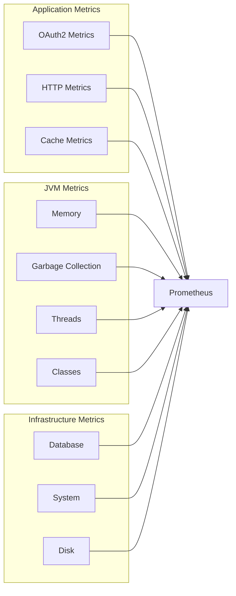

# Metrics

This document provides comprehensive documentation on all metrics exposed by the OAuth2 Authorization Server.

## Metrics Categories



---

## OAuth2 Metrics

Custom metrics for OAuth2 operations.

### `oauth2_tokens_issued_total`

**Type:** Counter

Total number of tokens issued.

```promql
# Token issuance rate per minute
rate(oauth2_tokens_issued_total[5m]) * 60
```

### `oauth2_tokens_revoked_total`

**Type:** Counter

Total number of tokens revoked.

```promql
# Token revocation rate
rate(oauth2_tokens_revoked_total[5m])
```

### `oauth2_authorization_requests_total`

**Type:** Counter

Total number of authorization requests.

```promql
# Authorization request rate
rate(oauth2_authorization_requests_total[5m])
```

### `oauth2_authorization_failed_total`

**Type:** Counter

Total number of failed authorization attempts.

```promql
# Authorization failure rate
rate(oauth2_authorization_failed_total[5m])

# Failure percentage
rate(oauth2_authorization_failed_total[5m]) /
rate(oauth2_authorization_requests_total[5m]) * 100
```

---

## HTTP Metrics

Spring Boot Actuator HTTP metrics.

### `http_server_requests_seconds`

**Type:** Summary/Histogram

Duration of HTTP server request handling.

**Labels:**

| Label | Description |
|-------|-------------|
| `method` | HTTP method (GET, POST, etc.) |
| `uri` | Request URI pattern |
| `status` | HTTP status code |
| `exception` | Exception class (if any) |
| `outcome` | SUCCESS, CLIENT_ERROR, SERVER_ERROR |

```promql
# Request rate by endpoint
sum(rate(http_server_requests_seconds_count[5m])) by (uri)

# P50 latency
histogram_quantile(0.50, sum(rate(http_server_requests_seconds_bucket[5m])) by (le, uri))

# P95 latency
histogram_quantile(0.95, sum(rate(http_server_requests_seconds_bucket[5m])) by (le, uri))

# P99 latency
histogram_quantile(0.99, sum(rate(http_server_requests_seconds_bucket[5m])) by (le, uri))

# Error rate by endpoint
sum(rate(http_server_requests_seconds_count{status=~"5.."}[5m])) by (uri) /
sum(rate(http_server_requests_seconds_count[5m])) by (uri) * 100

# Requests by status code
sum(rate(http_server_requests_seconds_count[5m])) by (status)
```

---

## JVM Metrics

### Memory Metrics

#### `jvm_memory_used_bytes`

**Type:** Gauge

Current JVM memory usage.

**Labels:**

| Label | Description |
|-------|-------------|
| `area` | `heap` or `nonheap` |
| `id` | Memory pool name |

```promql
# Heap memory usage percentage
jvm_memory_used_bytes{area="heap"} / jvm_memory_max_bytes{area="heap"} * 100

# Memory by pool
jvm_memory_used_bytes{area="heap"} by (id)
```

#### `jvm_memory_max_bytes`

**Type:** Gauge

Maximum JVM memory available.

### Garbage Collection Metrics

#### `jvm_gc_pause_seconds`

**Type:** Summary

GC pause duration.

**Labels:**

| Label | Description |
|-------|-------------|
| `action` | GC action (e.g., `end of minor GC`) |
| `cause` | GC cause |

```promql
# GC pause rate
rate(jvm_gc_pause_seconds_count[5m])

# GC pause time per second
rate(jvm_gc_pause_seconds_sum[5m])

# 95th percentile GC pause
histogram_quantile(0.95, rate(jvm_gc_pause_seconds_bucket[5m]))
```

#### `jvm_gc_memory_allocated_bytes_total`

**Type:** Counter

Total bytes allocated.

```promql
# Memory allocation rate (bytes/sec)
rate(jvm_gc_memory_allocated_bytes_total[5m])
```

### Thread Metrics

#### `jvm_threads_live_threads`

**Type:** Gauge

Current live thread count.

```promql
# Live threads
jvm_threads_live_threads

# Thread growth rate
deriv(jvm_threads_live_threads[5m])
```

#### `jvm_threads_daemon_threads`

**Type:** Gauge

Current daemon thread count.

#### `jvm_threads_peak_threads`

**Type:** Gauge

Peak thread count.

#### `jvm_threads_states_threads`

**Type:** Gauge

Threads by state.

**Labels:**

| Label | Description |
|-------|-------------|
| `state` | Thread state (RUNNABLE, BLOCKED, WAITING, etc.) |

```promql
# Blocked threads
jvm_threads_states_threads{state="blocked"}

# Waiting threads
jvm_threads_states_threads{state="waiting"}
```

---

## Database Metrics

HikariCP connection pool metrics.

### `hikaricp_connections`

**Type:** Gauge

Total connections in pool.

### `hikaricp_connections_active`

**Type:** Gauge

Active connections in use.

```promql
# Connection pool utilization
hikaricp_connections_active / hikaricp_connections_max * 100
```

### `hikaricp_connections_idle`

**Type:** Gauge

Idle connections in pool.

### `hikaricp_connections_pending`

**Type:** Gauge

Threads waiting for a connection.

```promql
# Alert on pending connections
hikaricp_connections_pending > 5
```

### `hikaricp_connections_timeout_total`

**Type:** Counter

Connection timeout count.

```promql
# Connection timeout rate
rate(hikaricp_connections_timeout_total[5m])
```

### `hikaricp_connections_acquire_seconds`

**Type:** Summary

Time to acquire a connection.

```promql
# Average connection acquire time
rate(hikaricp_connections_acquire_seconds_sum[5m]) /
rate(hikaricp_connections_acquire_seconds_count[5m])
```

---

## System Metrics

### `system_cpu_usage`

**Type:** Gauge

System CPU usage (0-1).

```promql
# CPU usage percentage
system_cpu_usage * 100
```

### `process_cpu_usage`

**Type:** Gauge

Process CPU usage (0-1).

```promql
# Process CPU percentage
process_cpu_usage * 100
```

### `system_load_average_1m`

**Type:** Gauge

System load average over 1 minute.

### `disk_free_bytes`

**Type:** Gauge

Free disk space.

```promql
# Disk usage percentage
(1 - disk_free_bytes / disk_total_bytes) * 100
```

---

## Recording Rules

Pre-computed queries for efficiency.

```yaml
# recording_rules.yml
groups:
  - name: oauth2-server
    rules:
      # Request rate
      - record: oauth2:http_request_rate_5m
        expr: sum(rate(http_server_requests_seconds_count[5m]))
      
      # Error rate
      - record: oauth2:http_error_rate_5m
        expr: |
          sum(rate(http_server_requests_seconds_count{status=~"5.."}[5m])) /
          sum(rate(http_server_requests_seconds_count[5m]))
      
      # P95 Latency
      - record: oauth2:http_latency_p95_5m
        expr: |
          histogram_quantile(0.95, 
            sum(rate(http_server_requests_seconds_bucket[5m])) by (le)
          )
      
      # Token issuance rate
      - record: oauth2:tokens_issued_rate_5m
        expr: rate(oauth2_tokens_issued_total[5m])
      
      # Memory utilization
      - record: oauth2:jvm_heap_utilization
        expr: |
          sum(jvm_memory_used_bytes{area="heap"}) /
          sum(jvm_memory_max_bytes{area="heap"})
      
      # DB connection utilization
      - record: oauth2:db_connection_utilization
        expr: |
          hikaricp_connections_active / hikaricp_connections_max
```

---

## Dashboard Panels

### Request Rate Panel

```json
{
  "title": "Request Rate",
  "type": "graph",
  "datasource": "Prometheus",
  "targets": [
    {
      "expr": "sum(rate(http_server_requests_seconds_count{job=\"oauth2-server\"}[5m])) by (uri)",
      "legendFormat": "{{uri}}"
    }
  ],
  "yAxes": [
    {"format": "reqps", "min": 0}
  ]
}
```

### Error Rate Panel

```json
{
  "title": "Error Rate",
  "type": "graph",
  "datasource": "Prometheus",
  "targets": [
    {
      "expr": "oauth2:http_error_rate_5m * 100",
      "legendFormat": "Error Rate %"
    }
  ],
  "thresholds": [
    {"value": 1, "colorMode": "warning"},
    {"value": 5, "colorMode": "critical"}
  ]
}
```

### Latency Heatmap

```json
{
  "title": "Request Latency Heatmap",
  "type": "heatmap",
  "datasource": "Prometheus",
  "targets": [
    {
      "expr": "sum(rate(http_server_requests_seconds_bucket{job=\"oauth2-server\"}[5m])) by (le)",
      "legendFormat": "{{le}}"
    }
  ],
  "options": {
    "calculate": true,
    "calculation": {"yBuckets": {"mode": "count", "value": "50"}}
  }
}
```

---

## Metric Labels Best Practices

### Good Labels

| Label | Values | Cardinality |
|-------|--------|-------------|
| `method` | GET, POST, PUT, DELETE | Low (5-10) |
| `status` | 200, 201, 400, 401, 500 | Low (10-20) |
| `uri` | /oauth2/token, /oauth2/authorize | Low (<50) |
| `client_type` | confidential, public | Low (2) |

### Avoid These Labels

| Label | Problem |
|-------|---------|
| `user_id` | High cardinality (millions) |
| `request_id` | High cardinality (unbounded) |
| `timestamp` | High cardinality (unbounded) |
| `ip_address` | High cardinality (large) |

---

## Prometheus Configuration

```yaml
# prometheus.yml
global:
  scrape_interval: 15s
  evaluation_interval: 15s

rule_files:
  - "recording_rules.yml"
  - "alerting_rules.yml"

scrape_configs:
  - job_name: 'oauth2-server'
    metrics_path: '/actuator/prometheus'
    static_configs:
      - targets: ['oauth2-server:9000']
    relabel_configs:
      - source_labels: [__address__]
        target_label: instance
        regex: '([^:]+):\d+'
        replacement: '${1}'
```

---

## Next Steps

- [Distributed Tracing](tracing.md) - Trace configuration
- [Logging](logging.md) - Log configuration
- [Dashboards](dashboards.md) - Grafana setup
- [SLOs](../operations/slos.md) - Service Level Objectives
