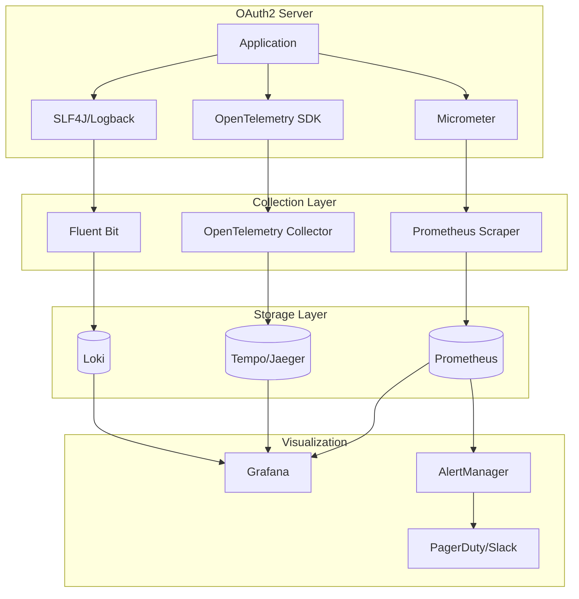
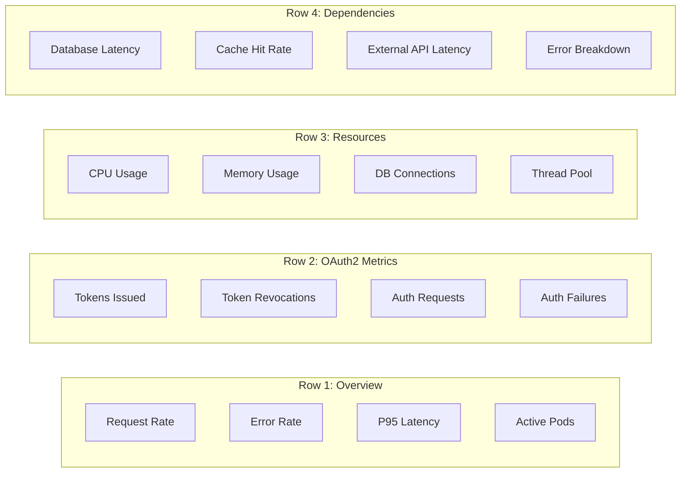
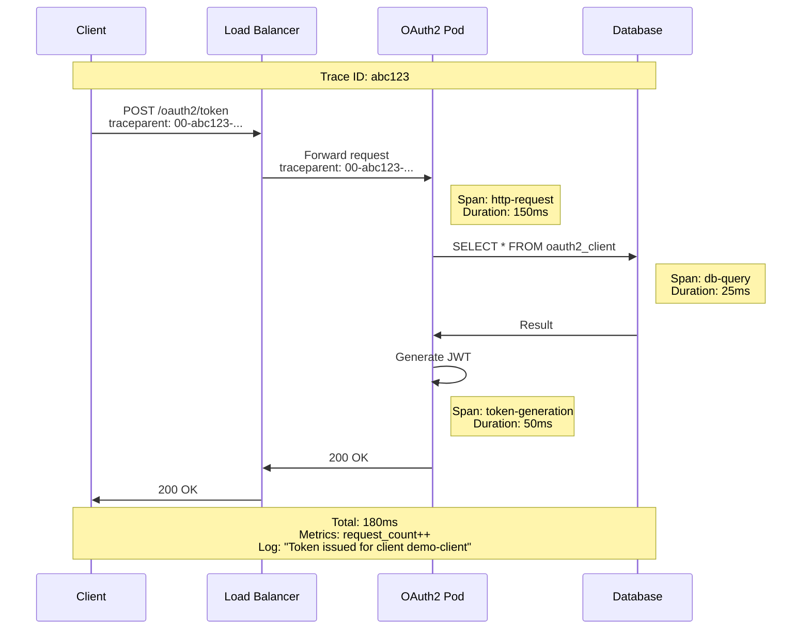
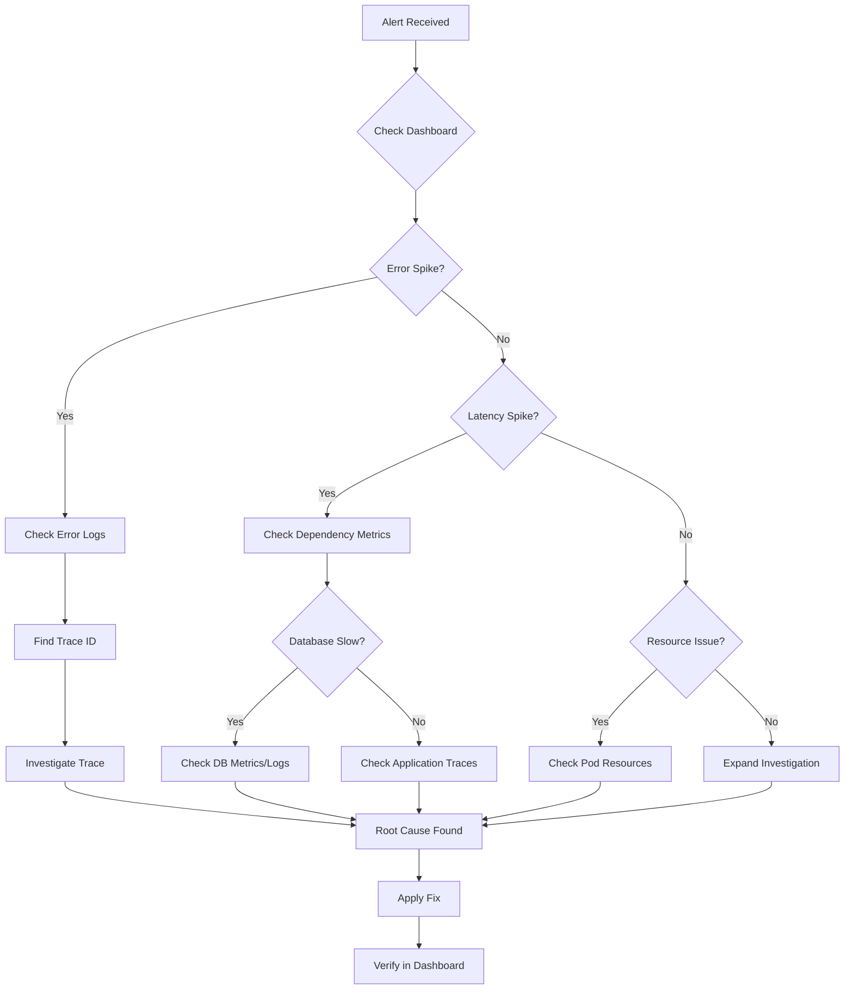

# Observability Overview

This document provides a comprehensive guide to observability for the OAuth2 Authorization Server, covering metrics, distributed tracing, logging, and alerting.

## Observability Architecture



## Three Pillars of Observability

### 1. Metrics

Quantitative measurements of system behavior over time.

| Category | Examples |
|----------|----------|
| **Request Metrics** | Request rate, latency, error rate |
| **Business Metrics** | Tokens issued, authorization failures |
| **Resource Metrics** | CPU, memory, connections |
| **Dependency Metrics** | Database latency, cache hit rate |

👉 [Detailed Metrics Guide](metrics.md)

### 2. Distributed Tracing

End-to-end request tracking across services.

| Component | Purpose |
|-----------|---------|
| **Traces** | Complete request journey |
| **Spans** | Individual operations within a trace |
| **Context** | Propagated headers for correlation |

👉 [Distributed Tracing Guide](tracing.md)

### 3. Logging

Structured logs for debugging and audit trails.

| Log Type | Use Case |
|----------|----------|
| **Application Logs** | Debugging, error investigation |
| **Security Logs** | Audit trail, compliance |
| **Access Logs** | Request/response tracking |

👉 [Logging Guide](logging.md)

---

## Quick Start

### Enable Observability

The OAuth2 server comes with observability pre-configured. Verify the configuration:

```properties
# application.properties

# Metrics
management.prometheus.metrics.export.enabled=true
management.endpoints.web.exposure.include=health,info,prometheus

# Tracing
otel.exporter.otlp.endpoint=http://otel-collector:4317
otel.service.name=oauth2-authorization-server

# Logging
logging.level.com.bootsandcats=INFO
```

### Deploy Observability Stack

```bash
# Using Docker Compose
docker-compose up -d prometheus grafana otel-collector

# Or deploy to Kubernetes with Helm
helm repo add prometheus-community https://prometheus-community.github.io/helm-charts
helm install prometheus prometheus-community/kube-prometheus-stack

helm repo add grafana https://grafana.github.io/helm-charts
helm install tempo grafana/tempo
helm install loki grafana/loki-stack
```

### Verify Metrics

```bash
# Check Prometheus metrics endpoint
curl http://localhost:9000/actuator/prometheus | head -50

# Sample output:
# oauth2_tokens_issued_total 125.0
# http_server_requests_seconds_count{uri="/oauth2/token"} 450.0
```

---

## Key Performance Indicators (KPIs)

### Availability

```promql
# Service availability (5-minute window)
avg_over_time(up{job="oauth2-server"}[5m]) * 100
```

### Latency

```promql
# P95 token endpoint latency
histogram_quantile(0.95, 
  sum(rate(http_server_requests_seconds_bucket{uri="/oauth2/token"}[5m])) by (le)
)
```

### Error Rate

```promql
# Error rate percentage
sum(rate(http_server_requests_seconds_count{status=~"5.."}[5m])) /
sum(rate(http_server_requests_seconds_count[5m])) * 100
```

### Throughput

```promql
# Requests per second
sum(rate(http_server_requests_seconds_count[5m]))
```

---

## Dashboards

### OAuth2 Server Dashboard



👉 [Dashboard Configuration Guide](dashboards.md)

---

## Alerting Strategy

### Alert Severity Levels

| Severity | Response Time | Examples |
|----------|---------------|----------|
| **Critical** | < 15 minutes | Service down, 100% error rate |
| **High** | < 1 hour | Error rate > 10%, P95 > 5s |
| **Medium** | < 4 hours | Error rate > 5%, memory > 90% |
| **Low** | < 24 hours | Disk space warning, slow queries |

### Core Alerts

| Alert | Condition | Severity |
|-------|-----------|----------|
| Service Down | `up == 0` for 1m | Critical |
| High Error Rate | Error rate > 5% for 5m | High |
| High Latency | P95 > 2s for 5m | Medium |
| Pod Crashlooping | Restart count > 3 in 15m | High |
| Database Unreachable | DB check fails for 1m | Critical |

---

## Correlation Example

### Request Tracing Flow



### Finding Related Data

```bash
# 1. Start with trace ID from logs or headers
TRACE_ID="abc123"

# 2. Query logs
kubectl logs -l app=oauth2-server | grep $TRACE_ID

# 3. Find in Grafana
# Open Tempo/Jaeger and search for trace ID

# 4. Correlate with metrics
# Time range from trace can be used to query Prometheus
```

---

## Best Practices

### Metrics

- [ ] Use consistent naming conventions
- [ ] Avoid high-cardinality labels
- [ ] Set appropriate scrape intervals (15-30s)
- [ ] Use recording rules for complex queries
- [ ] Implement metric aggregation

### Tracing

- [ ] Propagate trace context across services
- [ ] Add business-relevant span attributes
- [ ] Use sampling for high-volume endpoints
- [ ] Exclude health check endpoints
- [ ] Set appropriate trace retention

### Logging

- [ ] Use structured logging (JSON)
- [ ] Include correlation IDs
- [ ] Log at appropriate levels
- [ ] Avoid logging sensitive data
- [ ] Implement log rotation and retention

### Alerting

- [ ] Start with SLO-based alerts
- [ ] Avoid alert fatigue (too many alerts)
- [ ] Include runbook links in alerts
- [ ] Use appropriate severity levels
- [ ] Test alert routing regularly

---

## Troubleshooting Flow



---

## Quick Reference

### Endpoints

| Endpoint | Description |
|----------|-------------|
| `/actuator/prometheus` | Prometheus metrics |
| `/actuator/health` | Health status |
| `http://prometheus:9090` | Prometheus UI |
| `http://grafana:3000` | Grafana dashboards |
| `http://jaeger:16686` | Jaeger traces |

### PromQL Cheat Sheet

```promql
# Rate of change
rate(metric_name[5m])

# Histogram quantile
histogram_quantile(0.95, sum(rate(bucket[5m])) by (le))

# Increase over time
increase(counter[1h])

# Aggregation
sum by (label) (metric)
```

### Log Queries (Loki)

```logql
# Filter by application
{app="oauth2-server"}

# Error logs
{app="oauth2-server"} |= "ERROR"

# JSON parsing
{app="oauth2-server"} | json | level="ERROR"

# Rate of errors
sum(rate({app="oauth2-server"} |= "ERROR" [5m]))
```

---

## Next Steps

- [Metrics](metrics.md) - Detailed metrics documentation
- [Tracing](tracing.md) - Distributed tracing setup
- [Logging](logging.md) - Logging configuration
- [Dashboards](dashboards.md) - Grafana dashboard setup
- [SLOs](../operations/slos.md) - Service Level Objectives
