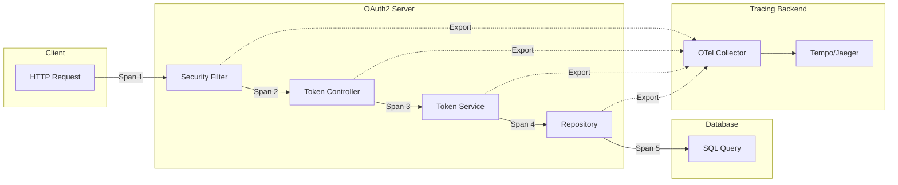
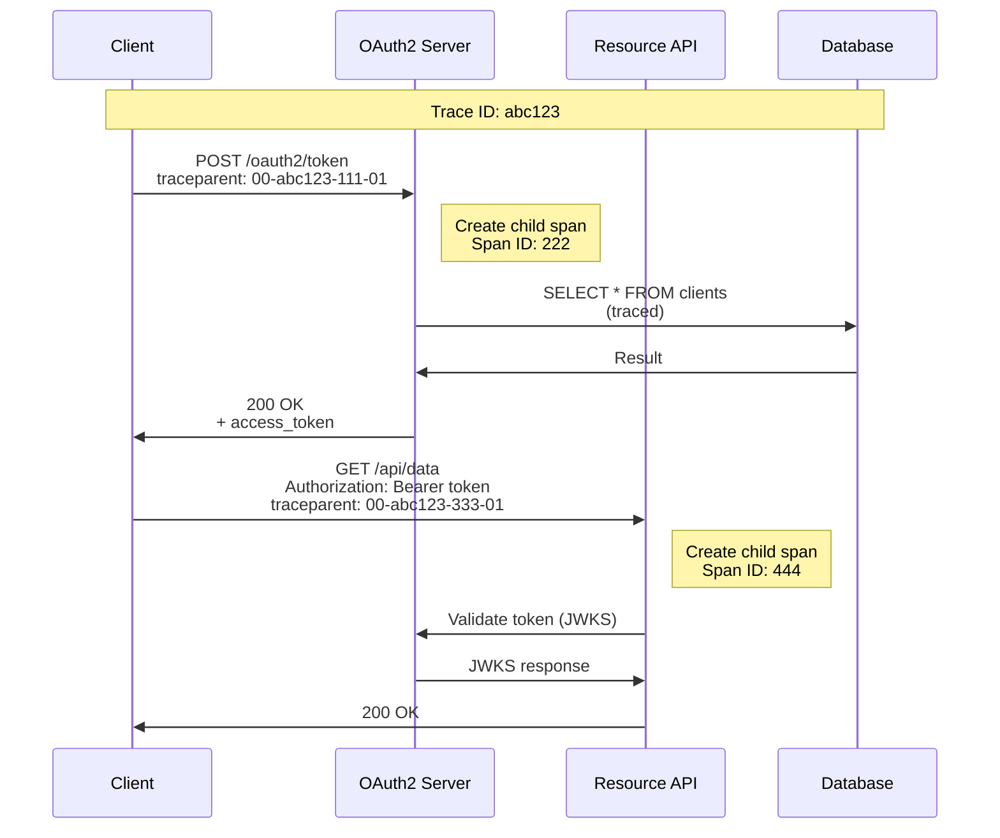
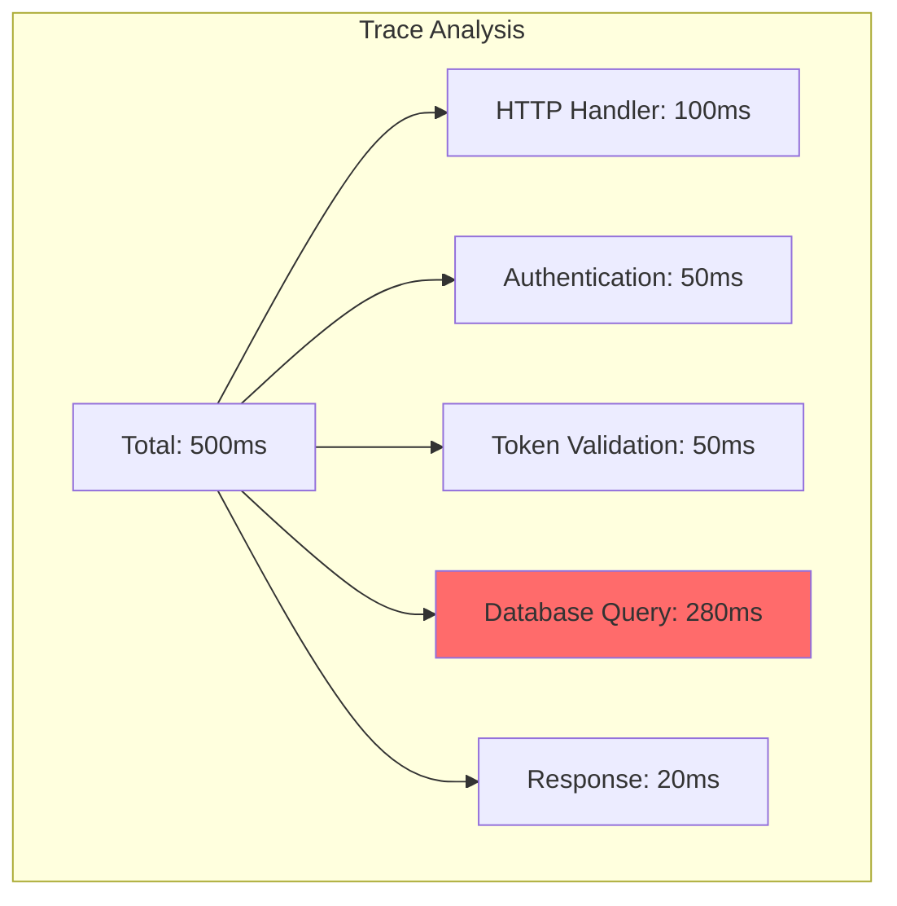

# Distributed Tracing

This document provides comprehensive documentation on distributed tracing configuration and usage for the OAuth2 Authorization Server.

## Overview

Distributed tracing allows you to follow requests as they flow through the OAuth2 server and connected services.



---

## Configuration

### Application Properties

```properties
# OpenTelemetry Configuration
otel.exporter.otlp.endpoint=http://otel-collector:4317
otel.exporter.otlp.protocol=grpc
otel.service.name=oauth2-authorization-server

# Tracing
otel.traces.exporter=otlp
otel.traces.sampler=parentbased_traceidratio
otel.traces.sampler.arg=1.0

# Metrics export via Prometheus (not OTLP)
otel.metrics.exporter=prometheus

# Logs
otel.logs.exporter=otlp

# Resource attributes
otel.resource.attributes=service.namespace=oauth2,deployment.environment=production
```

### Environment Variables

```bash
# OTLP Exporter
export OTEL_EXPORTER_OTLP_ENDPOINT="http://otel-collector:4317"
export OTEL_EXPORTER_OTLP_PROTOCOL="grpc"

# Service identification
export OTEL_SERVICE_NAME="oauth2-authorization-server"
export OTEL_RESOURCE_ATTRIBUTES="service.namespace=oauth2,deployment.environment=production"

# Sampling (1.0 = 100%, 0.1 = 10%)
export OTEL_TRACES_SAMPLER="parentbased_traceidratio"
export OTEL_TRACES_SAMPLER_ARG="1.0"
```

---

## Trace Context Propagation

### W3C Trace Context

The server uses W3C Trace Context for propagation:

```http
traceparent: 00-0af7651916cd43dd8448eb211c80319c-b7ad6b7169203331-01
tracestate: oauth2=abc123
```

### Header Format

| Header | Format | Description |
|--------|--------|-------------|
| `traceparent` | `00-{trace-id}-{span-id}-{flags}` | W3C standard trace context |
| `tracestate` | `key=value,key=value` | Vendor-specific trace state |

### Propagation Example



---

## Span Attributes

### HTTP Spans

| Attribute | Type | Description |
|-----------|------|-------------|
| `http.method` | string | HTTP method (GET, POST) |
| `http.url` | string | Full request URL |
| `http.target` | string | Request path |
| `http.status_code` | int | Response status code |
| `http.request_content_length` | int | Request body size |
| `http.response_content_length` | int | Response body size |
| `http.user_agent` | string | User-Agent header |

### OAuth2 Custom Spans

| Attribute | Type | Description |
|-----------|------|-------------|
| `oauth2.grant_type` | string | Grant type used |
| `oauth2.client_id` | string | Client identifier |
| `oauth2.scope` | string | Requested scopes |
| `oauth2.token_type` | string | Token type (access, refresh) |

### Database Spans

| Attribute | Type | Description |
|-----------|------|-------------|
| `db.system` | string | Database type (postgresql) |
| `db.name` | string | Database name |
| `db.statement` | string | SQL statement |
| `db.operation` | string | Operation type (SELECT, INSERT) |

---

## OpenTelemetry Collector Configuration

```yaml
# otel-collector-config.yaml
receivers:
  otlp:
    protocols:
      grpc:
        endpoint: 0.0.0.0:4317
      http:
        endpoint: 0.0.0.0:4318

processors:
  batch:
    timeout: 1s
    send_batch_size: 1024
  
  memory_limiter:
    check_interval: 1s
    limit_mib: 512
    spike_limit_mib: 128
  
  # Filter out health check traces
  filter:
    traces:
      exclude:
        match_type: regexp
        attributes:
          - key: http.target
            value: /actuator.*
  
  # Add resource attributes
  resource:
    attributes:
      - key: deployment.environment
        value: production
        action: upsert

exporters:
  # Export to Tempo
  otlp/tempo:
    endpoint: tempo:4317
    tls:
      insecure: true
  
  # Export to Jaeger
  jaeger:
    endpoint: jaeger:14250
    tls:
      insecure: true
  
  # Debug logging
  logging:
    loglevel: info
  
  # Prometheus (for trace metrics)
  prometheus:
    endpoint: "0.0.0.0:8889"
    namespace: oauth2

service:
  pipelines:
    traces:
      receivers: [otlp]
      processors: [memory_limiter, filter, batch, resource]
      exporters: [otlp/tempo, logging]
    
    metrics:
      receivers: [otlp]
      processors: [memory_limiter, batch]
      exporters: [prometheus]
```

---

## Sampling Strategies

### Head-Based Sampling

Sample decisions made at trace start.

```yaml
# Sample 10% of traces
OTEL_TRACES_SAMPLER=traceidratio
OTEL_TRACES_SAMPLER_ARG=0.1

# Always sample if parent is sampled
OTEL_TRACES_SAMPLER=parentbased_traceidratio
OTEL_TRACES_SAMPLER_ARG=0.1
```

### Recommended Sampling by Environment

| Environment | Sampling Rate | Rationale |
|-------------|---------------|-----------|
| Development | 100% | Full visibility for debugging |
| Staging | 50% | Balanced visibility and storage |
| Production | 10-25% | Storage cost optimization |
| Production (errors) | 100% | Always sample errors |

### Error-Based Sampling

Always sample error traces:

```yaml
# In OpenTelemetry Collector
processors:
  probabilistic_sampler:
    sampling_percentage: 10
  
  tail_sampling:
    decision_wait: 10s
    policies:
      - name: errors-policy
        type: status_code
        status_code: {status_codes: [ERROR]}
      - name: latency-policy
        type: latency
        latency: {threshold_ms: 1000}
      - name: probabilistic-policy
        type: probabilistic
        probabilistic: {sampling_percentage: 10}
```

---

## Querying Traces

### By Trace ID

```bash
# Find trace in Jaeger/Tempo
curl "http://jaeger:16686/api/traces/abc123"

# Or use Grafana Tempo
curl "http://tempo:3200/api/traces/abc123"
```

### By Service and Operation

```promql
# In Tempo
{resource.service.name="oauth2-authorization-server" && name="/oauth2/token"}
```

### By Attributes

```promql
# Find slow token requests
{resource.service.name="oauth2-authorization-server" && span.http.status_code=200 && duration > 1s}

# Find failed requests
{resource.service.name="oauth2-authorization-server" && status=error}

# Find by client_id
{resource.service.name="oauth2-authorization-server" && span.oauth2.client_id="demo-client"}
```

---

## Integration with Logs

### Correlation IDs

Logs automatically include trace context:

```json
{
  "timestamp": "2024-01-15T10:30:00.000Z",
  "level": "INFO",
  "logger": "c.b.o.s.OAuth2MetricsService",
  "message": "Token issued for client demo-client",
  "trace_id": "abc123def456",
  "span_id": "789xyz",
  "service": "oauth2-authorization-server"
}
```

### Log Query with Trace ID

```logql
# Loki query
{app="oauth2-server"} | json | trace_id="abc123def456"
```

---

## Troubleshooting with Traces

### Identifying Slow Spans



### Common Issues

| Symptom | Investigation | Resolution |
|---------|---------------|------------|
| Missing spans | Check sampling rate | Increase sampling or check filters |
| No trace propagation | Check headers | Verify W3C context headers |
| High latency | Check span durations | Identify slow spans in trace |
| Incomplete traces | Check collector status | Verify collector is running |

### Debug Configuration

```properties
# Enable debug logging for tracing
logging.level.io.opentelemetry=DEBUG
logging.level.io.micrometer.tracing=DEBUG
```

---

## Kubernetes Deployment

### OpenTelemetry Collector DaemonSet

```yaml
apiVersion: apps/v1
kind: DaemonSet
metadata:
  name: otel-collector
  namespace: observability
spec:
  selector:
    matchLabels:
      app: otel-collector
  template:
    metadata:
      labels:
        app: otel-collector
    spec:
      containers:
        - name: otel-collector
          image: otel/opentelemetry-collector-contrib:latest
          args:
            - "--config=/etc/otel/config.yaml"
          ports:
            - containerPort: 4317  # OTLP gRPC
            - containerPort: 4318  # OTLP HTTP
          volumeMounts:
            - name: config
              mountPath: /etc/otel
      volumes:
        - name: config
          configMap:
            name: otel-collector-config
```

### Service Configuration

```yaml
apiVersion: v1
kind: Service
metadata:
  name: otel-collector
  namespace: observability
spec:
  selector:
    app: otel-collector
  ports:
    - name: otlp-grpc
      port: 4317
      targetPort: 4317
    - name: otlp-http
      port: 4318
      targetPort: 4318
```

---

## Best Practices

### DO

- ✅ Use W3C Trace Context for propagation
- ✅ Add business-relevant span attributes
- ✅ Sample appropriately for production
- ✅ Correlate traces with logs
- ✅ Set appropriate trace retention
- ✅ Monitor collector health

### DON'T

- ❌ Log sensitive data in spans
- ❌ Create too many custom spans
- ❌ Disable sampling in high-traffic production
- ❌ Ignore trace propagation in API calls
- ❌ Use excessively long span names

---

## Next Steps

- [Logging](logging.md) - Logging configuration
- [Metrics](metrics.md) - Metrics documentation
- [Dashboards](dashboards.md) - Grafana setup
- [Incident Response](../operations/incident-response.md) - Using traces for debugging
