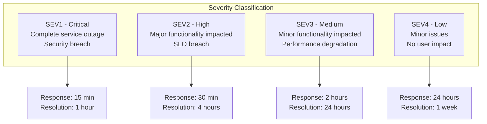
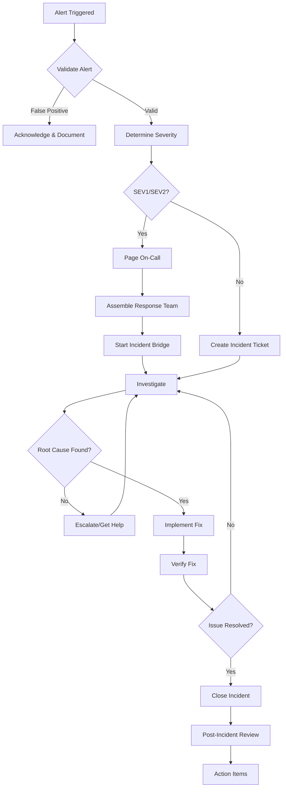

# Incident Response

This document provides incident response procedures for the OAuth2 Authorization Server.

## Incident Severity Levels



---

## Severity Definitions

### SEV1 - Critical

**Criteria:**
- Complete service outage
- 100% of users cannot authenticate
- Security breach or data leak
- Error budget completely exhausted

**Response:**
- Immediate page to on-call
- All-hands response
- Executive notification
- External communication prepared

### SEV2 - High

**Criteria:**
- Major functionality degraded
- >50% of users affected
- SLO breach for >15 minutes
- Error budget <10%

**Response:**
- Page on-call engineer
- Secondary engineer standby
- Status page update
- Customer communication

### SEV3 - Medium

**Criteria:**
- Minor functionality degraded
- <50% of users affected
- Performance degradation
- Error budget <25%

**Response:**
- Notify on-call engineer
- Address during business hours
- Internal communication

### SEV4 - Low

**Criteria:**
- Minor issues
- No user impact
- Cosmetic issues
- Informational alerts

**Response:**
- Create ticket
- Address in next sprint
- No immediate action required

---

## Incident Response Process



---

## On-Call Responsibilities

### Primary On-Call

- Acknowledge alerts within 15 minutes
- Initial triage and severity assessment
- Coordinate response efforts
- Communicate status updates
- Escalate when needed

### Secondary On-Call

- Available as backup
- Join incident calls when needed
- Assist with investigation
- Take over if primary unavailable

### Incident Commander (SEV1/SEV2)

- Overall incident coordination
- Decision authority
- External communication
- Resource allocation
- Timeline management

---

## Investigation Checklist

### 1. Initial Assessment (5 minutes)

- [ ] What is the impact scope?
- [ ] When did the issue start?
- [ ] Are there any recent deployments?
- [ ] Is the issue affecting specific endpoints?
- [ ] Is the issue affecting specific clients?

### 2. Data Collection (10 minutes)

- [ ] Check dashboard for anomalies
- [ ] Review error logs
- [ ] Check trace data for failures
- [ ] Verify database connectivity
- [ ] Check resource utilization

### 3. Correlation (5 minutes)

- [ ] Any infrastructure changes?
- [ ] Any configuration changes?
- [ ] Any dependent service issues?
- [ ] Any similar past incidents?

---

## Quick Diagnostic Commands

### Check Pod Status

```bash
# Get pod status
kubectl get pods -n oauth2-system -l app=oauth2-server

# Get pod events
kubectl describe pod -n oauth2-system -l app=oauth2-server

# Check resource usage
kubectl top pods -n oauth2-system
```

### Check Logs

```bash
# Recent logs
kubectl logs -l app=oauth2-server -n oauth2-system --tail=100

# Error logs only
kubectl logs -l app=oauth2-server -n oauth2-system | grep ERROR

# Follow logs
kubectl logs -l app=oauth2-server -n oauth2-system -f
```

### Check Metrics

```bash
# Quick health check
curl http://oauth2-server:9000/actuator/health

# Prometheus metrics
curl http://oauth2-server:9000/actuator/prometheus | grep -E "^(http_|oauth2_)"
```

### Database Connectivity

```bash
# Test database connection
kubectl exec -it deployment/oauth2-server -n oauth2-system -- \
  curl -s http://localhost:9000/actuator/health/db

# Check connection pool
curl http://oauth2-server:9000/actuator/prometheus | grep hikaricp
```

---

## Common Incident Scenarios

### Scenario 1: Complete Outage

**Symptoms:**
- All health checks failing
- No pods running
- 100% error rate

**Investigation:**
1. Check pod status and events
2. Check recent deployments
3. Check node availability
4. Check resource quotas

**Resolution:**
- Scale up replicas
- Rollback if deployment issue
- Check and fix configuration

### Scenario 2: High Error Rate

**Symptoms:**
- Error rate >5%
- 5xx responses increasing
- Latency spikes

**Investigation:**
1. Check error logs for patterns
2. Check database connectivity
3. Check dependent services
4. Check resource utilization

**Resolution:**
- Scale resources if capacity issue
- Fix configuration if misconfigured
- Failover if dependency issue

### Scenario 3: High Latency

**Symptoms:**
- P95 >2 seconds
- Slow response times
- Timeouts increasing

**Investigation:**
1. Check database query performance
2. Check GC metrics
3. Check connection pool usage
4. Check network latency

**Resolution:**
- Optimize slow queries
- Increase heap size if GC issues
- Scale connection pool
- Check and fix network issues

### Scenario 4: Authentication Failures

**Symptoms:**
- Users cannot log in
- Token validation failing
- JWKS endpoint issues

**Investigation:**
1. Check JWKS endpoint availability
2. Verify key rotation timing
3. Check client configurations
4. Review authentication logs

**Resolution:**
- Restart if key issue
- Update client configurations
- Clear caches
- Verify secret rotation

---

## Communication Templates

### Internal Status Update

```
**OAuth2 Authorization Server Incident Update**

**Severity:** SEV2
**Status:** Investigating
**Started:** 2024-01-15 10:30 UTC
**Duration:** 25 minutes

**Impact:**
- Token issuance is experiencing elevated error rates
- ~30% of token requests are failing
- Authorization flows are unaffected

**Current Actions:**
- Investigating database connection pool exhaustion
- Scaling database connections
- Monitoring for improvement

**Next Update:** 15 minutes or when resolved
```

### External Status Page

```
**Partial Service Degradation - Authentication Service**

We are currently experiencing issues with our authentication 
service that may affect login and token issuance.

**Impact:** Some users may experience login failures or delays.

**Workaround:** If you encounter an error, please wait 30 seconds 
and try again.

**Status:** Our team is actively working on a resolution.

**Last Updated:** 2024-01-15 10:55 UTC
```

---

## Escalation Matrix

| Condition | Escalate To | Method |
|-----------|-------------|--------|
| No progress after 30 min | Secondary on-call | PagerDuty |
| SEV1 or security issue | Engineering Lead | Phone call |
| Customer impact >1 hour | Customer Success | Slack |
| Media attention | Communications | Phone call |
| Extended outage (>4 hours) | VP Engineering | Phone call |

---

## Post-Incident Review

### Within 24 Hours

1. Write incident timeline
2. Collect all relevant data
3. Schedule review meeting
4. Draft initial findings

### Review Meeting Agenda

1. Incident timeline walkthrough
2. What went well
3. What could be improved
4. Action items
5. Follow-up owners

### Post-Incident Report Template

```markdown
# Post-Incident Report: [Title]

## Summary
Brief description of the incident.

## Impact
- Duration: X hours Y minutes
- Users affected: N
- SLO impact: X% error budget consumed

## Timeline
- HH:MM - Event
- HH:MM - Event
- HH:MM - Resolved

## Root Cause
Description of the root cause.

## Resolution
How the incident was resolved.

## Action Items
- [ ] Action 1 - Owner - Due date
- [ ] Action 2 - Owner - Due date

## Lessons Learned
Key takeaways from this incident.
```

---

## Tools and Access

### Required Access

| Tool | Purpose | Access Level |
|------|---------|--------------|
| Kubernetes | Pod management | Admin |
| Grafana | Dashboards | Viewer |
| PagerDuty | Alerting | Responder |
| Slack | Communication | Member |
| AWS/GCP/Azure | Infrastructure | Power User |

### Incident Tools

| Tool | URL | Purpose |
|------|-----|---------|
| Status Page | status.example.com | External communication |
| Incident Bridge | meet.google.com/xxx | Video conferencing |
| War Room | #incident-response | Slack channel |
| Runbooks | docs.example.com/runbooks | Procedures |

---

## Next Steps

- [Runbooks](runbooks/common-issues.md) - Detailed troubleshooting procedures
- [SLOs](slos.md) - Service Level Objectives
- [Scaling Runbook](runbooks/scaling.md) - Scaling procedures
