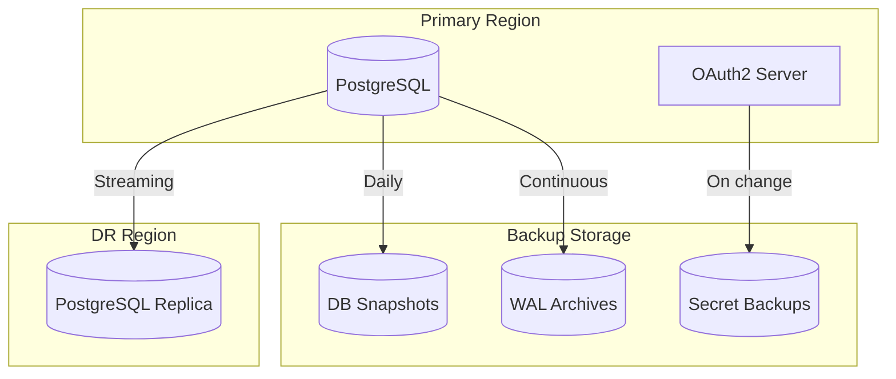
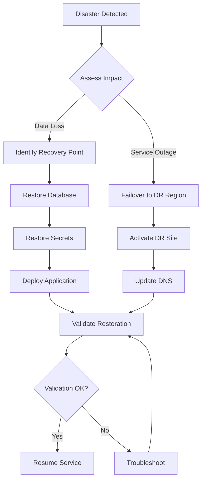

# Backup and Restore Runbook

This runbook covers backup and restore procedures for the OAuth2 Authorization Server.

## Backup Strategy

### Data Classification

| Data Type | Backup Frequency | Retention | Priority |
|-----------|------------------|-----------|----------|
| Database (PostgreSQL) | Continuous + Daily | 30 days | Critical |
| Client configurations | On change | 90 days | High |
| Secrets/Keys | On rotation | 7 versions | Critical |
| Audit logs | Continuous | 1 year | High |
| Application configs | On change | 90 days | Medium |

### Backup Architecture



---

## Database Backup

### Automated Backups (Cloud Managed)

**AWS RDS:**

```bash
# Check backup configuration
aws rds describe-db-instances \
  --db-instance-identifier oauth2-postgres \
  --query 'DBInstances[0].{BackupRetention:BackupRetentionPeriod,BackupWindow:PreferredBackupWindow}'

# List available snapshots
aws rds describe-db-snapshots \
  --db-instance-identifier oauth2-postgres \
  --query 'DBSnapshots[*].{ID:DBSnapshotIdentifier,Created:SnapshotCreateTime,Status:Status}'

# Create manual snapshot
aws rds create-db-snapshot \
  --db-instance-identifier oauth2-postgres \
  --db-snapshot-identifier oauth2-manual-$(date +%Y%m%d-%H%M%S)
```

**Azure PostgreSQL:**

```bash
# Check backup configuration
az postgres flexible-server show \
  --resource-group oauth2-prod-rg \
  --name oauth2-postgres \
  --query '{BackupRetention:backup.backupRetentionDays,GeoRedundant:backup.geoRedundantBackup}'

# Create manual backup (point-in-time restore creates from backup)
az postgres flexible-server backup create \
  --resource-group oauth2-prod-rg \
  --server-name oauth2-postgres \
  --backup-name manual-$(date +%Y%m%d-%H%M%S)
```

**Google Cloud SQL:**

```bash
# Check backup configuration
gcloud sql instances describe oauth2-postgres \
  --format='value(settings.backupConfiguration)'

# List backups
gcloud sql backups list --instance=oauth2-postgres

# Create on-demand backup
gcloud sql backups create --instance=oauth2-postgres
```

### Manual Database Backup

```bash
# Create pg_dump backup
kubectl exec -it deployment/oauth2-server -n oauth2-system -- \
  pg_dump -h $DATABASE_HOST -U $DATABASE_USER -d oauth2db \
  --format=custom --file=/tmp/oauth2-backup.dump

# Copy backup from pod
kubectl cp oauth2-system/oauth2-server-xxx:/tmp/oauth2-backup.dump \
  ./oauth2-backup-$(date +%Y%m%d).dump

# Upload to object storage
aws s3 cp oauth2-backup-$(date +%Y%m%d).dump \
  s3://oauth2-backups/database/
```

---

## Secrets Backup

### Kubernetes Secrets

```bash
# Export secrets (encrypted)
kubectl get secret oauth2-server-secrets -n oauth2-system -o yaml > \
  secrets-backup-$(date +%Y%m%d).yaml

# Encrypt before storing
gpg --symmetric --cipher-algo AES256 secrets-backup-$(date +%Y%m%d).yaml

# Store encrypted backup
aws s3 cp secrets-backup-$(date +%Y%m%d).yaml.gpg \
  s3://oauth2-backups/secrets/
```

### JWK Keys

```bash
# Export current JWKS (public keys only - safe to backup)
curl http://oauth2-server:9000/oauth2/jwks > jwks-backup-$(date +%Y%m%d).json

# For private keys, export from secret manager
aws secretsmanager get-secret-value \
  --secret-id oauth2/jwk-private-key \
  --query SecretString > jwk-private-backup.json

# Encrypt and store
gpg --symmetric --cipher-algo AES256 jwk-private-backup.json
```

---

## Database Restore

### Restore from Cloud Snapshot

**AWS RDS:**

```bash
# List available snapshots
aws rds describe-db-snapshots \
  --db-instance-identifier oauth2-postgres

# Restore to new instance
aws rds restore-db-instance-from-db-snapshot \
  --db-instance-identifier oauth2-postgres-restored \
  --db-snapshot-identifier rds:oauth2-postgres-2024-01-15-05-00 \
  --db-instance-class db.r6g.large \
  --vpc-security-group-ids sg-xxx

# Wait for restore
aws rds wait db-instance-available \
  --db-instance-identifier oauth2-postgres-restored
```

**Azure PostgreSQL:**

```bash
# Point-in-time restore
az postgres flexible-server restore \
  --resource-group oauth2-prod-rg \
  --name oauth2-postgres-restored \
  --source-server oauth2-postgres \
  --restore-time "2024-01-15T10:00:00Z"
```

**Google Cloud SQL:**

```bash
# Restore from backup
gcloud sql backups restore <BACKUP_ID> \
  --restore-instance=oauth2-postgres-restored \
  --backup-instance=oauth2-postgres
```

### Restore from pg_dump

```bash
# Download backup
aws s3 cp s3://oauth2-backups/database/oauth2-backup-20240115.dump .

# Copy to pod
kubectl cp oauth2-backup-20240115.dump \
  oauth2-system/oauth2-server-xxx:/tmp/

# Restore database
kubectl exec -it deployment/oauth2-server -n oauth2-system -- \
  pg_restore -h $DATABASE_HOST -U $DATABASE_USER -d oauth2db \
  --clean --if-exists /tmp/oauth2-backup-20240115.dump
```

---

## Disaster Recovery

### Full DR Procedure



### Step-by-Step DR

1. **Assess the Situation**
   ```bash
   # Check primary region status
   kubectl get nodes
   kubectl get pods -n oauth2-system
   
   # Check database status
   aws rds describe-db-instances --db-instance-identifier oauth2-postgres
   ```

2. **Initiate Failover**
   ```bash
   # For RDS Multi-AZ
   aws rds reboot-db-instance \
     --db-instance-identifier oauth2-postgres \
     --force-failover
   
   # For manual failover to DR region
   # Promote read replica
   aws rds promote-read-replica \
     --db-instance-identifier oauth2-postgres-replica
   ```

3. **Update Application Configuration**
   ```bash
   # Update database connection string
   kubectl set env deployment/oauth2-server -n oauth2-system \
     DATABASE_URL=jdbc:postgresql://dr-postgres:5432/oauth2db
   
   # Restart pods
   kubectl rollout restart deployment/oauth2-server -n oauth2-system
   ```

4. **Update DNS**
   ```bash
   # Update Route 53
   aws route53 change-resource-record-sets \
     --hosted-zone-id $ZONE_ID \
     --change-batch file://dns-failover.json
   ```

5. **Validate**
   ```bash
   # Health check
   curl https://auth.example.com/actuator/health
   
   # Test token issuance
   curl -X POST https://auth.example.com/oauth2/token \
     -u m2m-client:secret \
     -d "grant_type=client_credentials"
   ```

---

## Recovery Time Objectives

| Scenario | RTO | RPO | Procedure |
|----------|-----|-----|-----------|
| Pod failure | 1 minute | 0 | Kubernetes self-healing |
| Node failure | 5 minutes | 0 | Pod rescheduling |
| AZ failure | 10 minutes | 0 | Multi-AZ failover |
| Database failure | 15 minutes | 0 | RDS Multi-AZ failover |
| Region failure | 1 hour | 1 hour | DR region activation |
| Data corruption | 4 hours | Point-in-time | Restore from backup |

---

## Backup Verification

### Monthly Backup Tests

```bash
#!/bin/bash
# backup-verification.sh

echo "Starting backup verification..."

# 1. List recent backups
echo "Recent backups:"
aws rds describe-db-snapshots \
  --db-instance-identifier oauth2-postgres \
  --query 'DBSnapshots[-5:].{ID:DBSnapshotIdentifier,Time:SnapshotCreateTime}'

# 2. Restore to test instance
RESTORE_ID="oauth2-backup-test-$(date +%Y%m%d)"
aws rds restore-db-instance-from-db-snapshot \
  --db-instance-identifier $RESTORE_ID \
  --db-snapshot-identifier $LATEST_SNAPSHOT \
  --db-instance-class db.t3.medium

# 3. Wait for restore
aws rds wait db-instance-available --db-instance-identifier $RESTORE_ID

# 4. Verify data
RESTORE_ENDPOINT=$(aws rds describe-db-instances \
  --db-instance-identifier $RESTORE_ID \
  --query 'DBInstances[0].Endpoint.Address' --output text)

psql -h $RESTORE_ENDPOINT -U admin -d oauth2db -c "
  SELECT COUNT(*) FROM oauth2_registered_client;
  SELECT COUNT(*) FROM oauth2_authorization;
"

# 5. Cleanup
aws rds delete-db-instance \
  --db-instance-identifier $RESTORE_ID \
  --skip-final-snapshot

echo "Backup verification complete."
```

### Verification Checklist

- [ ] Backup completed successfully
- [ ] Backup size is expected
- [ ] Restore to test instance works
- [ ] Data integrity verified
- [ ] Application can connect to restored database
- [ ] All tables present with expected row counts
- [ ] Test instance cleaned up

---

## Next Steps

- [Certificate Rotation](certificate-rotation.md) - Key and certificate management
- [Common Issues](common-issues.md) - Troubleshooting
- [Incident Response](../incident-response.md) - Incident procedures
