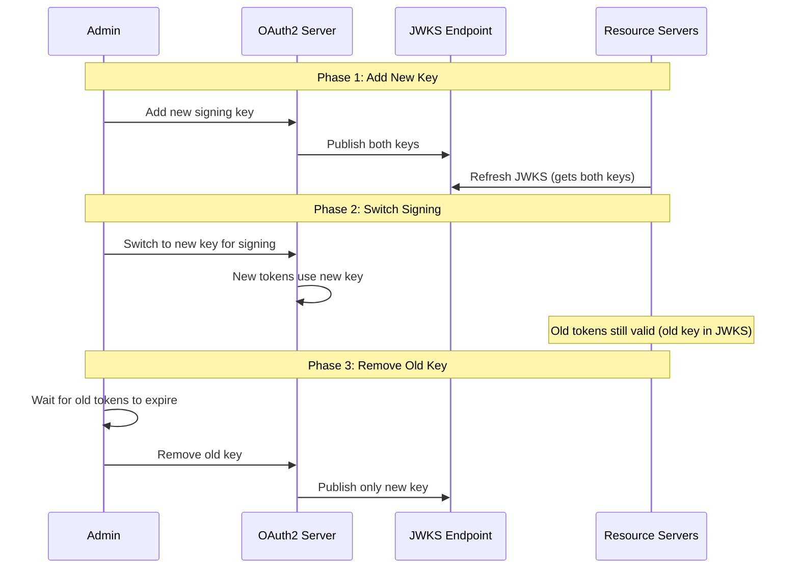
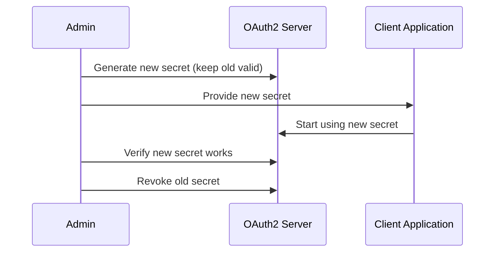

# Certificate Rotation Runbook

This runbook covers certificate and key rotation procedures for the OAuth2 Authorization Server.

## Certificate Types

| Certificate | Purpose | Rotation Frequency | Impact |
|-------------|---------|-------------------|--------|
| TLS Certificate | HTTPS encryption | Annually (or before expiry) | Brief connection errors |
| JWT Signing Key | Token signing | 90 days | Requires JWKS refresh |
| Client Secrets | Client authentication | 90 days | Clients must update |
| Database TLS | DB connection encryption | Annually | Brief reconnection |

---

## TLS Certificate Rotation

### With cert-manager (Automated)

```bash
# Check certificate status
kubectl get certificate -n oauth2-system
kubectl describe certificate oauth2-server-tls -n oauth2-system

# Check expiration
kubectl get secret oauth2-server-tls -n oauth2-system -o jsonpath='{.data.tls\.crt}' | \
  base64 -d | openssl x509 -noout -dates

# Force renewal (if needed)
kubectl delete certificate oauth2-server-tls -n oauth2-system
# cert-manager will automatically create new certificate

# Verify new certificate
kubectl get certificate oauth2-server-tls -n oauth2-system -o jsonpath='{.status.conditions}'
```

### Manual TLS Certificate Rotation

```bash
# 1. Generate new certificate (or receive from CA)
openssl req -x509 -nodes -days 365 \
  -newkey rsa:2048 \
  -keyout new-tls.key \
  -out new-tls.crt \
  -subj "/CN=auth.example.com"

# 2. Create new secret
kubectl create secret tls oauth2-server-tls-new \
  --cert=new-tls.crt \
  --key=new-tls.key \
  -n oauth2-system

# 3. Update ingress to use new secret
kubectl patch ingress oauth2-server -n oauth2-system \
  --type='json' \
  -p='[{"op": "replace", "path": "/spec/tls/0/secretName", "value": "oauth2-server-tls-new"}]'

# 4. Verify new certificate is active
curl -v https://auth.example.com 2>&1 | grep "subject:"

# 5. Delete old secret (after verification)
kubectl delete secret oauth2-server-tls -n oauth2-system

# 6. Rename new secret
kubectl get secret oauth2-server-tls-new -n oauth2-system -o yaml | \
  sed 's/oauth2-server-tls-new/oauth2-server-tls/' | \
  kubectl apply -f -
kubectl delete secret oauth2-server-tls-new -n oauth2-system
```

---

## JWT Signing Key Rotation

### Rotation Strategy



### Step-by-Step Key Rotation

**Phase 1: Generate and Add New Key (Day 1)**

```bash
# Generate new RSA key pair
openssl genrsa -out new-jwk-private.pem 2048
openssl rsa -in new-jwk-private.pem -pubout -out new-jwk-public.pem

# Convert to JWK format (using node jose-util or similar)
jose-util generate-key-pair --alg RS256 --key-id new-key-id > new-jwk.json

# Store in secret manager
aws secretsmanager create-secret \
  --name oauth2/jwk-new \
  --secret-string file://new-jwk.json

# Update application to include new key
kubectl set env deployment/oauth2-server -n oauth2-system \
  JWK_NEW_KEY_ID=new-key-id \
  JWK_NEW_KEY_SECRET=oauth2/jwk-new

# Restart to pick up new key
kubectl rollout restart deployment/oauth2-server -n oauth2-system
```

**Verify JWKS contains both keys:**

```bash
curl https://auth.example.com/oauth2/jwks | jq '.keys | length'
# Should return 2

curl https://auth.example.com/oauth2/jwks | jq '.keys[].kid'
# Should show both old and new key IDs
```

**Phase 2: Switch to New Key (Day 2)**

```bash
# Update to use new key for signing
kubectl set env deployment/oauth2-server -n oauth2-system \
  JWK_ACTIVE_KEY_ID=new-key-id

# Restart to switch signing key
kubectl rollout restart deployment/oauth2-server -n oauth2-system
```

**Verify new tokens use new key:**

```bash
# Get a new token
TOKEN=$(curl -s -X POST https://auth.example.com/oauth2/token \
  -u m2m-client:secret \
  -d "grant_type=client_credentials" | jq -r '.access_token')

# Check key ID in token header
echo $TOKEN | cut -d. -f1 | base64 -d | jq '.kid'
# Should show new key ID
```

**Phase 3: Remove Old Key (Day 3-7, after token expiry)**

```bash
# Wait for longest token lifetime (e.g., 24h for refresh tokens)
# Then remove old key

kubectl set env deployment/oauth2-server -n oauth2-system \
  JWK_OLD_KEY_ID- \
  JWK_OLD_KEY_SECRET-

# Restart to remove old key from JWKS
kubectl rollout restart deployment/oauth2-server -n oauth2-system

# Verify JWKS only has new key
curl https://auth.example.com/oauth2/jwks | jq '.keys | length'
# Should return 1
```

---

## Client Secret Rotation

### Rotation Process



### Step-by-Step Client Secret Rotation

**1. Generate New Secret**

```bash
# Generate new secret
NEW_SECRET=$(openssl rand -base64 32)

# Encode with BCrypt
ENCODED_SECRET=$(python -c "import bcrypt; print(bcrypt.hashpw(b'$NEW_SECRET', bcrypt.gensalt(12)).decode())")

# Update in database (add as secondary secret)
psql -h $DATABASE_HOST -U $DATABASE_USER -d oauth2db <<EOF
UPDATE oauth2_registered_client 
SET client_secret = '$ENCODED_SECRET',
    client_secret_expires_at = NULL
WHERE client_id = 'demo-client';
EOF

# Store new secret for client
echo "New secret for demo-client: $NEW_SECRET"
```

**2. Notify Client Application**

```bash
# Send notification to client owner
# Include:
# - New secret value
# - Deadline to switch
# - Rollback procedure

# Or update via CI/CD
kubectl set env deployment/client-app -n client-namespace \
  OAUTH2_CLIENT_SECRET=$NEW_SECRET
```

**3. Verify New Secret Works**

```bash
# Test with new secret
curl -X POST https://auth.example.com/oauth2/token \
  -u demo-client:$NEW_SECRET \
  -d "grant_type=client_credentials"
```

**4. Monitor and Confirm**

```bash
# Check logs for authentication with new secret
kubectl logs -l app=oauth2-server -n oauth2-system | grep "demo-client"
```

---

## Database TLS Certificate Rotation

### AWS RDS

```bash
# Check current CA certificate
aws rds describe-db-instances \
  --db-instance-identifier oauth2-postgres \
  --query 'DBInstances[0].CACertificateIdentifier'

# Apply new CA certificate
aws rds modify-db-instance \
  --db-instance-identifier oauth2-postgres \
  --ca-certificate-identifier rds-ca-2019 \
  --apply-immediately

# Wait for modification
aws rds wait db-instance-available \
  --db-instance-identifier oauth2-postgres

# Restart application to use new CA
kubectl rollout restart deployment/oauth2-server -n oauth2-system
```

### Azure PostgreSQL

```bash
# Download new CA certificate
curl -o BaltimoreCyberTrustRoot.crt.pem \
  https://www.digicert.com/CACerts/BaltimoreCyberTrustRoot.crt.pem

# Update secret with new CA
kubectl create secret generic postgres-ca \
  --from-file=ca.crt=BaltimoreCyberTrustRoot.crt.pem \
  -n oauth2-system \
  --dry-run=client -o yaml | kubectl apply -f -

# Restart application
kubectl rollout restart deployment/oauth2-server -n oauth2-system
```

---

## Rotation Schedule

### Recommended Schedule

| Item | Frequency | Lead Time | Notification |
|------|-----------|-----------|--------------|
| TLS Certificate | Annually | 30 days before expiry | Team + stakeholders |
| JWT Signing Key | 90 days | 7 days | Team + resource servers |
| Client Secrets | 90 days | 14 days | Client owners |
| Database TLS | Annually | 30 days | Team |
| Admin Passwords | 90 days | 7 days | Admins |

### Rotation Calendar

```bash
# Create calendar reminders

# TLS Certificate (annual)
echo "REMINDER: TLS certificate expires in 30 days" | \
  at "January 1, 2025 09:00"

# JWT Keys (quarterly)
echo "REMINDER: JWT key rotation due" | \
  at "March 1, 2024 09:00"
echo "REMINDER: JWT key rotation due" | \
  at "June 1, 2024 09:00"
echo "REMINDER: JWT key rotation due" | \
  at "September 1, 2024 09:00"
echo "REMINDER: JWT key rotation due" | \
  at "December 1, 2024 09:00"
```

---

## Rollback Procedures

### TLS Certificate Rollback

```bash
# Restore old secret from backup
kubectl apply -f tls-secret-backup.yaml

# Update ingress
kubectl patch ingress oauth2-server -n oauth2-system \
  --type='json' \
  -p='[{"op": "replace", "path": "/spec/tls/0/secretName", "value": "oauth2-server-tls-old"}]'
```

### JWT Key Rollback

```bash
# Restore old key configuration
kubectl set env deployment/oauth2-server -n oauth2-system \
  JWK_ACTIVE_KEY_ID=old-key-id

# Restart
kubectl rollout restart deployment/oauth2-server -n oauth2-system
```

### Client Secret Rollback

```bash
# Restore old secret in database
psql -h $DATABASE_HOST -U $DATABASE_USER -d oauth2db <<EOF
UPDATE oauth2_registered_client 
SET client_secret = '$OLD_ENCODED_SECRET'
WHERE client_id = 'demo-client';
EOF
```

---

## Monitoring

### Certificate Expiry Alerts

```yaml
# Prometheus alerting rule
groups:
  - name: certificates
    rules:
      - alert: TLSCertificateExpiringSoon
        expr: |
          (probe_ssl_earliest_cert_expiry - time()) / 86400 < 30
        for: 1h
        labels:
          severity: warning
        annotations:
          summary: "TLS certificate expires in less than 30 days"
      
      - alert: TLSCertificateExpiryCritical
        expr: |
          (probe_ssl_earliest_cert_expiry - time()) / 86400 < 7
        for: 1h
        labels:
          severity: critical
        annotations:
          summary: "TLS certificate expires in less than 7 days"
```

---

## Next Steps

- [Common Issues](common-issues.md) - Troubleshooting
- [Backup & Restore](backup-restore.md) - Data recovery
- [Incident Response](../incident-response.md) - Incident procedures
