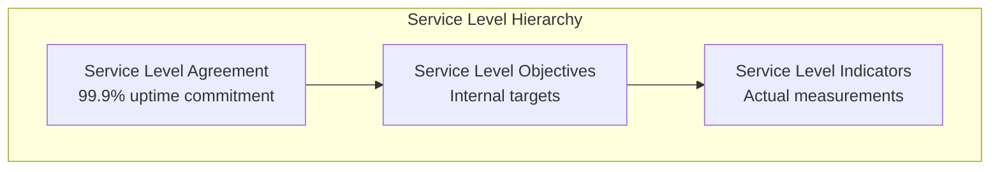

# Service Level Objectives (SLOs)

This document defines the Service Level Objectives (SLOs) for the OAuth2 Authorization Server in production.

## SLO Overview



---

## Core SLOs

### 1. Availability

**Objective**: The OAuth2 Authorization Server shall be available 99.95% of the time.

| Metric | Target | Measurement |
|--------|--------|-------------|
| Availability | 99.95% | `avg_over_time(up{job="oauth2-server"}[30d])` |
| Downtime Budget (30 days) | 21.6 minutes | |
| Downtime Budget (per month) | 21.9 minutes | |

**SLI Query:**

```promql
# Availability percentage over 30 days
avg_over_time(up{job="oauth2-server"}[30d]) * 100
```

### 2. Latency

**Objective**: 95% of requests shall complete within 500ms, 99% within 2 seconds.

| Percentile | Target | Measurement |
|------------|--------|-------------|
| P50 | < 100ms | |
| P95 | < 500ms | `histogram_quantile(0.95, ...)` |
| P99 | < 2000ms | `histogram_quantile(0.99, ...)` |

**SLI Query:**

```promql
# P95 latency for token endpoint
histogram_quantile(0.95, 
  sum(rate(http_server_requests_seconds_bucket{uri="/oauth2/token"}[5m])) by (le)
)

# Percentage of requests under 500ms
sum(rate(http_server_requests_seconds_bucket{le="0.5"}[5m])) /
sum(rate(http_server_requests_seconds_count[5m])) * 100
```

### 3. Error Rate

**Objective**: The error rate shall not exceed 0.1% of total requests.

| Metric | Target | Measurement |
|--------|--------|-------------|
| Error Rate | < 0.1% | `sum(rate(5xx)) / sum(rate(total))` |
| Error Budget (30 days) | 0.1% of requests | |

**SLI Query:**

```promql
# Error rate percentage
sum(rate(http_server_requests_seconds_count{status=~"5.."}[5m])) /
sum(rate(http_server_requests_seconds_count[5m])) * 100
```

### 4. Token Issuance Success Rate

**Objective**: 99.9% of valid token requests shall succeed.

| Metric | Target | Measurement |
|--------|--------|-------------|
| Token Success Rate | 99.9% | Token issued / Valid requests |

**SLI Query:**

```promql
# Token endpoint success rate
sum(rate(http_server_requests_seconds_count{uri="/oauth2/token",status="200"}[5m])) /
sum(rate(http_server_requests_seconds_count{uri="/oauth2/token",status!~"4.."}[5m])) * 100
```

---

## Endpoint-Specific SLOs

### Authorization Endpoint (`/oauth2/authorize`)

| SLO | Target | Critical Threshold |
|-----|--------|-------------------|
| Availability | 99.95% | < 99.5% |
| P95 Latency | < 1000ms | > 2000ms |
| Error Rate | < 0.5% | > 2% |

### Token Endpoint (`/oauth2/token`)

| SLO | Target | Critical Threshold |
|-----|--------|-------------------|
| Availability | 99.99% | < 99.9% |
| P95 Latency | < 500ms | > 1000ms |
| Error Rate | < 0.1% | > 0.5% |

### JWKS Endpoint (`/oauth2/jwks`)

| SLO | Target | Critical Threshold |
|-----|--------|-------------------|
| Availability | 99.99% | < 99.9% |
| P95 Latency | < 100ms | > 500ms |
| Cache Hit Rate | > 99% | < 95% |

### UserInfo Endpoint (`/userinfo`)

| SLO | Target | Critical Threshold |
|-----|--------|-------------------|
| Availability | 99.95% | < 99.5% |
| P95 Latency | < 200ms | > 500ms |
| Error Rate | < 0.1% | > 0.5% |

---

## Error Budget

### Calculation

```
Error Budget = 100% - SLO Target
```

| SLO | Target | Error Budget |
|-----|--------|--------------|
| Availability | 99.95% | 0.05% |
| Latency | 95% < 500ms | 5% > 500ms |
| Error Rate | < 0.1% | 0.1% |

### Error Budget Consumption

```promql
# Availability error budget consumed
(1 - avg_over_time(up{job="oauth2-server"}[30d])) / 0.0005 * 100

# Latency error budget consumed
(1 - (sum(rate(http_server_requests_seconds_bucket{le="0.5"}[30d])) /
      sum(rate(http_server_requests_seconds_count[30d])))) / 0.05 * 100

# Error rate budget consumed
(sum(rate(http_server_requests_seconds_count{status=~"5.."}[30d])) /
 sum(rate(http_server_requests_seconds_count[30d]))) / 0.001 * 100
```

### Error Budget Policy

| Budget Remaining | Action |
|------------------|--------|
| > 50% | Normal development velocity |
| 25-50% | Increased testing, slower rollouts |
| 10-25% | Feature freeze, focus on reliability |
| < 10% | All hands on reliability |
| 0% | Rollback changes, incident response |

---

## SLO Dashboard

### Grafana Panels

```json
{
  "panels": [
    {
      "title": "Availability SLO",
      "type": "gauge",
      "targets": [
        {
          "expr": "avg_over_time(up{job=\"oauth2-server\"}[30d]) * 100",
          "legendFormat": "Availability"
        }
      ],
      "thresholds": {
        "steps": [
          {"color": "red", "value": 99.5},
          {"color": "yellow", "value": 99.9},
          {"color": "green", "value": 99.95}
        ]
      },
      "fieldConfig": {
        "defaults": {
          "min": 99,
          "max": 100,
          "unit": "percent"
        }
      }
    },
    {
      "title": "Error Budget Remaining",
      "type": "gauge",
      "targets": [
        {
          "expr": "100 - ((1 - avg_over_time(up{job=\"oauth2-server\"}[30d])) / 0.0005 * 100)",
          "legendFormat": "Budget"
        }
      ],
      "thresholds": {
        "steps": [
          {"color": "red", "value": 0},
          {"color": "yellow", "value": 25},
          {"color": "green", "value": 50}
        ]
      }
    },
    {
      "title": "P95 Latency SLO",
      "type": "stat",
      "targets": [
        {
          "expr": "histogram_quantile(0.95, sum(rate(http_server_requests_seconds_bucket{job=\"oauth2-server\"}[5m])) by (le))",
          "legendFormat": "P95"
        }
      ],
      "fieldConfig": {
        "defaults": {
          "unit": "s",
          "thresholds": {
            "steps": [
              {"color": "green", "value": 0},
              {"color": "yellow", "value": 0.5},
              {"color": "red", "value": 2}
            ]
          }
        }
      }
    }
  ]
}
```

---

## Alerting Rules

### SLO-Based Alerts

```yaml
groups:
  - name: oauth2-slos
    rules:
      # Availability SLO
      - alert: OAuth2AvailabilitySLOBreach
        expr: |
          avg_over_time(up{job="oauth2-server"}[1h]) < 0.999
        for: 5m
        labels:
          severity: critical
          slo: availability
        annotations:
          summary: "OAuth2 availability SLO breach"
          description: "Availability is {{ $value | printf \"%.2f\" }}% (target: 99.95%)"
          runbook_url: "https://docs.example.com/runbooks/availability"
      
      # Latency SLO
      - alert: OAuth2LatencySLOBreach
        expr: |
          histogram_quantile(0.95, 
            sum(rate(http_server_requests_seconds_bucket{uri="/oauth2/token"}[5m])) by (le)
          ) > 0.5
        for: 5m
        labels:
          severity: warning
          slo: latency
        annotations:
          summary: "OAuth2 token endpoint P95 latency SLO breach"
          description: "P95 latency is {{ $value | printf \"%.2f\" }}s (target: 0.5s)"
      
      # Error Rate SLO
      - alert: OAuth2ErrorRateSLOBreach
        expr: |
          sum(rate(http_server_requests_seconds_count{status=~"5.."}[5m])) /
          sum(rate(http_server_requests_seconds_count[5m])) > 0.001
        for: 5m
        labels:
          severity: warning
          slo: error_rate
        annotations:
          summary: "OAuth2 error rate SLO breach"
          description: "Error rate is {{ $value | printf \"%.2f\" }}% (target: 0.1%)"
      
      # Error Budget Alerts
      - alert: OAuth2ErrorBudgetLow
        expr: |
          100 - ((1 - avg_over_time(up{job="oauth2-server"}[30d])) / 0.0005 * 100) < 25
        for: 5m
        labels:
          severity: warning
        annotations:
          summary: "OAuth2 error budget below 25%"
          description: "Error budget remaining: {{ $value | printf \"%.1f\" }}%"
      
      - alert: OAuth2ErrorBudgetCritical
        expr: |
          100 - ((1 - avg_over_time(up{job="oauth2-server"}[30d])) / 0.0005 * 100) < 10
        for: 5m
        labels:
          severity: critical
        annotations:
          summary: "OAuth2 error budget below 10%"
          description: "Error budget remaining: {{ $value | printf \"%.1f\" }}%"
```

---

## SLO Reporting

### Weekly SLO Report

| Metric | Target | Actual | Status |
|--------|--------|--------|--------|
| Availability | 99.95% | 99.98% | ✅ |
| P95 Latency | 500ms | 320ms | ✅ |
| Error Rate | 0.1% | 0.05% | ✅ |
| Error Budget | - | 65% remaining | ✅ |

### Monthly SLO Trends

```promql
# Weekly availability trend
avg_over_time(up{job="oauth2-server"}[7d])

# Weekly P95 latency trend
avg_over_time(
  histogram_quantile(0.95, 
    sum(rate(http_server_requests_seconds_bucket[7d])) by (le)
  )
[7d])
```

---

## SLO Review Process

### Monthly Review

1. Review SLO performance against targets
2. Analyze error budget consumption
3. Identify reliability improvements
4. Adjust SLO targets if necessary
5. Plan reliability investments

### Quarterly Review

1. Review SLO relevance to business needs
2. Assess SLO measurement accuracy
3. Evaluate alert effectiveness
4. Update documentation
5. Train team on SLO updates

---

## Dependencies

### Upstream Dependencies

| Dependency | Impact on OAuth2 SLO |
|------------|---------------------|
| PostgreSQL | Availability, Latency |
| Redis | Latency, Throughput |
| Load Balancer | Availability |
| DNS | Availability |

### Downstream Dependencies

| Service | OAuth2 Impact |
|---------|---------------|
| API Gateway | Token validation |
| Microservices | Authentication |
| Web Applications | Login flow |

---

## Best Practices

### Defining SLOs

1. Start with user-centric metrics
2. Set achievable but ambitious targets
3. Leave room for error budget
4. Align with business requirements
5. Review and adjust regularly

### Measuring SLOs

1. Use consistent measurement windows
2. Exclude planned maintenance
3. Account for dependencies
4. Use recording rules for efficiency
5. Maintain measurement accuracy

### Acting on SLOs

1. Prioritize reliability over features when budget low
2. Use error budget for innovation
3. Communicate SLO status regularly
4. Learn from SLO breaches
5. Celebrate reliability wins

---

## Next Steps

- [Incident Response](incident-response.md) - Responding to SLO breaches
- [Runbooks](runbooks/common-issues.md) - Troubleshooting procedures
- [Metrics](../observability/metrics.md) - Available metrics
